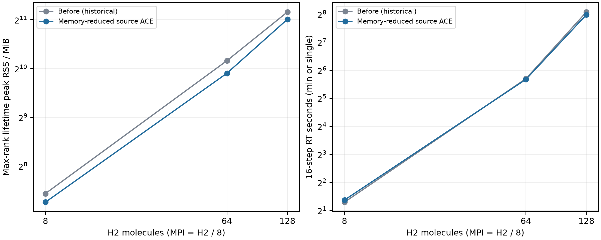

# 実空間RTのEXXメモリ削減

追加の物理近似を入れず、native HSE/PBEhの作業配列と局所支持ACEの格納を変更した。比較は99.9%局所支持ACE同士で、Fullは再計算していない。強スケーリングは保留したまま。

## 実装

- 中点ACEの倍幅因子を作らず、端点ACEの作用を半分ずつ加算する。
- 交換作用を実空間hpsiへ直接加算し、出力用の全格子コピーを除去する。DCコア交換エネルギーでのみ使う作用キャッシュはRTで保持しない。
- source ACEは交換作用Wの厳密な非ゼロ値と行添字、および計量の因子Aを保持する。密なACE因子を展開せず、`-W A(A†(W†t dv))`として作用させる。
- 計量`M=-S†W dv`の固有分解から`A=V/sqrt(e)`を作る。明示的な逆行列は作らず、従来のHermitian・正定値・条件数検査を維持する。
- 受理された固定イオンsource ACEでは、構築後のmasked MLWF配列を解放する。次の更新時に実空間軌道から再生成し、ゲージ運搬に必要なpreviousとgaugeは保持する。

## 同一入力・同一seedの16ステップ比較

各フラグメントにH₂ 2×2×2、PBEh(40)、99.9%支持、impulse1e-4、dt=.02 a.u.。8 H₂は3回の最短時間、64/128 H₂は単回。RSSはランク最大の生涯ピーク（3回なら中央値）で、RTループ以外も含む。基準値は既存測定を再利用し、両バイナリのhashと数値差を保存した。特にMPI16は他アプリとの競合を含み得る。

|H₂ / MPI|変更前RSS MiB|変更後RSS MiB|削減率|変更前 / 後 秒|最大ΔJ a.u.|最大ΔE Ha|
|---:|---:|---:|---:|---:|---:|---:|
|8 / 1|173.1|153.1|11.6%|2.453 / 2.587|2.529e-20|1.066e-14|
|64 / 8|1145.0|957.6|16.4%|51.843 / 51.042|1.016e-20|9.948e-14|
|128 / 16|2288.1|2062.7|9.9%|269.590 / 252.010|1.016e-20|1.023e-12|

## 検証と残る格納

MPI1〜8・軌道分割1〜8・HSE/PBEhカーネルの27構成で、非直交支持軌道と任意の複素対象軌道に対する密／疎ACEの一致を検証した。ゼロ作用、空の軌道所有ランク、不正計量後の状態無効化も含む。native経路は45件の回帰と、実行中配列の検査で確認した。さらにエーレンフェスト経路の17件（イオン運動、力、パルス、水、空間・軌道分割）も正常終了した。ScaLAPACK有効のビルドで検証した。

独立レビューで、条件数8.2646e11の受理可能な計量に対して明示的逆行列の作用が密なACEから2.05e-5ずれる例を検出した。因子形式へ修正後は1.90e-11となり、条件数の受理基準は緩めていない。

128 H₂・MPI16では全格子×占有軌道の複素配列1個がランクあたり64 MiB。第1段階で対象にした中点倍幅因子・出力・DC用キャッシュの配列容量は合計256 MiBだが、寿命が異なるためRSSの削減幅と直接同じにはならない。

今回の削減は密なコピーを減らし、交換作用Wの局所性を格納に使うもの。時間発展する実空間波動関数とゲージ運搬用軌道は密なままで、局所格子点数×軌道数の格納が残る。小さい軌道空間の計量・ゲージ行列も密であり、メモリの完全な線形化は達成していない。新しいメモリ上限は設けていない。

生データと実行来歴は[results.json](reports/exx-memory/results.json)、集計は[summary.json](reports/exx-memory/summary.json)。レビュー修正前の予備測定はこの最終比較に混ぜていない。
