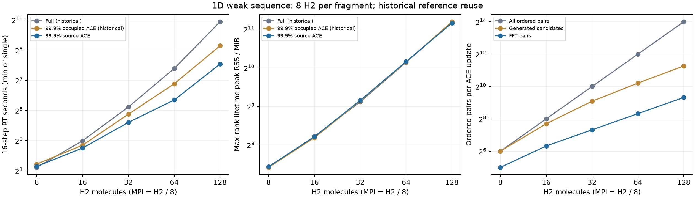

# 局所支持ACE：H₂の弱スケーリング

> 2026-10-06：以下の`benchmarks`は当時のローカル性能測定です。マージ対象から除外し、測定コードはブランチ外へ保存しています。

PBEh(40)の固定イオン・実空間RT、impulse後16ステップ。各フラグメントのコアはH₂ 2×2×2（16³ bohr）、MPI数はフラグメント数。GSはバッファ付きDC-SCF、共通化学ポテンシャル300 K、フラグメント内MLWFなし。従来と同じGS seedを再利用した。

Fullと従来99.9%支持の値はユーザー指定により完了済み測定を再利用した。新方式は`exx_ace_support=source`、99.9%支持MLWFでACEを構築し、支持が重ならない対を除外する。実行ファイルと測定時期が異なるため、速度比は過去測定との比較である。

時間は32 H₂以下が3回の最短値、64・128 H₂が1回。RSSはランク最大の生涯ピーク値（3回なら中央値）で、初期再構成も含む。MPI16は他アプリ競合の影響を受け得る単回値。

|フラグメント配列|H₂ / MPI|回数|Full 秒|従来99.9% 秒|局所支持ACE 秒|Full比 / 従来比|RSS Full / 従来 / 新 MiB|
|---|---:|---:|---:|---:|---:|---:|---:|
|1×1×1|8 / 1|3|2.345|2.726|2.453|0.96 / 1.11|171.0 / 170.9 / 173.1|
|2×1×1|16 / 2|3|7.962|6.495|5.697|1.40 / 1.14|298.0 / 291.5 / 296.8|
|4×1×1|32 / 4|3|37.510|26.982|18.500|2.03 / 1.46|555.7 / 565.2 / 570.4|
|8×1×1|64 / 8|1|220.510|109.030|51.843|4.25 / 2.10|1130.4 / 1135.5 / 1145.0|
|16×1×1|128 / 16|1|1878.000|624.660|269.590|6.97 / 2.32|2320.0 / 2343.9 / 2288.1|
|2×2×1|32 / 4|3|37.499|18.699|15.029|2.50 / 1.24|526.4 / 516.4 / 517.1|
|4×4×1|128 / 16|1|1851.500|545.640|211.880|8.74 / 2.58|1955.0 / 1970.7 / 1978.6|
|2×2×2|64 / 8|1|196.090|69.096|46.855|4.19 / 1.47|940.9 / 929.5 / 929.3|

|配列|全対数|生成候補/更新|FFT対/更新|最大R bohr|ACE受理 / fallback|ΔJ 最大 a.u.|ΔE 最大 Ha|新方式エネルギー変動幅 Ha|
|---|---:|---:|---:|---:|---:|---:|---:|---:|
|1×1×1|64|64.0|32.0|4.950|99 / 0|4.398e-10|1.525e-04|2.274e-07|
|2×1×1|256|208.0|80.0|4.187|99 / 0|2.776e-09|7.119e-04|6.465e-06|
|4×1×1|1024|544.0|160.0|5.033|99 / 0|1.428e-09|5.890e-04|3.855e-06|
|8×1×1|4096|1184.0|320.0|5.031|33 / 0|1.257e-09|1.176e-03|7.211e-06|
|16×1×1|16384|2464.0|640.0|5.031|33 / 0|1.208e-09|2.354e-03|1.466e-05|
|2×2×1|1024|32.0|32.0|3.844|99 / 0|3.189e-09|2.571e-03|7.915e-06|
|4×4×1|16384|4624.0|768.0|5.089|33 / 0|1.296e-09|2.252e-03|3.116e-05|
|2×2×2|4096|64.0|64.0|3.647|33 / 0|2.144e-08|6.937e-03|9.510e-05|

ΔJ・ΔEはFullとの最大差。支持の打ち切りとACE構築空間変更による近似を含み、99.9%という規格化条件がこれらの誤差上限を保証するわけではない。FFT対は候補から積密度ゼロの対をさらに除いた数。

初期条件は格子幅0.5 bohr、H₂結合1.4 bohr、Γ点、Coulomb cutoff 4 bohr、rVV10なし。MLWF interval/maxiter/tolerance=5/1000/1e-6、dt=.02 a.u.、impulse x=1e-4 a.u.。支持半径は規格化99.9%から自動設定。これらの物理的収束性や長時間安定性を検証した測定ではない。

生データ・実行ファイルhash・測定来歴・全反復の時間は[保存データ](benchmarks/2026-09-28-source-ace-weak/results.json)、集計は[summary.json](benchmarks/2026-09-28-source-ace-weak/summary.json)。強スケーリングの未完了条件は本報告に含めない。

## 読み取り

1次元128 H₂では、Full 1878.00秒、従来99.9%支持 624.66秒から、新方式 269.59秒へ短縮した。Full比 6.97倍、従来99.9%比 2.32倍。

1次元16・32・64・128 H₂のFFT対は80・160・320・640対で、MPIあたり40対に揃った。したがって交換対の数については、局所性により全対数の二乗増加を回避できている。候補生成数も208・544・1184・2464対に抑えた。

ただし16→128 H₂（MPI2→16）でRT時間は47.3倍、ランク最大RSSは7.7倍となり、全体が一定時間・一定メモリになる弱スケーリングには到達していない。128 H₂のRSSは2288.1 MiB（約2.23 GiB）。

実装はまだ実空間軌道、MLWF、ACE因子を密な配列として保持する。格子点数と占有軌道数がともに系サイズNに比例するため、空間分割だけでは全メモリはO(N²)、MPI数をNに比例させてもランクあたりO(N)の格納が残る。観測したRSS増加はこの構造と整合する。

また対数が減っても、全軌道に対する回転・ACE構築／作用・通信は残る。128 H₂の標準タイマーではtime propagationが195.24秒、Exc_Cor routineが51.55秒だった。これらはACEや通信だけを分離したタイマーではないので、残存コストの内訳は今回の測定だけでは確定しない。MPI16の競合もあるため、次の最適化箇所の判断には処理別の計測が必要。

局所支持ACEは全528回の更新で受理され、フォールバックは0回。支持の重ならない対の除外はゼロ誤差だが、支持を切る近似とACE構築空間を変更する近似の差は上表のFull比較に残っている。
