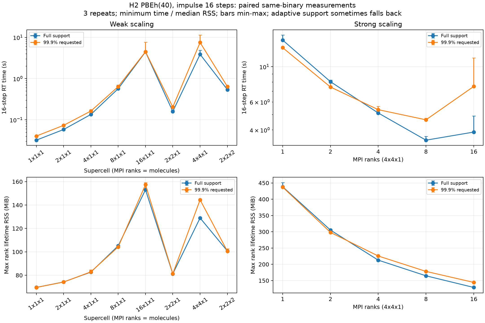

# H₂ PBEh(40)：99.9% WF支持領域のRT計測

> 2026-10-06：以下の`benchmarks`は当時のローカル性能測定です。マージ対象から除外し、測定コードはブランチ外へ保存しています。

同一実行ファイル・同一初期波動関数で、全領域支持と99.9%支持領域を比較しました。
現状の実装では、**弱スケーリングの改善は確認できません**。局所FFTが選択されてもFFT体積の削減が小さく、
4軌道単位の実行と通信の負担が残ります。またMLWF未収束時の全領域への切替が、RTのエネルギーの跳びを生んでいます。
この結果は99.9%とACEの組合せ一般を否定するものではなく、今回の空間分散・自動半径・RT更新経路の課題です。

## 測定条件

- 実装コミット `68aecdab`。MPI/HSE/ScaLAPACK有効のGNUビルド。今回、物理計算コードは変更していません。
- Apple M5 Pro、18コア・64 GiB、共有端末。OpenMP/BLAS各1スレッド、CPU固定なし。
- PBEh(40)、rVV10なし。H₂基本セル8³ bohr、結合長1.4 bohr、格子間隔0.5 bohr、Γ点。
- Coulomb cutoff 4 bohr。固定イオン・固定占有数。実空間メッシュのTaylor4＋ACE予測修正。
- x方向impulse 1e-4 a.u.、dt=0.02 a.u.、16ステップ。電流とエネルギーを毎ステップ出力。
- `exx_mlwf_interval/maxiter/tolerance = 5/100/1e-7`、`exx_mlwf_radius=0`、`exx_local_fft='auto'`。
- `exx_mlwf_norm_fraction=1.0` と `0.999` を交互に3回ずつ、偶数反復では順序を逆転。12条件×2方式×3回＝72実行。

全領域基準にもfraction=1を指定し、MPI1を含めて同じ空間分散EXX経路を使います。
以前のMPI1は旧単一ランク経路だったため、今回の対比較では以前の時間を分母にしません。
99.9%は **WFの二乗ノルムの保持率** です。空間体積の99.9%ではありません。

[前回](h2-pbeh-rt-scaling-ja.md)の8形状の収束済み全領域GSを再利用し、読込前後の保存波動関数ハッシュを照合しました。
全セル1フラグメント・bufferなしのDC-LCFOデータからメッシュへ再構成し、RT中にLCFO基底は保持しません。
**これは全体系のnative RTの測定で、多フラグメントDC法のスケーリングではありません。**
また打切り側に専用のGSを作り直していないため、初期状態に対する演算子変更の影響も数値差に含みます。

時間は最大ランクの内部 `rt iterations` タイマーの**3回の最短値**。角括弧に中央値と最大値を示します。
MPI16は特に他アプリとの競合があるため、最短値を優先しますが、専有環境の性能とは解釈しません。
RSSは各SALMONプロセスの寿命全体（初期データ読込・メッシュ再構成を含む）のランク最大値の中央値。
RTループだけのピークでも、全ランク同時刻合計でもありません。別プロセスのGS準備・Python起動器は除外しています。

## 弱スケーリング

|形状|MPI|全領域 秒 min [median,max]|99.9% 秒 min [median,max]|全領域/99.9%|RSS全領域→99.9% MiB|
|---|---:|---:|---:|---:|---:|
|1×1×1|1|0.0322 [0.0327,0.0339]|0.0405 [0.0405,0.0406]|0.795|69.6→69.6|
|2×1×1|2|0.0583 [0.0591,0.0591]|0.0736 [0.0747,0.0761]|0.792|74.3→74.2|
|4×1×1|4|0.1353 [0.1362,0.1509]|0.1638 [0.1697,0.1755]|0.826|82.7→82.9|
|8×1×1|8|0.5698 [0.5751,0.7017]|0.6392 [0.6607,0.6929]|0.891|105.2→104.2|
|16×1×1|16|4.4466 [4.4734,4.6754]|4.4878 [5.7021,7.6581]|0.991|153.0→157.4|
|2×2×1|4|0.1601 [0.1666,0.1713]|0.2046 [0.2139,0.2155]|0.783|81.2→81.4|
|4×4×1|16|3.8792 [4.7735,4.8949]|7.5181 [7.8596,11.3740]|0.516|128.9→144.5|
|2×2×2|8|0.5406 [0.5410,0.5701]|0.6421 [0.6557,0.6690]|0.842|100.8→100.5|

## 強スケーリング：4×4×1

|形状|MPI|全領域 秒 min [median,max]|99.9% 秒 min [median,max]|全領域/99.9%|RSS全領域→99.9% MiB|
|---|---:|---:|---:|---:|---:|
|4×4×1|1|14.7090 [14.7330,15.8180]|13.1810 [13.2560,13.3630]|1.116|438.2→437.2|
|4×4×1|2|8.0516 [8.2077,8.2306]|7.4539 [7.4810,7.8639]|1.080|305.2→298.2|
|4×4×1|4|5.1152 [5.2389,5.2654]|5.3679 [5.3954,5.6260]|0.953|212.9→225.6|
|4×4×1|8|3.4495 [3.5465,3.6454]|4.6346 [4.7130,4.7387]|0.744|164.7→178.3|
|4×4×1|16|3.8792 [4.7735,4.8949]|7.5181 [7.8596,11.3740]|0.516|128.9→144.5|

## 支持領域と数値差

|形状|MPI|打切り有効更新数（各33回中）|局所FFT対数/有効時全対数（3試行計）|局所FFT格子比|最大電流差 a.u.|最大エネルギー幅 Ha|
|---|---:|---|---:|---:|---:|---:|
|1×1×1|1|[33, 33, 33]|0/99|—|5.1703e-10|5.8302e-08|
|2×1×1|2|[33, 33, 33]|0/396|—|1.7798e-09|2.0677e-07|
|4×1×1|4|[33, 33, 33]|0/1584|—|5.4113e-10|1.0151e-07|
|8×1×1|8|[13, 28, 18]|0/3776|—|4.4429e-10|1.5507e-04|
|16×1×1|16|[0, 9, 4]|3328/3328|0.7031|1.5029e-10|3.0995e-04|
|2×2×1|4|[33, 33, 33]|0/1584|—|1.4944e-10|1.1042e-07|
|4×4×1|16|[28, 27, 27]|20992/20992|0.9888|1.2937e-09|2.8944e-04|
|2×2×2|8|[33, 33, 33]|0/6336|—|4.0182e-10|2.2329e-07|
|4×4×1|1|[27, 27, 27]|20736/20736|0.9888|1.3096e-09|2.8951e-04|
|4×4×1|2|[24, 24, 24]|18432/18432|0.9888|1.1580e-09|2.8951e-04|
|4×4×1|4|[25, 25, 25]|19200/19200|0.9888|1.2084e-09|2.8946e-04|
|4×4×1|8|[24, 24, 24]|18432/18432|0.9888|1.0940e-09|2.8948e-04|

「全領域/99.9%」は時間比で、1より大きい場合のみ高速化しています。強スケーリングの最速は両方式ともMPI8で、
全領域3.4495秒、99.9%設定4.6346秒です。MPI16では99.9%設定が約1.94倍遅く、RSSも128.9→144.5 MiBへ増加しました。

図の誤差棒は3試行の最小〜最大で、信頼区間ではありません。
局所FFT対数は打切り有効時の集計で、全領域に戻った更新の計算量は含みません。
FFT格子比は局所FFT1対当たりの格子数／全セル格子数で、カーネル準備・通信は含みません。
全領域基準では全実行で33回の交換更新を確認しています。

## 性能が改善しない箇所

1. **支持球とFFTパディング。** 自動半径は概ね5 bohrで、8 bohr幅の短い方向を覆います。
   現行実装は全方向を線形畳み込み用にパディングし、その積が全セル以上なら全領域FFTへ戻ります。
   1×1×1〜8×1×1、2×2×1、2×2×2では局所FFT使用数はゼロでした。
2. **4×4×1でもFFT体積がほぼ同じ。** 局所1対あたり64800点、全領域65536点で98.88%。
   切り詰めたWFの球体積が小さくても、実際に計算するFFT箱の体積はほとんど減っていません。
   打切り有効な更新でも16×16＝256対を評価しており、対数の削減はありません。
3. **局所FFTの並列実行。** `spatial_local_apply` は4ターゲットずつ集合通信し、各対を1ランクでFFTします。
   各バッチでFFTを実行するのは最大4ランクで、MPI8/16を同時に使い切れません。
   箱・カーネルの準備と集合通信の費用もあるため、FFT点数だけでは時間短縮を予測できません。
4. **MLWFの再試行。** 未収束時は次の交換更新でも局所化を再試行します。
   16×1×1では3試行の打切り有効回数が0/9/4回と異なり、全領域へのフォールバックが大部分です。
   したがってこのケースの時間を「常時99.9%局所交換の性能」と解釈できません。

## 数値精度と切替の問題

全72実行が正常終了し、16行の電流・17行のエネルギー、時間格子、impulse、有限値、全ランクの終了とRSSを確認しました。
ただし、**正常終了は精度合格を意味しません**。元の全領域ハーネスのエネルギー幅1e-7 Haという基準を、
今回の近似計測では停止条件から記録フラグへ切り替え、超過値をそのまま保存しています。

全領域の最大エネルギー幅は2.700e-12 Ha。4×4×1のMPI1基準に対するMPI分割間差は、
電流1.420e-20 a.u.、エネルギー1.102e-12 Haです。
一方、99.9%設定の最大幅は3.100e-4 Ha、4×4×1の分割間差は電流2.160e-10 a.u.、
エネルギー2.895e-4 Haで、以前の分割一致基準（1e-10 a.u.／1e-8 Ha）を満たしません。
各形状の全領域との差は上表の通りで、異なるMPI数の最大電流差と混同しないでください。

4×4×1/MPI16/反復1では、step 5のMLWF status=1に伴い全領域に戻り、
エネルギーがstep 4の -18.7566890428184 Haから -18.7569782794137 Haへ跳びます。
次の更新がstatus=0となると、step 6は -18.7566888387627 Haへ戻ります。
`hse_native.f90` の `adaptive_active` は直近の局所化成否から毎更新決まるため、
このような近似演算子の切替が起きます。初期GSと演算子の違いや支持半径の変化もあるため、全誤差をこの切替だけに帰属させません。

同ケースの全領域電流ピーク3.9335e-7 a.u.に対する最大電流差は1.2937e-9 a.u.（約0.33%）です。
短時間電流の差が小さくても、エネルギーの跳びとMPI依存が残るため、この経路を長時間RT/MDに十分と評価できません。

次の改修では、収束済みゲージの輸送・保持によって局所化再試行と支持領域切替を安定化すること、
短い周期方向を不必要にパディングしない畳み込み、4軌道固定バッチによる並列性の制限を解消することを優先します。
これらは今回の測定から特定した改修対象であり、本計測ではまだ変更していません。

## 再現データ

- 測定・解析スクリプト（ローカル測定記録）
- [全測定値、実行環境、ソース、ハッシュ](benchmarks/2026-09-28-h2-adaptive-rt/results.json)
- [支持領域・数値差の診断](benchmarks/2026-09-28-h2-adaptive-rt/diagnostics.json)
- [72実行の入力・ログ・電流・エネルギー・ランク別RSS](benchmarks/2026-09-28-h2-adaptive-rt/rt-runs.tar.gz)
- [共通初期波動関数の既存アーカイブ](benchmarks/2026-09-28-h2-rt/seeds-and-preparation.tar.gz)

RTアーカイブには初期波動関数と実行ファイルを重複保存していません。既存のseedアーカイブと元のresults.jsonを同じseedディレクトリへ置き、READMEの測定コマンドで再実行できます。
