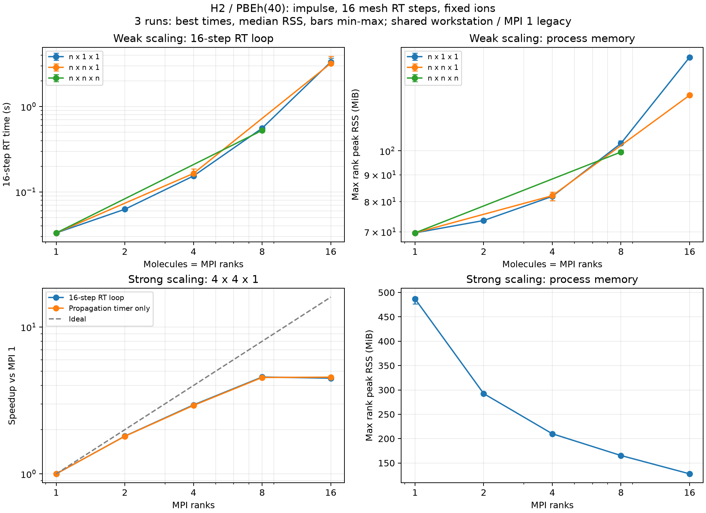

# H₂超格子：PBEh(40) impulse RT 16ステップの時間とメモリ

> 2026-10-06：以下の`benchmarks`は当時のローカル性能測定です。マージ対象から除外し、測定コードはブランチ外へ保存しています。

指定の8形状の弱スケーリングと、4×4×1におけるMPI1・2・4・8・16の強スケーリングを測定しました。
各3回、共通ケースを共有して**全36回のRTが16ステップを完走**しました。前回のGS時間とは別の測定です。

時間は他アプリとの競合を考慮し、3回の**最短値**を主指標にしています。
強スケーリングはMPI8が観測上最速で、16ステップ **3.1539秒**、
MPI1比 **4.57倍**でした。MPI16は3.2125秒で、8と16は観測上ほぼ同じ時間です。
弱スケーリングの1次元系列は1→16分子で0.0331→3.3321秒となり、一定時間にはなっていません。
MPI16にも競合の影響が残り得るため、専有環境の性能とは解釈しません。

## 条件と初期状態

- Apple M5 Pro、18コア・64 GiB、単一ノード。前回と同じScaLAPACK有効の既存GNU/MPIビルド。
- 基本セル8³ bohr、H₂結合長1.4 bohr（x方向）、格子間隔0.5 bohr、Γ点、PBEh(40)、rVV10なし。
- Coulomb cutoffは全形状で4 bohr、`exx_mlwf_radius=0`（全領域支持）。MLWF制御は5／100／1e-7。
- イオン固定・占有数固定。x方向impulse `e_impulse=1e-4 a.u.`、`dt=0.02 a.u.`、16ステップ（計0.32 a.u.）。
- 実空間メッシュ上のTaylor4＋ACE・予測修正。電流とエネルギーを毎ステップ出力。
- OpenMP／BLAS各1スレッド、MPIのCPU固定なし。全測定を順次、新規プロセスで実行。

前回のGSは波動関数を保存していないため、形状ごとに初期状態を新たに準備しました。
現行PBEh実空間RTが読めるDC-LCFO形式にするため、**全セルを覆う1フラグメント・bufferなし**でGSを収束させ、
占有状態を全て保存しています。初期GSのみゼロ温度占有とし、RT中は占有数固定で電子温度は定義しません。
GSの初期化はgauss10、Broyden係数0.1、収束閾値1e-10です。

初期状態を実空間メッシュに再構成した後、LCFO基底を保持した射影時間発展は行いません。
同一形状では全反復・全MPI数が**同じ保存波動関数**を読みます。強スケーリングの結果にGS収束状態の違いは混入しません。
読込前後のハッシュで保存データが変更されていないことを確認しました。

## 弱スケーリング

分子数＝MPI数、1軌道グループ。空間分割はMPI1/2/4/8/16の順に
`1,1,1` / `1,2,1` / `1,2,2` / `1,4,2` / `1,4,4`です。
所有格子点数は4096／ランクで一定ですが、各ランクに保持する占有軌道数と全領域の軌道対評価は増えます。
x方向を保持するFFT pencilなので、1次元超格子の伸長方向xは分割していません。

時間はSALMON内部の**最大ランク `rt iterations` 時間**で、16ステップの密度・ポテンシャル更新や電流・エネルギー出力を含みます。
表の時間は最短 [中央値, 最大]、RSSは最大ランク値の中央値 [最小, 最大]です。
弱効率は1×1×1の最短RT時間を各形状の最短時間で割った値です。

| 超格子 | MPI | RT16ステップ 秒 | ms／step 最短 | 弱効率 % | ピークRSS MiB／rank |
|---|---:|---:|---:|---:|---:|
| 1×1×1 | 1 | 0.0331 [0.0342, 0.0343] | 2.069 | 100.00 | 69.7 [69.7, 69.7] |
| 2×1×1 | 2 | 0.0627 [0.0636, 0.0640] | 3.918 | 52.79 | 73.6 [73.5, 73.6] |
| 4×1×1 | 4 | 0.1538 [0.1605, 0.1613] | 9.614 | 21.51 | 81.8 [81.8, 82.1] |
| 8×1×1 | 8 | 0.5580 [0.5681, 0.5880] | 34.875 | 5.93 | 103.3 [103.3, 104.5] |
| 16×1×1 | 16 | 3.3321 [3.5510, 3.7160] | 208.256 | 0.99 | 151.0 [150.6, 151.7] |
| 2×2×1 | 4 | 0.1647 [0.1802, 0.1874] | 10.291 | 20.10 | 82.1 [80.3, 83.4] |
| 4×4×1 | 16 | 3.2125 [3.7764, 3.8967] | 200.781 | 1.03 | 127.8 [127.7, 128.5] |
| 2×2×2 | 8 | 0.5262 [0.5578, 0.5722] | 32.885 | 6.29 | 99.5 [99.4, 100.3] |

## 強スケーリング：4×4×1（16分子）

全ケース16ステップなので、総RT時間とstep当たり時間の速度向上率は同じです。
MPI1は既存の単一ランクWannier経路、MPI>1は空間分散交換経路です。この実装切替も含む比較です。

| MPI | RT16ステップ 秒 | ms／step 最短 | 速度向上 | 並列効率 % | ピークRSS MiB／rank |
|---:|---:|---:|---:|---:|---:|
| 1 | 14.4120 [14.5510, 15.2880] | 900.750 | 1.00 | 100.0 | 487.0 [476.3, 490.5] |
| 2 | 7.9745 [7.9928, 8.0390] | 498.406 | 1.81 | 90.4 | 292.5 [292.5, 292.5] |
| 4 | 4.8864 [4.8917, 4.9165] | 305.400 | 2.95 | 73.7 | 210.0 [209.9, 210.0] |
| 8 | 3.1539 [3.1707, 3.2483] | 197.119 | 4.57 | 57.1 | 165.4 [165.0, 165.6] |
| 16 | 3.2125 [3.7764, 3.8967] | 200.781 | 4.49 | 28.0 | 127.8 [127.7, 128.5] |

図の時間は最短、メモリは中央値、誤差棒は試行の最小〜最大であり信頼区間ではありません。
伝播部分だけの`time propagation`タイマー、初期化を含む全体時間、MPI起動込みwall timeも生データに保存しています。
伝播部分とRT全体のタイマーは入れ子なので合算しません。最短値でも競合が完全に除かれたとは言えません。

## メモリ値の範囲

RSSはSALMON子プロセスの寿命全体でのピークを`wait4`で取得しています。
**初期状態の読み込み・メッシュ再構成・ライブラリ状態を含むRTジョブのピーク**であり、RTループ内だけのピークではありません。
GS準備は別プロセスなので、そのピークメモリは含みません。PythonラッパーやMPI起動プロセスも含みません。
ランク最大値の中央値を掲載しており、全ランク合計やノード全体の同時刻使用量ではありません。メモリ上限は設定していません。

## 数値確認

- 全36実行で16行のRT出力と17行（t=0を含む）のエネルギー出力、時間刻み、impulse量、有限値、正常終了を確認。
- 共通の4×4×1初期状態に対し、MPI1の基準試行に対する全軌跡の最大差：電流 **1.867e-20 a.u.**、エネルギー **1.101e-12 Ha**。
- 全36実行のimpulse後エネルギー幅の最大値：**2.700e-12 Ha**。t=0はkick前なので幅の計算から除外。

16ステップの短時間比較です。長時間の安定性、格子・cutoff・時間刻みの物理的収束を保証するものではありません。
全領域支持のため、有限半径のMLWF局所近似・疎な軌道対選別の性能も測っていません。

## 再現データ

- 実行スクリプトと測定定義（ローカル測定記録）
- [全測定値・環境・ソース・ハッシュ](benchmarks/2026-09-28-h2-rt/results.json)
- [RT全36実行の入力・ログ・軌跡・ランク別RSS](benchmarks/2026-09-28-h2-rt/rt-runs.tar.gz)
- [同じ初期状態を再利用するための保存波動関数とGS準備ログ](benchmarks/2026-09-28-h2-rt/seeds-and-preparation.tar.gz)
- [図のSVG](benchmarks/2026-09-28-h2-rt/scaling.svg)

2つのアーカイブを同じディレクトリに展開すると、RTディレクトリの相対リンクから対応するGS保存データを参照できます。
[前回のGS測定](h2-pbeh-scaling-ja.md)とはタイマーの範囲・初期状態準備が異なります。
