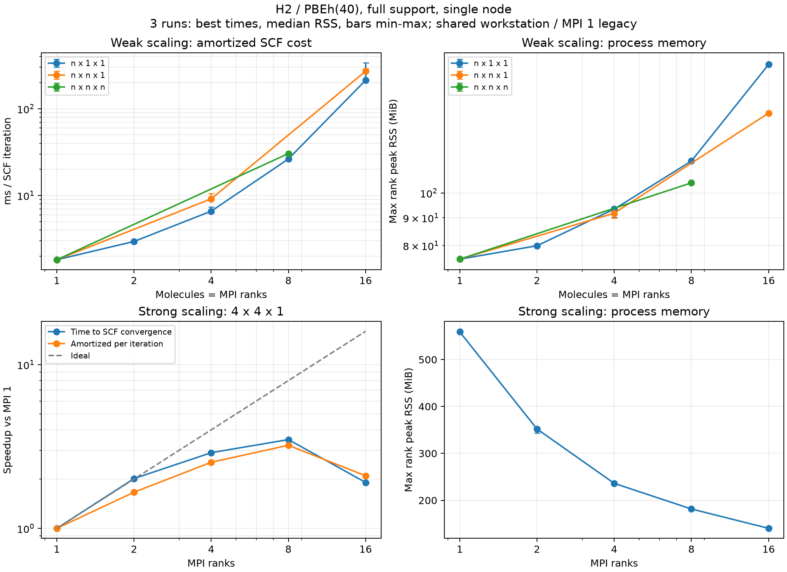

# H₂超格子のPBEh(40)弱・強スケーリング

指定された8形状で弱スケーリング、4×4×1でMPI 1・2・4・8・16の強スケーリングを測定しました。
**実際の周期H₂配列をSCF収束まで計算した、単一ノードでの結果です。**
DC-LCFOやMDは実行していません。本体の計算コードは変更していません。

最短の反復当たり時間では、強スケーリングはMPI8が最速で、MPI1比 **3.22倍**（並列効率40.2%）でした。
MPI16は **2.10倍**にとどまり、他アプリとの競合を含む観測値として扱います。
弱スケーリングの1次元系列は1.819→212.736 ms／反復（1→16分子）で、理想的な一定時間にはなっていません。
全領域交換と増える占有軌道数の影響を含む測定であり、個別処理のボトルネックをこの測定だけでは特定できません。

## 計算条件

- Apple M5 Pro、18物理／論理コア、64 GiB、macOS、GNU Fortran / OpenMPI / OpenBLAS / FFTW。
- ScaLAPACK有効の既存Releaseビルド。ただし今回は通常SCFなのでLCFO全体対角化は使いません。
- 基本セル8×8×8 bohr、セル中心にx向きのH₂（結合長1.4 bohr）。格子間隔0.5 bohr、基本格子16³。
- `xc='pbeh40'`、rVV10なし、Γ点のみ、1分子あたり1占有軌道・2電子。
- `pbeh_coulomb_radius=4 bohr`を全形状で固定。2×2×2だけ相互作用半径が変わることを避けています。
- `exx_mlwf_radius=0`（全領域支持）、MLWF更新間隔5、最大100反復、許容値1e-7。
- SCFは`rho_dne`の閾値1e-10、CG 4回、Broyden係数`alpha_mb=0.1`、`method_init_wf='gauss10'`、SCF上限2000。
- 各ケース3回、独立した新規プロセスで順次実行。OpenMP／BLAS各1スレッド、`--bind-to none`。
- 弱・強に共通の4×4×1／MPI16は共有し、12ケース・計36実行。予備・失敗試行は性能値に混ぜていません。

弱スケーリングは分子数とMPIランク数を同じにし、所有する格子点数を4096／ランクに固定しました。
軌道グループは常に1です。空間分割はMPI 1/2/4/8/16に対して順に
`1,1,1` / `1,2,1` / `1,2,2` / `1,4,2` / `1,4,4`。
現実装のx方向を保持するFFT pencilに合わせてy/zへ分割しており、1次元超格子の伸長方向xは分割しません。

**各ランクが持つ占有軌道数は系の拡大とともに増えます。** 全領域の軌道対交換を使うため、
一定の分子数／ランク・格子点数／ランクは、一定の演算量や波動関数メモリを意味しません。
またMPI1は既存の単一ランクWannier経路、MPI>1は空間分散交換経路なので、その実装切替も含む性能です。
有限半径のMLWF近似や軌道分割、DC分割の性能測定ではありません。

## 弱スケーリング

時間はSALMON内部の`scf iterations`の最大ランク値。ユーザーからMPI16は他アプリとの競合があるとの指摘を受け、
**時間は3回の最短値を重視します。主指標は各実行のSCF時間を実際の反復数で割ってから取る最短値です。**
SCF時間欄は最短 [中央値, 最大]、反復数欄は中央値 [最小, 最大]です。
各指標の最短値は異なる試行に由来する場合があり、一つの試行として組み合わせてはいけません。
このSCF領域には最後の力計算・出力も含まれるため、純粋な反復本体だけの時間ではありません。
弱効率は1×1×1の反復当たり最短時間を各ケースの同じ指標で割った値です。
最短値は競合の影響が比較的小さかった観測値であり、競合が完全になかったことを保証しません。

| 超格子 | MPI | SCF反復数 | SCF時間 秒 | ms／反復 最短 | 弱効率 % | 最大ランクRSS MiB |
|---|---:|---:|---:|---:|---:|---:|
| 1×1×1 | 1 | 95 [95, 95] | 0.173 [0.174, 0.176] | 1.819 | 100.00 | 75.5 |
| 2×1×1 | 2 | 115 [115, 115] | 0.340 [0.345, 0.346] | 2.954 | 61.59 | 79.9 |
| 4×1×1 | 4 | 124 [124, 124] | 0.818 [0.856, 0.913] | 6.596 | 27.58 | 93.4 |
| 8×1×1 | 8 | 161 [154, 176] | 4.333 [4.448, 4.641] | 26.366 | 6.90 | 114.5 |
| 16×1×1 | 16 | 286 [156, 352] | 40.894 [74.883, 97.092] | 212.736 | 0.86 | 172.5 |
| 2×2×1 | 4 | 104 [104, 104] | 0.952 [1.005, 1.099] | 9.154 | 19.87 | 91.8 |
| 4×4×1 | 16 | 157 [157, 157] | 42.456 [43.105, 45.422] | 270.420 | 0.67 | 140.3 |
| 2×2×2 | 8 | 147 [147, 147] | 4.472 [4.481, 4.633] | 30.420 | 5.98 | 104.4 |

## 強スケーリング：4×4×1（H₂ 16分子）

速度向上は各MPI数の最短値から計算します。主指標は反復当たり時間の速度向上で、
並列効率はこれをMPI数で割った値です。収束までの最短時間の速度向上も併記します。

| MPI | SCF反復数 | SCF時間 秒 | SCF全体速度向上 | 反復当たり並列効率 % | 反復当たり速度向上 | 最大ランクRSS MiB |
|---:|---:|---:|---:|---:|---:|---:|
| 1 | 143 [143, 143] | 81.032 [81.205, 81.773] | 1.00 | 100.0 | 1.00 | 559.0 |
| 2 | 118 [118, 118] | 40.220 [42.624, 43.045] | 2.01 | 83.1 | 1.66 | 352.1 |
| 4 | 125 [125, 125] | 27.944 [28.786, 32.850] | 2.90 | 63.4 | 2.53 | 236.2 |
| 8 | 132 [132, 132] | 23.237 [23.824, 24.508] | 3.49 | 40.2 | 3.22 | 181.6 |
| 16 | 157 [157, 157] | 42.456 [43.105, 45.422] | 1.91 | 13.1 | 2.10 | 140.3 |

図の時間は最短値、RSSは中央値です。弱スケーリングの誤差棒は3回の最小・最大であり、信頼区間ではありません。
MPI起動・出力検証を含むwall time、rootの全体時間、RSSの範囲は生データに別々に保存しています。
最大ランクRSSはSALMONプロセスの寿命全体でのピークで、PythonラッパーやMPI起動プロセスを含みません。
MPI・ライブラリの使用量は含みます。特定の配列の使用量でも、ノード全体の同時刻RSSでもありません。

## 収束と初期化の確認

既定の単一Gaussian初期化・Broyden係数0.75では、16×1×1が500反復で未収束でした。
初期密度だけを原子密度に変えても未収束でした。係数0.1だけに変えると264反復で収束した試行がありましたが、
再実行は500反復で未収束となったため、その1回だけを性能結果には採用していません。
`gauss10`＋係数0.1の予備計算は330反復で収束しました。最終測定は全形状でこの条件を統一しています。
単一ランクと16ランクの最初の5反復のエネルギーは表示精度1e-8 eVで一致しましたが、
後続の収束履歴は異なるため、この比較だけで不安定さの原因を断定していません。

最終36実行はすべて密度残差1e-10未満で収束しました。4×4×1の全ランク数・全試行の最終収束エネルギー範囲は **1.596e-08 eV** です（検証基準1e-5 eV）。

局在化の診断には許容値未達の更新も含まれます。全領域支持では非収束のユニタリゲージでも交換演算子を保持しますが、
この結果は有限半径近似の精度を保証しません。格子・cutoffの物理的な収束試験は未実施です。
超格子のΓ点は基本セル換算のk点サンプリングも変えるため、異なる超格子のエネルギー／分子が一致するとは限りません。

## 再現データ

- [入力生成・実行方法](../testsuites/benchmark_h2_pbeh/README.md)
- [全測定値・実行環境・ソース・バイナリハッシュ](benchmarks/2026-09-28-h2/results.json)
- [全36計算の入力・出力・エネルギー・ランク別RSS](benchmarks/2026-09-28-h2/runs.tar.gz)
- [初期化の診断ログ（失敗試行を含む）](benchmarks/2026-09-28-h2/initialization-diagnostics.tar.gz)
- [図のSVG](benchmarks/2026-09-28-h2/scaling.svg)

MPIのプロセス固定、専有ノード・周波数制御、複数ノード環境での再測定は行っていません。
単一ノードの小規模結果から巨大な水・溶液系や富岳での効率を外挿しないでください。

続く測定：[impulse RT16ステップの時間とメモリ](h2-pbeh-rt-scaling-ja.md)。
