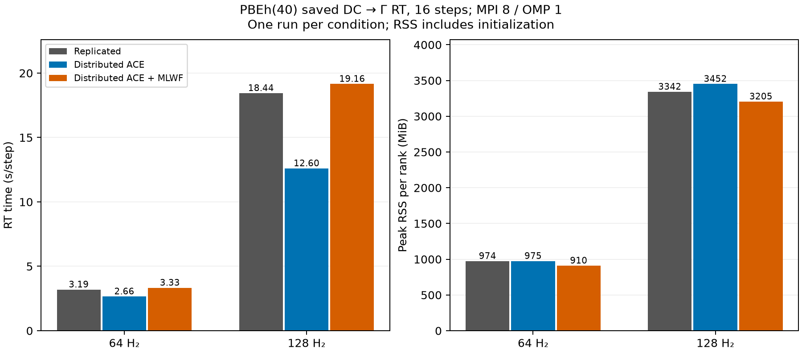

# ACE・MLWF分散化の実計算でのメモリ／時間比較

2026-09-29。長時間実行中だったSi Nk=4³のRTと後続キューを停止し、途中結果を保存してから測定した。今回の変更対象はnative Γ点経路なので、収束済みDC GSを利用できる64・128 H₂のPBEh(40)実空間RTで比較する。Si 512原子や富岳での性能測定ではない。

## 比較方法

同じ現行ソースとコンパイル済みオブジェクトから、`exx_native`の呼び出し先だけを変えた3実行ファイルを作成した。旧コミットのバイナリとの比較ではない。

- 複製：既存の複製ACE・MLWF経路。
- ACE分散：ACEを分散し、MLWFは既存経路。
- ACE＋MLWF分散：今回の両分散経路。

MPI 8、OMP 1、BLAS 1、同時実行1ジョブ。ホストは18コア、64 GiB。保存済みDC-LCFOデータを同じ実空間波動関数へ再構成し、x方向impulse 1e-4、dt=0.02 a.u.、16ステップを実行。PBEh(40)、rVV10なし、source ACE、MLWF norm fraction=0.999、明示半径0、Coulomb半径4 bohr、MLWF tolerance=1e-6、更新間隔5を全経路で固定した。無外場計算・電流差引きは行わない。

64 H₂は256×32×32、128 H₂は512×32×32メッシュ。空間MPI分割は1×4×2。弱スケーリング試験ではなく、MPI数固定での系サイズ・実装比較である。

時間はSALMONの`rt iterations`の最大ランク値を16で割った値。最大RSSは各SALMONプロセスの`wait4`による生存期間中の最大値のうち最大ランクを採用し、LCFO再構成・初期化を含む。RSSのランク合計は共有ページを重複計上するのでノード実メモリとはみなさない。0.5秒間隔のRSSサンプリングも全経路で実施する。

ユーザーの指示により反復計測は行わず、全条件各1回で比較した。各サイズとも複製→ACE分散→ACE＋MLWF分散の順。同じバイナリ群・入力・GSデータで比較しているが、他アプリ・キャッシュ・実行順による時間変動は評価していない。数%の時間差を有意差と断定しない。

## 結果

| H₂数 | 経路 | 秒/step | RT 16 step (秒) | ジョブ全体 (秒) | 最大RSS (MiB/ランク) |
|---:|---|---:|---:|---:|---:|
| 64 | 複製 | 3.195 | 51.12 | 53.98 | 974.1 |
| 64 | ACE分散 | 2.657 | 42.51 | 45.31 | 974.6 |
| 64 | ACE＋MLWF分散 | 3.334 | 53.35 | 56.46 | 909.8 |
| 128 | 複製 | 18.443 | 295.09 | 307.17 | 3341.8 |
| 128 | ACE分散 | 12.601 | 201.62 | 208.75 | 3451.7 |
| 128 | ACE＋MLWF分散 | 19.156 | 306.49 | 319.54 | 3205.3 |

両方の分散は従来比で64 H₂のRSSを6.6%、128 H₂を4.1%削減し、RT時間はそれぞれ4.4%、3.9%増加した。各1回なのでこの小さな時間増は傾向として扱う。一方、ACEのみ分散は時間が16.8%、31.7%短縮したが、RSSは0.1%、3.3%増えた。この規模で速度を優先するならACEのみ分散が有望だが、128 H₂での再現性や大規模系は未確認。両分散を自動的に速度改善とみなす結果ではない。

全6計算は16ステップ完了、全ランク正常終了。複製経路との最大差は次の通り（電流は原子単位）：

- 64 H₂：電流 1.016e-20、全エネルギー 9.948e-14 Ha。
- 128 H₂：電流 1.016e-20、全エネルギー 9.948e-13 Ha。

いずれも比較基準2e-8以内。各計算でACE構築は33回。支持積ログのproducts/skipped/catalogueは64 H₂で1184/3776/2048、128 H₂で2464/15744/4096であり、同サイズの3経路で一致した。交換対選別や物理条件を変えた速度比較ではない。

## 解釈上の注意

分散されるN×N行列単体は、64軌道で64 KiB、128軌道で256 KiBである。今回の系では、行列の分散率だけからプロセス全体の削減量を予想できない。MLWF分散経路では列を逐次処理する波動関数変換も使うため、既存のメッシュサイズ一時配列や行列積経路の差も測定に含む。

Ngrid×Nのメッシュ波動関数は、1コピーだけでも64 H₂で32 MiB/ランク、128 H₂で128 MiB/ランク（複素倍精度、MPI 8）。系を2倍にしてMPI数を固定すると、この項は4倍になる。ACE/MLWF行列だけを分散しても、RT全体の記憶量が線形になるわけではない。

Jacobi局所化の分散は集団通信を増やすため、メモリ削減と実行時間にはトレードオフがある。単一ホストの小行列の結果を、多ノード・富岳・数千軌道の性能へ外挿しない。測定後、ユーザーの選択によりACEのみ分散を通常経路として採用した。MLWF分散は比較検証用に保持する。測定値は採用前の同じ3実行ファイルによる結果のまま保存している。

## 再現資料

集計値・図は[レポート](reports/matrix-memory-tradeoff/summary.json)を参照。測定・集計手順は[benchmark README](../testsuites/benchmark_matrix_memory/README.md)。ローカルの`work/matrix-memory-tradeoff/`には各入力、全出力、ランク別RSS、観測量、実行ファイルと共通オブジェクトのSHA256、ルーティング用ソースを保存した。GS再計算は不要だが、再現には同じ保存済みGSデータが必要。

実装の詳細は[ACE分散](distributed-ace-memory-ja.md)と[MLWF分散](distributed-mlwf-memory-ja.md)を参照。
