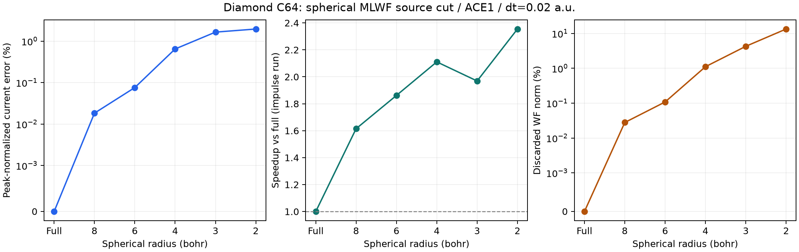
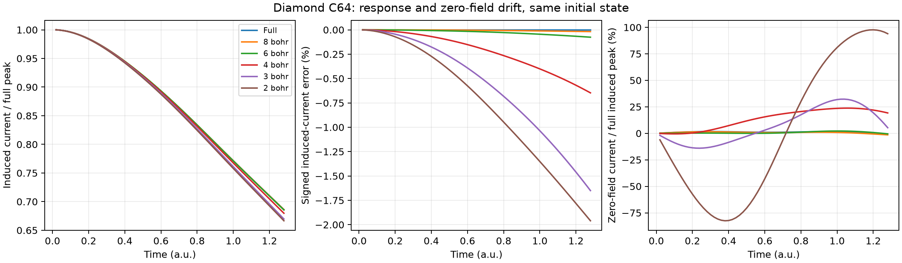
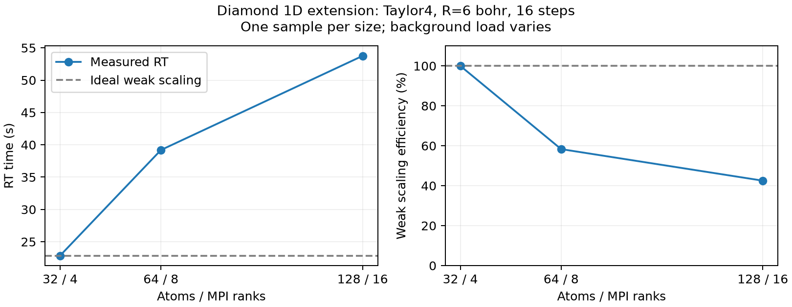
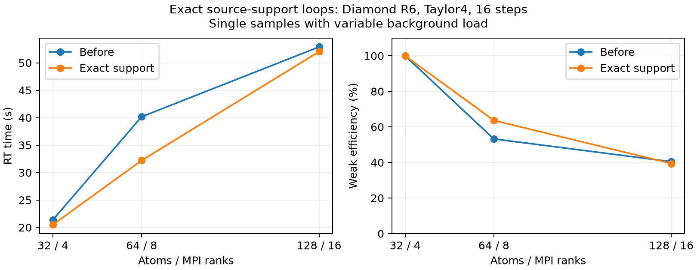

# Diamond C64：MLWFの球状積分範囲の比較

> 過去の測定条件・実装段階を含む時系列記録です。最新の状況・比較表は[統合ノート](../../../DEVELOPMENT_NOTES.md)を参照してください。旧x方向カット、3次元球カット、異なるステップ数の速度比は相互に混在させません。

基本実装をb1773c78で固定し、材料と計算入力のみを変更した。

## 条件

C64、通常セル8×1×1、格子定数6.72 bohr（リポジトリのdiamond試験値）、全体53.76×6.72×6.72 bohr。炭素擬ポテンシャルはtestsuites/pseudo/C_rps.dat、lloc=1。8フラグメント、コア16³、buffer=8,0,0（buffer込み32×16×16）、格子間隔0.42 bohr。128占有軌道、Gamma点、MPI8/OMP2/BLAS1、計算は逐次実行。GNU Fortran15/AArch64でループベクトル化無効。

共通DC-HSE/LCFO初期状態を使用し、追加SCFは行わない。三次元最小像距離でソースWFを切断する。ACEは毎ステップ更新、初期MLWFのU・中心は全条件で同一。x方向impulse=1e-4 a.u.。各半径で励起／無励起ペアを計算し、ΔJ=J_impulse−J_zeroを比較する。時間刻み0.02 a.u.、64ステップ、総時間1.28 a.u.（約0.031 fs）。

## 誤差と速度

E∞=100 max_t|ΔJ_R−ΔJ_full|/max_t|ΔJ_full|、D_T=100[ΔJ_R(T)−ΔJ_full(T)]/max_t|ΔJ_full|。どちらも全範囲のx電流ピークで規格化する。

| 半径 bohr | 破棄WFノルム最大 % | E∞ % | D_T % | impulse全時間 秒 | RT部分 秒 | 全時間高速化 | 初期非ゼロソース/可能数 |
|---|---:|---:|---:|---:|---:|---:|---:|
| 全範囲 | 0 | 0 | +0 | 317.32 | 313.86 | 1.000 | 1024/1024 |
| 8 | 0.0278272 | 0.0182954 | -0.0182954 | 196.50 | 193.99 | 1.615 | 576/1024 |
| 6 | 0.107991 | 0.0757775 | -0.0757775 | 170.44 | 168.19 | 1.862 | 480/1024 |
| 4 | 1.1102 | 0.646991 | -0.646991 | 150.33 | 148.30 | 2.111 | 384/1024 |
| 3 | 4.27118 | 1.65013 | -1.65013 | 161.15 | 159.01 | 1.969 | 384/1024 |
| 2 | 13.3871 | 1.95983 | -1.95983 | 134.76 | 132.68 | 2.355 | 320/1024 |

速度は同じACE1の全範囲impulse計算を基準とし、初期化を含む単回実測。無励起計算の時間はこの速度比に合算しない。非ゼロソース数はフラグメント×ソースWF数で、交換ペア数そのものではない。

## 検証と解釈の範囲

全範囲の時間刻み0.01 a.u.との比較：E∞=0.00040311%。
各半径の初期U・中心・係数は診断ファイルのSHA256一致で確認。全体密度・Hartreeを切る試験ではない。ソースマスク近似ではエネルギーを診断量として扱う。

この短時間・細長いGamma点セルの比較は、切断半径依存性のスクリーニングである。バルクdiamondの誘電関数、k点・格子・フラグメントbufferの収束、長時間の安定性を確定するものではない。

完了状態：全半径完了。

[測定データ](summary.json)

## 初期WFの局在範囲

| 含むノルム | 必要半径：WF中央値 bohr | 必要半径：最大 bohr |
|---|---:|---:|
| 99% | 4.1574 | 4.1576 |
| 99.9% | 6.0645 | 6.0716 |
| 99.99% | 8.8644 | 8.9100 |

| 半径 bohr | WF外側ノルムの平均 % | WF外側ノルムの最大 % |
|---|---:|---:|
| 2 | 13.3871 | 13.3929 |
| 3 | 4.27118 | 4.27718 |
| 4 | 1.1102 | 1.11414 |
| 6 | 0.106966 | 0.107984 |
| 8 | 0.0263397 | 0.0271993 |

中心信頼度による保護WFは0/128。初期ノルム損失の再構築値をSALMON診断と照合した。

## Diamondの半径依存性：詳細な解釈

全範囲から8 bohrで約1.61倍、6 bohrで約1.86倍となり、誘起電流のE∞はそれぞれ0.0183%、0.0758%。4 bohrでは約2.11倍だが0.647%、3 bohrは約1.97倍で1.65%、2 bohrは約2.35倍で1.96%となった。3 bohrと4 bohrでは非ゼロソース数が同じ384/1024で、ソース数の削減は起きていない。速度差には単回測定の変動も含まれると考えられる。

| 半径 bohr | 誘起電流 E∞ % | 高速化 | 無励起電流の最大値 a.u. | 基準誘起電流ピークに対する無励起電流 % |
|---|---:|---:|---:|---:|
| 全範囲 | 0 | 1.000 | 1.773192e-07 | 1.680 |
| 8 | 0.0182954 | 1.615 | 1.550441e-07 | 1.469 |
| 6 | 0.0757775 | 1.862 | 2.309800e-07 | 2.188 |
| 4 | 0.646991 | 2.111 | 2.510289e-06 | 23.779 |
| 3 | 1.65013 | 1.969 | 3.404243e-06 | 32.247 |
| 2 | 1.95983 | 2.355 | 1.031013e-05 | 97.665 |

無励起電流は初期状態と時間発展演算子のずれを含む診断で、誘起応答では各半径に対応した無励起計算を差し引いている。4 bohr以下ではこの背景電流が大きくなる。差し引き後のE∞だけが小さくても、生の電流や定常性まで同じ精度になったとは言えない。密度差を織り込み済みとして、そのままRTした条件を維持した結果である。

初期WFの外側ノルム平均は8/6/4/3/2 bohrで0.02634/0.10697/1.1102/4.2712/13.3871%。99/99.9/99.99%を含む半径のWF中央値は4.157/6.065/8.864 bohr、最大は4.158/6.072/8.910 bohr。保護WFは0/128で、今回のノルム解析では全WFが実際に切断の対象になった。

したがって、今回の短時間スクリーニングでは6 bohr付近が次の精査に使う自然な候補である。8 bohrを高精度側の比較点として残し、4 bohr以下を単に高速という理由で採用しない。これは16³/コア・Γ点・細長い周期セル・総時間1.28 a.u.での傾向であり、長時間誘電応答の許容半径の確定ではない。全範囲でdtを半分にした差0.000403%は、今回の半径差より小さい。

初期ノルムの照合はSALMONのES14.6出力（有効7桁）に丸めて一致を確認した。2 bohrの再構築値0.133870534…と表示値0.1338705の差は表示丸めによる。

### 電流の時間依存性と実装上の切断範囲

今回の全半径では誤差最大が観測最終時刻に現れたため、表のE∞と|D_T|が一致する。定義を同じにしたのではなく、この短時間軌道で一致した結果である。長時間では一般に一致しない。

半径は三次元最小像距離によるソースWFのマスクである。現実装ではフラグメントのFFT格子32×16×16そのものは半径で縮めない。非ゼロソース×対象基底について同じ大きさのFFTを行い、ソース全体がゼロなら省略する。そのため4→3 bohrのように非ゼロソース数が変わらない区間では、ノルムをさらに捨てても交換FFT数を減らせない。

## Diamond：8×1×1→16×1×1の弱スケーリング

分散化実装33dbea5aを固定し、C64/8 MPIとC128/16 MPIを逐次比較した。通常セルをx方向へ並べ、各フラグメントは8原子、コア16³、buffer=8,0,0、FFT領域32×16×16、格子間隔0.42 bohr。dt=0.02 a.u.、16ステップ、ACE1、energy出力間隔40、密度出力は最終16ステップ。全範囲と6 bohrを同じ条件で計算した。性能測定用の短い区間であり、上の64ステップの半径精度試験とは別の試験である。

C64の収束済みGSを再利用し、C128は同じDC-HSE条件で新規SCFを行った。両方とも閾値1e-7を満たしたLCFO初期状態から、追加の全体系SCFを挟まず時間発展した。各サイズ内の全範囲/6 bohrで初期MLWFファイルは一致した。

OMP1/BLAS1。18物理コアの単一ホストMac17,9上でMPI8→16とした。OSの性能クラスは6コア＋12コアであり、異機種ノードを増やすクラスタ弱スケーリングとは区別する。前の半径試験はOMP2・旧実装だったので、そちらの秒数をこの比較の分母に流用していない。

| 半径 | 系 / MPI | 全時間 秒 | RT 秒 | RT 秒/step | RT以外 秒 | 最大ランクRSS MiB | 初期非ゼロソース/fragment | 最大破棄ノルム % |
|---|---|---:|---:|---:|---:|---:|---:|---:|
| 全範囲 | C64 / 8 | 108.283 | 104.530 | 6.5331 | 3.753 | 437.7 | 128.00 | 0 |
| 6 bohr | C64 / 8 | 60.439 | 57.684 | 3.6052 | 2.755 | 438.2 | 60.00 | 0.106967 |
| 全範囲 | C128 / 16 | 321.269 | 304.010 | 19.0006 | 17.259 | 644.9 | 256.00 | 0 |
| 6 bohr | C128 / 16 | 111.497 | 100.370 | 6.2731 | 11.127 | 650.2 | 60.00 | 0.107011 |

RT以外には入力・初期化・初回MLWF構築・I/O等を含む。RSSは0.25秒間隔の観測最大値。単回測定。原子数とMPI数を同時に2倍とする弱スケーリングなので、理想RT時間比は1で、効率η=100 T8/T16。2 T8/T16は系全体の処理量の増加率で、効率そのものではない。

| 半径 | RT時間比 T16/T8 | 弱スケーリング効率 % | 原子数込みの処理量比 2T8/T16 | 全時間比 |
|---|---:|---:|---:|---:|
| 全範囲 | 2.9084 | 34.38 | 0.6877 | 2.9669 |
| 6 bohr | 1.7400 | 57.47 | 1.1494 | 1.8448 |

| 系・半径 | 初回 C収集 / WF / 交換 / ACE 秒 | 初回以外 C収集 / WF / 交換 / ACE 秒 | ACE構築回数 |
|---|---|---|---:|
| C64・全範囲 | 0.011 / 0.713 / 2.459 / 0.005 | 0.337 / 1.859 / 95.684 / 0.161 | 35 |
| C64・6 bohr | 0.011 / 0.743 / 1.364 / 0.006 | 0.360 / 2.622 / 47.967 / 0.166 | 35 |
| C128・全範囲 | 0.032 / 7.655 / 8.345 / 0.030 | 0.915 / 5.314 / 278.583 / 0.777 | 35 |
| C128・6 bohr | 0.028 / 7.723 / 2.049 / 0.034 | 0.977 / 7.845 / 71.477 / 1.068 | 35 |

各フェーズ値は呼び出しごとの空間ランク最大時間の合計であり、RT全時間の厳密な加算分解ではない。初回MLWF最適化を初回欄へ分けた。

| 系 | 占有軌道数 | 局所C行数 | 全C行数 | Halo行数 |
|---|---:|---:|---:|---:|
| C64 | 128 | 64 | 512 | 192 |
| C128 | 256 | 64 | 1024 | 192 |

固定しているのは原子数・実空間格子点数／フラグメントである。この試験はnproc_ob=1なので、ランクごとの占有軌道列数は128→256に増える。局所C行・Halo行が固定でも、全占有軌道のWF再構築、C†C等の軌道行列、ACE作用やnative軌道更新の仕事量は固定ではない。U・metric・変換行列はまだ全ランクに複製されている。ScaLAPACKは分解を分散するが、これらのサイズ増加そのものはなくさない。

全範囲の場合は各フラグメントの非ゼロソース数も系サイズとともに増える。6 bohrでこの数が抑えられているかを上表で確認し、交換部分とWF/ACE部分を分けて評価する。この測定だけでNに対する漸近次数やクラスタでの効率を確定しない。

[弱スケーリング測定データ](weak-scaling-summary.json) / [C128 GS収束情報](weak-scaling-gs128.json)

## WF再構築の第1段高速化：必要な列を先に選択

実装：[c9abacb9](https://github.com/SALMON-TDDFT/SALMON2/commit/c9abacb94f97da483b6693804af3fbe4ca1f07fa)。既存の球状マスクを先に評価し、フラグメントと交わるWF列だけを実空間へ再構築する。中心・半径・protected判定はRT中固定なので、点ごとのマスクもキャッシュする。遠方の全ゼロソース列を交換ループから除外する。保護対象WFは常に残す。

ノルム診断は、全WFをコア格子上へ再構築して外側ノルムを足す方法から、全ノルム−保持ノルムへ変更した。全ノルムはtrace(F† G F)、G=B†Bを一度作って使用する。Gを単位行列と仮定しないので、複素・非直交基底にも成り立つ。切断条件と交換演算は数学的に同じで、新しい物理近似は導入していない。極小の破棄ノルムでは差し引きの丸めがあるため、機械精度付近の値に意味を持たせない。

測定は直前のC64/8 MPI・C128/16 MPI、6 bohr、16³コア、dt=0.02、nt=16、ACE1、OMP1/BLAS1、同じGSで比較した。WF時間は初回を除いたWFフェーズの合計。密なU輸送・係数回転は今回も同じ処理を行う。

| 系 / MPI | WF 秒 旧→新 | WF高速化 | RT 秒 旧→新 | RT高速化 | E∞ % | D_T % |
|---|---:|---:|---:|---:|---:|---:|
| C64 / 8 | 2.6216 → 1.2369 | 2.120 | 57.684 → 56.595 | 1.019 | 3.693e-11 | +3.693e-11 |
| C128 / 16 | 7.8446 → 2.7070 | 2.898 | 100.370 → 94.138 | 1.066 | 2.082e-11 | -1.231e-11 |

この表の誤差は、同じ6 bohrの旧実装の生のx電流ピークで規格化した実装一致の測定である。前の「全範囲に対する誘起電流の切断誤差」とは比較対象が異なる。初期U/係数のファイルはバイト一致、最大電流差3.90e-18 a.u.、密度差2.00e-15。出力エネルギーと7桁表示の破棄ノルムは一致し、ACE構築は両方35回。

| 系 | 旧再構築列 | 新フラグメント再構築列 | 新コア診断列 | 初回WF処理 秒 |
|---|---:|---:|---:|---:|
| C64 | 128 | 60 | 44 | 0.6975 |
| C128 | 256 | 60 | 44 | 7.0302 |

最適化後の6 bohrの弱スケーリング効率は60.12%（旧57.47%）。局所WFの実空間再構築列数を系サイズから切り離せた一方、全RTの改善はC64で約2%、C128で約6.6%にとどまる。交換処理とnative軌道更新も依然として重い。

### 大規模化に残るWFの課題

係数フレームC_local Uは依然として全占有列を持ち、U・重なりmetric・変換行列は密である。今回一定にしたのは実空間再構築の列数であり、U輸送や全データ量を線形スケーリングに変えたわけではない。初回のroot MLWF最適化もC128で約7秒残る。マスク初期化の一時配列も全WF列を含む。

次の優先順位は、必要WF列に限定したHalo通信と初期マスク判定の省メモリ化、続いて密なU輸送・局在化そのものの見直しである。後者を局所ブロックや低頻度更新に置き換える場合はゲージの追跡精度が変わり得るので、電流、ノルム、交換演算のエルミート性、長時間応答を別に検証する。現状の小系でWFだけを減らせば全時間も同じ倍率で速くなる、とは言えない。

参考設計として、PTゲージでの時間積分とACEを組み合わせた先行研究がある。[Jia and Lin, CPC 240 (2019), 21–29](https://doi.org/10.1016/j.cpc.2019.02.009)。現在のコードは交換ソース用にpolar輸送したUを使う一方、nativeの時間発展器を維持しており、このPT時間積分法そのものの実装ではない。文献の高速化率を今回へ直接適用したり、PTだけで疎な局所WF演算が保証されると解釈したりしない。

[WF最適化の測定データ](wf-active-summary.json)

## WF通信の第2段最適化：必要な列だけを交換

実装：[35d1d38e](https://github.com/SALMON-TDDFT/SALMON2/commit/35d1d38e0a21f2ffba38e1f984bdebbfbf14a1df)。

フラグメントに必要なWF列番号を初回に共有し、その後は既存の行Haloに必要列だけを載せて通信する。列番号と送受信バッファを保存し、受信したコンパクトな係数から直接WFを再構築する。U、中心、球状マスク、protected判定、コア全ノルム診断は同じで、追加の物理近似はない。列の要求集合・行Halo・占有数が変わる場合は通信計画の作り直しが必要。現在のRTではいずれも固定。

前節の実装c9abacb9を保存したバイナリと今回の実装を、C64旧→新→C128旧→新の順に一件ずつ実行した。同じGS、R6、core16³、dt=0.02、nt=16、ACE1、OMP1/BLAS1、ループベクトル化無効。以下の旧時間は今回測り直した値であり、前節の測定値と混在させない。各条件1回なので小さな時間差に統計的有意性は主張しない。

| 系 / MPI | WF 秒 旧→新 | WF高速化 | RT 秒 旧→新 | RT高速化 | E∞ % | D_T % |
|---|---:|---:|---:|---:|---:|---:|
| C64 / 8 | 1.2069 → 1.2237 | 0.986 | 56.062 → 57.873 | 0.969 | 3.125e-11 | +1.137e-11 |
| C128 / 16 | 2.6375 → 2.5944 | 1.017 | 100.290 → 99.992 | 1.003 | 4.073e-11 | -2.368e-11 |

WF時間は初回を除くWFフェーズの合計で、通信単独のタイマーではない。E∞・D_Tは同じ6 bohrの旧実装の生のx電流ピークで規格化した実装一致の指標であり、全範囲計算に対する切断誤差ではない。

| 系 | 各ランクのWF列 旧→新 | 各ランク受信値数 旧→新 | 削減率 |
|---|---:|---:|---:|
| C64 | 128 → 60 | 24576 → 11520 | 53.12% |
| C128 | 256 → 60 | 49152 → 11520 | 76.56% |

値数は1回のソース構築当たりの複素倍精度数で、自己ランク分を含むMPI Alltoallvの受信配列サイズである。通信相手・Halo行数は変えない。ネットワーク越しの転送量だけを直接計測した数字ではない。

初期MLWFファイルは全ケースでバイト一致。電流の最大絶対差は4.301e-18 a.u.、密度差は1.998e-15、エネルギー差は0.000e+00、表示上の破棄ノルム差は0.000e+00。

今回の同条件測定の弱スケーリング効率η=T(C64,MPI8)/T(C128,MPI16)は、旧55.90%→新57.88%。通信量は確実に減るが、密なU輸送、全占有係数の回転、初回のroot MLWF最適化、交換計算は残るため、全RTが通信削減率に比例して速くなるわけではない。

検証：列通信のMPI2/4テスト（ランクごとに異なる列順、重複要求、ゼロ局所行、空要求、全列、繰り返し使用）、複素非直交基底でのcompact再構築、OMP1/2/4の輸送・3Dマスク、nativeのフラグメント×軌道MPI2/4、ACE1/2/4、impulse/laser、不均等軌道分割を通過。

[WF列通信の測定データ](wf-column-summary.json)

今回の小規模な共有メモリ機上では、通信量削減による明確なRT高速化は確認できなかった。C64は約3.2%遅く、C128は約0.3%速いだけで、各1回の測定から性能向上とは判断しない。WFフェーズもC64は1.207→1.224秒、C128は2.638→2.594秒でほぼ同じ。C128の交換フェーズは約75.6秒とRT全体の約76%を占める（フェーズごとの最大値の合計なので厳密な分解ではない）。当面の全体速度では交換処理が支配的であり、今回の意義はWF通信・バッファの系サイズ依存を抑えたことにある。別ノード間の通信効果や、さらに大きな系での効果は未測定。

## ノード間比較の準備（未測定）

比較入力と[測定手順](multinode/README.md)を保存した。C128・16 MPIを1ノードと2ノードで比較し、続いてC64・8 MPIとの弱スケーリングを測る。ユーザー指定により複数ノード試験は別途扱いとして保留。未投入・未測定。ノード内の結果からノード間の高速化率を推定値として掲載しない。

## 交換FFTの削減：厳密ゼロのペアを除外

実装：[beccb272](https://github.com/SALMON-TDDFT/SALMON2/commit/beccb2724fc5477940ff94a0ef6efcdbcd4aa971)。

各ソースWFと対象LCFO基底の積（ペア密度）が全格子点で厳密にゼロの場合、そのペアの順・逆FFTと交換作用の加算を省く。非ゼロの値に閾値を設けない。非常に小さい非ゼロ値も従来通り扱い、U、球状マスク、HSEカーネル、ACEスケジュールを変更しない。ペア積を作る前に対象軌道全体の絶対値を毎回走査していた処理も不要になった。

交換の畳み込みが非局所でも、入力ペア密度がゼロならその畳み込み結果はゼロである。この省略は追加の物理近似ではない。各スレッドのFFTバッファと64bit reductionでペア数を集計し、ソースの加算順は維持する。

比較は直前の35d1d38eを保存したバイナリと新実装。C64旧→新→C128旧→新の順で、一度に一つだけ実行した。共通GS、6 bohr、core16³、dt=0.02、nt=16、ACE1、OMP1/BLAS1、GNUループベクトル化無効。各条件1回の測定。交換時間は初回を除く交換フェーズの合計で、投影・通信も含む。

| 系 / MPI | 交換 秒 旧→新 | 交換高速化 | RT 秒 旧→新 | RT高速化 | E∞ % | D_T % |
|---|---:|---:|---:|---:|---:|---:|
| C64 / 8 | 47.321 → 34.274 | 1.381 | 55.846 → 42.923 | 1.301 | 3.977e-11 | -1.895e-11 |
| C128 / 16 | 72.940 → 46.706 | 1.562 | 96.865 → 71.234 | 1.360 | 2.272e-11 | +2.272e-11 |

E∞=100 max|J新−J旧|/max|J旧|、D_T=100(J新(T)−J旧(T))/max|J旧|。同じ6 bohrの旧実装の生のx電流を基準にした実装一致の誤差であり、全範囲に対する局所積分誤差とは別。

| 系 | 1ランク・1構築の実行／候補ペア範囲 | 全構築の候補数 | 実行数 | FFTペア削減率 |
|---|---:|---:|---:|---:|
| C64 | 7424–7424 / 11520–11520 | 3225600 | 2078720 | 35.56% |
| C128 | 7424–7424 / 11520–11520 | 6451200 | 4157440 | 35.56% |

ペア数は初回を含む35回の構築・全フラグメントを合計。各実行ペアには順・逆の2FFTがある。候補はソース数×対象基底数×並進セル数で、旧実装にも全ゼロのソース／対象を省く処理はあったため、一般には候補数を旧実行数と同一視しない。今回のLCFO基底と非ゼロソースの設定では、相互に支持が重ならない組を追加で除外する。

初期MLWFファイルはバイト一致。最大電流差4.200e-18 a.u.、密度差1.998e-15、出力エネルギー差0.000e+00、表示上の破棄ノルム差0.000e+00。

今回のRT時間から求めた弱スケーリング効率は旧57.65%→新60.26%。全体の高速化と弱スケーリング効率は別の指標であり、両サイズが速くなっても比が必ず改善するわけではない。

直接DFTで構成した周期畳み込みとの複素作用比較、離れた支持、全ゼロ、極小非ゼロ、エルミート性、OMP1/2/4、K点・分数占有・ACEの既存テスト、native MPI2/4の時間発展・ACE1/2/4・impulse/laser・不均等軌道分割を検証した。複数ノード試験はユーザー指定により保留し、本測定には含めていない。

[厳密ゼロペア除外の測定データ](exchange-exact-pair-summary.json)

## FFTまとめ処理と非ゼロブロック投影

実装：[19b9333c](https://github.com/SALMON-TDDFT/SALMON2/commit/19b9333c53fe6eb8f23670714409bc481b8f05bd)。

交換FFTは、各スレッドが非ゼロのペア密度を少数列ずつ詰めてFFTW plan_manyで処理できるようにした。実際の非ゼロ列数ごとのplanを保存し、端数も余分なゼロFFTなしで処理する。ソース加算順、HSEカーネル、正規化、厳密ゼロ判定は維持する。

一方、現在のマシンではまとめても速くならなかったため、**既定のまとめ幅は1**を維持した。LCFO RTで試す場合だけ `SALMON_LCFO_RT_FFT_BATCH=4` などで1〜32を指定できる。小さい問題や複数スレッドでは実効幅をtarget数／worker数に応じて縮める。ログのwidthは実効幅、callsは順逆2回を一組とした実行数である。

### FFT単独の比較

32×16×16格子、60source、192target、複素合成データと局所支持を用いた小試験。各幅の計時前にwarm-up、1→4→8→8→4→1→4の順に測定。OMP1/BLAS1、GNU O2・ループベクトル化無効。これは実RTの入力データではなく、サイズと支持構造を合わせた性能試験。

| 要求幅 | 1作用の時間中央値 秒 | 測定範囲 秒 | 実行ペア数 | 順逆FFT呼び出し組数 |
|---|---:|---:|---:|---:|
| 1 | 0.437292 | 0.435057–0.439528 | 7424 | 7424 |
| 4 | 0.445675 | 0.442243–0.446069 | 7424 | 1856 |
| 8 | 0.444030 | 0.443672–0.444388 | 7424 | 928 |

この試験では作用の差は表示上0。幅4/8の呼び出し数は減るが、処理時間は幅1よりわずかに長い。別CPUやFFTライブラリでの効果は未測定であり、バッチ化を一律の高速化とは扱わない。

### 投影の変更

従来の `scale B_core† action` はゼロ領域も含めて計算していた。固定B_coreの非ゼロ行・列だけを保存し、小さい行列積の結果を元の位置へ配置してから同じエルミート平均を取る。閾値は設けず、複素・非直交基底をそのまま扱う。

今回のフラグメントでは8192格子点・192列の基底から、コア4096格子点・64列だけを左側の投影に使用する。主要な行列積の演算量は1/6となる。全投影行列の192×192という出力サイズや、右側の対象192列を切り捨てたわけではない。

同サイズの複素合成データによる投影単独試験（3組、各10回平均）では、密な投影0.0509657秒→compact投影0.0082957秒、各組の速度比6.11〜6.27倍。最大行列要素差は7.105e-14。

GNU Fortran15/AArch64のO2＋external BLASでは、ベクトル添字付き出力へのMATMUL直接代入が、非ゼロ列の減ったテストでSIGBUSを起こした。O0またはexternal BLASなしでは通った。連続配列へ行列積を受けてから行を配置する形に変更し、O2/O3＋BLASを維持して検証した。過去のループベクトル化無効フラグは引き続き維持している。

### Diamond RTでの比較

同じGS・R6・core16³・dt=0.02・nt16・ACE1・OMP1/BLAS1。直前のbeccb272と今回の既定値（FFT幅1）をC64旧→新→C128旧→新の順で一件ずつ測定した。各条件1回。比較は非ゼロブロック投影と今回の既定実装全体の効果であり、幅4/8による効果ではない。

C64変更後の測定中、別のSALMONジョブはなかったがfileproviderd・OneDrive・suggestdなどのCPU使用を確認した（1時点の観測）。今回の基準時間も過去の測定から変化しているため、下表は負荷を排除した確定的な高速化率ではない。過去の時間とは混ぜず、今回の前後を記録する。

| 系 / MPI | 交換 秒 旧→新 | RT 秒 旧→新 | 高速化率 | E∞ % | D_T % |
|---|---:|---:|---:|---:|---:|
| C64 / 8 | 93.676 → 90.768 | 113.040 → 110.360 | 比較不採用 | 4.547e-11 | +1.609e-11 |
| C128 / 16 | 84.108 → 35.783 | 285.550 → 57.364 | 比較不採用 | 4.545e-11 | +3.882e-11 |

交換時間は初回を除いたフェーズのrank最大値の合計。E∞とD_Tは同じR6の旧実装の生のx電流ピークで規格化し、全範囲に対する切断誤差とは分ける。

| 系 | 新実装の作用 秒 | 新実装の投影 秒 |
|---|---:|---:|
| C64 | 89.6551 | 1.0732 |
| C128 | 35.2053 | 0.5296 |

詳細時間も初回を除く。作用時間にはFFTのほかsource変換・作用の加算などを含む。各フェーズのrank最大を別々に足すため、全wall時間の厳密な分解にはならない。旧実装に同じ詳細タイマーがないため、この表から投影の実RT高速化率だけを逆算しない。

初期MLWFファイルは全ケースでバイト一致。最大電流差5.763e-18 a.u.、密度差1.998e-15、出力エネルギー差0.000e+00、表示上の破棄ノルム差0.000e+00。

C128の基準実行の前半では未変更のU輸送が約12〜14秒／構築、ACEが約8秒／構築に伸び、その後の変更後実行ではサブ秒へ戻った。基準バイナリのSHA256は前回の検証済みバイナリと一致している。原因は未確定だが、実装以外の実行条件の変化が大きいため、この前後比をコード高速化率として採用しない。C64とC128の負荷条件も揃わないため、今回の弱スケーリング効率は評価しない。正しい精度比較と小試験の結果は別に保存する。

検証：直接DFTからの畳み込み参照、12targetの全重なりと端数、要求幅1〜8、OMP1/2/4、ゼロ・微小非ゼロ、エルミート性、複数K点・分数占有、native MPI2/4・ACE・impulse/laser・不均等軌道分割、RT幅4の軌跡一致と無効幅の拒否。投影は複素・非直交・飛び飛びのゼロ行列・全ゼロを検証。静的レビューでFFTW stride、cache破棄、OMP分離、scaleとHermitizeを確認。

[測定データ](batch-projection-summary.json) / [FFT小試験](fft-batch-benchmark.txt) / [投影小試験](projection-benchmark.txt)

## 負荷を確認した再計測（当時の準備記録・後続節に完了結果）

[再計測手順](controlled-timing-protocol.md)を固定し、実行ファイルと入力を同期対象外へ移した。開始前120秒の確認でも計算外CPU負荷が135〜314%で、計算は投入していない。新しい時間や高速化率はまだ未測定。

## 2026-09-27：条件をそろえた投影最適化の再計測

変更前beccb272と変更後19b9333cを同じGNU Fortran15・Release/O3・外部BLAS・ループベクトル化無効・MPI/ScaLAPACK設定でクリーンビルドした。実行ファイルとGS/入力は同期対象外の/private/tmpへコピーしてSHA256を保存した。CPU固定はmacOS/hwlocが非対応のため行えず、MPIのmap-by slot・bind-to none・oversubscribe禁止を明示した。

共通条件はDiamond R6、core16³、dt=.02、nt16、ACE1、FFT幅1、OMP1/BLAS1。C64/MPI8とC128/MPI16を、旧→新、新→旧の順を交替して各3回（計12回）逐次実行した。低負荷を待つ開始条件は測定0件の時点で撤廃し、各実行前と実行中の背景負荷を記録した。遅いWF/ACEフェーズも除外せず集計した。他のアプリは停止していない。初回の負荷確認ではSpotlight等が高く、開始せず待機してから再開した。

開始前に決めた安定性条件は、各版3回のRT時間の範囲が中央値の10%以内、未変更WFフェーズの前後中央値比が0.8〜1.25、背景CPU中央値の前後差が50ポイント以内。開始上限は100%から200%へ修正したが成立せず、ユーザーの指示により待機条件を撤廃した。これを満たしても統計的有意性を証明するものではない。下表の範囲は実測の最小〜最大で、信頼区間ではない。

| 系 / MPI | 旧RT 中央値［範囲］秒 | 新RT 中央値［範囲］秒 | 中央値の速度比 | 安定性条件 |
|---|---:|---:|---:|---|
| C64 / 8 | 42.980 [41.729–47.326] | 41.956 [40.557–45.073] | 1.024 | 不通過・速度比は参考のみ |
| C128 / 16 | 69.033 [64.313–70.668] | 66.004 [57.666–66.629] | 1.046 | 不通過・速度比は参考のみ |

| 系 | 旧交換 中央値 秒 | 新交換 中央値 秒 | 交換速度比 | 旧／新WF 中央値 秒 |
|---|---:|---:|---:|---:|
| C64 | 34.9974 | 33.6240 | 1.041 | 1.2016 / 1.2142 |
| C128 | 45.5916 | 42.6980 | 1.068 | 2.4536 / 2.3502 |

| 系 | 1組目 旧/新 | 2組目 旧/新 | 3組目 旧/新 | 最大E∞ % |
|---|---:|---:|---:|---:|
| C64 | 1.0244 | 1.0500 | 1.0289 | 7.577e-11 |
| C128 | 1.1153 | 1.0459 | 1.0606 | 8.619e-11 |

全6組で新版のRT時間が短かった。ただし実行間のばらつきが事前基準を超えており、速度比はこの通常負荷下での参考値とする。旧版を基準にした中央値の時間短縮率はC64で2.38%、C128で4.39%。CPU競合、コア配置、温度等の影響をこの測定から分離することはできない。

交換・WFは初回構築を除く34構築の各フェーズのrank最大値を合計した値。全RTの厳密な内訳ではない。FFT幅は両方1なので、これはバッチ幅4/8の高速化測定ではない。

| 系 | 最大電流差 a.u. | 最大密度差 | 最大出力エネルギー差 | 最大E∞ % | 最大絶対D_T % |
|---|---:|---:|---:|---:|---:|
| C64 | 8.001e-18 | 1.055e-15 | 0.000e+00 | 7.577e-11 | 6.250e-11 |
| C128 | 9.101e-18 | 1.998e-15 | 0.000e+00 | 8.619e-11 | 8.429e-11 |

E∞とD_Tは対応する旧版の生のx電流ピークで規格化。全範囲に対するR6切断誤差とは別。全実行で16ステップ、35ACE構築、対応する初期MLWFファイルのバイト一致を確認した。

| 系 | 旧の平均背景CPU 範囲 | 新の平均背景CPU 範囲 |
|---|---:|---:|
| C64 | 183.2–187.8% | 185.3–205.0% |
| C128 | 168.4–173.1% | 166.2–184.4% |

CPU100%は概ね1コア分。psによるサンプリング値で、専有ノードやCPU固定の試験ではない。前回の負荷が変動した1回測定の比率とは混ぜない。

安定性条件を満たさないケースがあるため、今回の弱スケーリング効率は評価しない。

[再計測の全データ](controlled-timing-results.json)

## 2026-09-27：WF構築の局所化をコードから再点検

対象は19b9333c。以下はコード経路と既存ログによる分析であり、内訳の新規実測や実装変更はまだ行っていない。

### 現在の局所化と残る全体系依存

| 量（rank当たり） | C64 / MPI8 | C128 / MPI16 |
|---|---:|---:|
| 全占有軌道数 N | 128 | 256 |
| 局所LCFO行数 m | 64 | 64 |
| バッファーを含むLCFO行数 | 192 | 192 |
| フラグメントで再構築するWF | 60 | 60 |
| コアの保持ノルム用に再構築するWF | 44 | 44 |
| 選択WFのhalo受信要素数 | 11520 | 11520 |
| 全占有係数のhalo要素数 | 24576 | 49152 |

既存の「WF時間」は正確にはsourceフェーズ時間である。hse_lcfo_rt.f90のrefresh_masterで、占有数・キャッシュ判定、全占有係数のlcfo_halo_get、lcfo_mlwf_sourceを含む。lcfo_mlwf_source内にはU輸送、係数回転、選択WF通信、実空間再構築、切断損失診断、集約がある。したがって、今回のsource中央値1.2142→2.3502秒を実空間WF再構築だけの増加と断定できない。全占有係数haloは後段のHx Cと連続性診断でも使われており、単純に削除できない。

U輸送は M=sum_rank C† W_ref の全N×N行列を集約し、polar分解でUを得る。続いて各rankでF=C Uを全N列に対して計算する。Cの局所行数mが一定でも、重なり構築と回転の仕事量はrank当たりO(m N²)、MとUの複製メモリはO(N²)。Nが128→256になると、この部分の行列積演算量・密な行列サイズは約4倍になる。polar分解はScaLAPACKで分散されるが、全体系の密行列依存は残る。今回の時間比から個別処理の寄与はまだ確定できない。

### 三つの改善経路

1. 既存の切断半径を変えず、実空間再構築を格子点・基底ブロックまで局所化する。現実装は選択60列について全格子点でB Fを計算してから球外をゼロにする。球内の格子点と、そこに厳密に非ゼロの基底ブロックだけを計算し、最後にゼロ初期化した配列へ配置すれば、数学的には同じマスク後のWFを得られる。小さなBLAS呼出しが増えすぎないよう、格子点タイルとWF群をまとめる。これは定数倍改善であり、密なU輸送のスケーリングは解消しない。
2. U輸送の頻度を下げ、輸送間は保存Uで再構築する。polar分解と全N×N重なり集約を減らせるが、F=C Uを全列計算する限り二次の仕事は残る。保持半径で切る交換はゲージに依存するため、Uがunitaryであり続けることだけでは現行輸送との精度同等性を保証しない。ACE更新間隔とは独立の精度試験が必要。
3. 局所WF係数を直接保持・伝播する。FをWF中心の近傍LCFO行に保存し、ハミルトニアン作用と直交性維持も疎な近傍演算にする。これは弱スケーリングの本命だが、伝播Hamiltonian、ACE作用、直交化まで密行列依存を調べる必要がある。フラグメント毎の独立polar分解だけでは全体の直交性を保証できない。積分半径R_intと伝播・輸送半径R_propを分け、R_propを広げた収束を確認する。HSEの遮蔽距離やR_int=6 bohrだけからR_propを決めてはいけない。

Uの行は一般に広がった占有固有状態の添字である。WFが局在していてもU自身が実空間距離に対して疎とは限らないため、Uの要素をWF距離だけで切る方法は採らない。局所性を使う対象は実空間WFまたは局所基底中のF=C Uである。

### 推奨する次の具体的な検証

最初にsourceを、全係数halo／重なり構築／重なり集約／polar分解／C U／選択WF halo／fragment再構築／core再構築・ノルム診断へ分けて計時する。細分タイマーのためのMPI同期は各区間に挿入せず、構築末尾にrank最大値をまとめて集約する。通常のC64・C128条件で内訳を確認し、その後に経路1を実装して同じ半径・同じU輸送で比較する。

経路1の検証は複素非直交基底、周期境界、空の支持領域、protected WF、全範囲を含む密計算との一致を使う。RTでは電流最大差・最終時刻差、密度、ノルム損失、エルミート性を比較する。経路2・3は追加近似なので別の切断誤差試験を用意し、電流と誘電応答、直交性、長時間安定性を評価する。短い16ステップの性能試験だけで物理精度を判断しない。

## 2026-09-27：① 球内格子点でのWF再構築

保持WFと厳密な非ゼロ基底のパターンが同じ格子点をまとめ、球内の必要な積のみ計算するキャッシュを実装。数値しきい値は追加しない。格子点群は重ならず、基底をWFごとに複製しない。Diamondではfragment側1069ブロック、積数94,371,840→13,238,272（約14%）となった。

19b9333cと①を旧→新(C64)、新→旧(C128)で各1回逐次比較。R6/core16³/dt.02/nt16/ACE1/FFT1/OMP1/BLAS1。各1回かつ背景負荷変動あり。全体速度の確定値ではない。

| 系 | 旧RT秒 | 新RT秒 | 旧/新RT比 | 旧source秒 | 新source秒 | 最大電流差 |
|---|---:|---:|---:|---:|---:|---:|
| C64 | 39.443 | 41.387 | 0.953 | 1.1524 | 0.8155 | 5.201e-18 |
| C128 | 60.640 | 56.949 | 1.065 | 2.5339 | 1.8273 | 3.901e-18 |

sourceはU輸送・通信・診断を含む34構築分。C64ではsourceが短縮しても交換時間の増加でRT全体は遅くなった。FFTペア数は7424で同じ。各実行の生データ・背景負荷・密度/エネルギー差を保存。初期MLWFは一致。
小規模検証：複素非直交基底、周期境界、protected/空/全範囲、全ゼロ基底行、孤立した1e-25成分、predictor巻き戻し、MPI2/4と軌道分割を検証。コードレビューで指摘された微小成分テストの絶対許容誤差を相対比較へ補強した。
[①の比較データ](spherical-wf-results.json)

## 2026-09-27：② U輸送間隔1・2・4の実装と比較

ACEとは独立したSALMON_LCFO_RT_U_INTERVALを追加。既定値1。間隔kでは初期状態と物理ステップ1,1+k,...で輸送する。保持中のWFを次の輸送基準にすると位相変形が累積する問題をレビューで発見し、最後に輸送したWFを別の基準として保持する方式へ修正。修正前の測定は中断し、ここには含めない。

101ステップの定常占有部分空間に相対位相を与え、全範囲・有限半径とも更新時に局在WFへ戻ることを確認。predictor巻き戻し・キャッシュされたUの受け入れ、間隔1互換性、全範囲のゲージ不変性、ACE4との併用、MPI2/4、軌道分割、不正入力を検証。保持中の有限半径誤差は別途残る。

同じ修正版バイナリ・GS、Diamond R6/core16³/dt.02/nt16/ACE1/FFT1/OMP1/BLAS1。C64は1→2→4、C128は4→2→1の順で逐次実行、各1回。E∞=100 max|Jx−Jx(U1)|/max|Jx(U1)|、D_Tは同じピークで規格化した最後の符号付き差。全範囲に対するR6誤差とは別。

| 系 | U間隔 | RT秒 | U1/RT比 | source秒 | polar回数 | E∞ % | D_T % | 平均背景CPU % |
|---|---:|---:|---:|---:|---:|---:|---:|---:|
| C64 | 1 | 39.299 | 1.000 | 0.8276 | 34 | 0.0000e+00 | 0.0000e+00 | 174.5 |
| C64 | 2 | 38.835 | 1.012 | 0.7332 | 18 | 9.7403e-03 | 9.7403e-03 | 55.4 |
| C64 | 4 | 39.511 | 0.995 | 0.6889 | 10 | 2.8631e-02 | 2.8631e-02 | 51.1 |
| C128 | 1 | 60.551 | 1.000 | 1.6949 | 34 | 0.0000e+00 | 0.0000e+00 | 58.9 |
| C128 | 2 | 57.708 | 1.049 | 1.3483 | 18 | 9.7397e-03 | 9.7397e-03 | 74.0 |
| C128 | 4 | 54.030 | 1.121 | 1.0505 | 10 | 2.8629e-02 | 2.8629e-02 | 50.1 |

各1回・通常背景負荷下の参考値。16ステップの比較では長時間の誘電関数精度は確定できない。U間隔の既定値は1を維持する。source時間は輸送・通信・再構築・診断を含む。
[②の比較データ](u-cadence-results.json)

③の直接局所WF伝播は未実装。接続調査では、単に初期軌道をWFへ変換して通常の時間発展を行うだけでは定常状態でも占有状態間の位相差でWFが広がるため、直接Fのゲージ方程式・直交性維持が必要と確認した。exp(i A·r)を固定LCFO基底へ射影した行列も一般にunitaryではなく、基底外への漏れを測る必要がある。①②では伝播半径や電磁場の位相処理は変更していない。

## 2026-09-27：③の基準実装—Taylor4による直接WF係数伝播

ユーザー指示により時間積分法はTaylor4を維持。PT-CNの提案は実装前に撤回し、PT-CNルーチンは変更していない。SALMON_LCFO_RT_DIRECT_WF=1で局所LCFO係数上にTaylor多項式を蓄積し、既存Hamiltonian適用には実空間へ再構築する。初期状態と受理した終点で実際の軌道をWFへ回転しUを単位行列へ戻す。密なゲージ補正はまだ残る。伝播範囲は無制限で、疎な格納やexp(i A·r)補正は未実装。

最初の検証で初期変換がコンパイル条件から漏れていた問題と、座標変換後のキャッシュ無効化がACEを余計に構築する問題を発見して修正。初期＋各ステップのGram検査回数を確認し、実際の新しい軌道を再射影した係数をキャッシュキーに用いる。演算子は不変なのでACE/Hxは保持。

小規模テストは全範囲・R3・ACE4/U2・時間刻み半減・MPIフラグメント×軌道分割・密度/電流/エネルギー・不正設定を確認。標準モードの既存テストも通過。軌道番号別出力は元のGSバンドではなくWFを指す。

Diamond条件：R6、core16³、dt.02、nt16、ACE1/U1、FFT1、OMP1/BLAS1。各1回、通常背景負荷下。両経路ともTaylor4。

| 系 | 従来RT秒 | 直接係数RT秒 | 従来/直接 比 | 最大電流差 a.u. | 最大密度差 | 直接経路最大Gram誤差 |
|---|---:|---:|---:|---:|---:|---:|
| C64 | 38.311 | 43.695 | 0.877 | 6.360e-17 | 1.310e-13 | 3.668e-13 |
| C128 | 56.126 | 60.490 | 0.928 | 4.370e-17 | 1.770e-13 | 5.753e-13 |

全実行で初期MLWFファイルは一致し、出力エネルギー差も許容内。追加の密な射影・再構築・Gram検査が残っており、直接経路は現段階では高速化になっていない。各1回なので速度比は参考値。通常経路を既定のまま維持する。次に係数空間のHamiltonian/ACE作用と疎な格納を進め、R_propをR_intとは別に収束させる。
[直接Taylor4の比較データ](direct-taylor-results.json)

## 2026-09-27：Taylor4の係数受け渡しで重複射影を削減

直接WF係数経路で、保持している係数をHamiltonianへ渡し、投影後の結果も係数として受け取るように変更。ACE入力の再射影・ACE出力の格子再構築・Taylor側での再射影を省く。Taylor1回につき12回、予測・修正を含む物理ステップあたり24回の格子/基底行列積を削減した。運動・局所・非局所ポテンシャルの既存格子ルーチン、空間MPIのACE重なり集約は維持。伝播の切断や新しい半径近似は加えていない。

比較基準は前節の直接WF係数Taylor4（78519d44）。通常の軌道経路との比較ではない。両者ともdirect=1、Diamond R6/core16³/buffer8×0×0/dt.02/nt16/ACE1/U1/FFT1/OMP1/BLAS1、同じGS。C64は旧→新、C128は新→旧、各1回、逐次実行。

E∞=100 max|ΔJx|/max|Jx旧|、D_T=100 ΔJx(T)/max|Jx旧|。Hamiltonian時間は既存タイマーのrank最大値で、全体RTと計測範囲が異なる。

| 系 | 旧RT秒 | 新RT秒 | 旧/新 比 | 旧→新Hamiltonian秒 | 最大電流差 a.u. | E∞ % | D_T % | 旧→新背景CPU % |
|---|---:|---:|---:|---:|---:|---:|---:|---:|
| C64/MPI8 | 42.083 | 40.527 | 1.038 | 5.6648→3.5785 | 1.130e-17 | 1.070e-10 | 1.043e-11 | 58.7→52.0 |
| C128/MPI16 | 64.000 | 52.698 | 1.214 | 15.1540→9.2638 | 1.040e-17 | 9.849e-11 | -2.368e-11 | 73.4→54.4 |

最大密度差はC64 4.00e-15、C128 5.00e-15、出力エネルギー差0。初期MLWFは同一。すべてACE構築35回、Taylor呼び出し32回、初期＋終点Gram検査17回で同じ。最大Gram誤差は5.78e-13以下。

Hamiltonian時間は約37〜39%短縮した一方、RT全体の短縮は約3.7%/17.7%。各1回かつC128の旧実行で背景負荷が高めだったため、全体1.038倍/1.214倍は参考値であり、コード単独の高速化率の確定値ではない。無変更のWF source時間もC128で1.661→1.542秒と変動している。過去の別実行の通常経路とは速度を直接比較しない。

検証：不均等MPI行分割・複素係数・ACE因子ランク2/4/6で密参照との一致と有限値を確認。native direct/defaultテスト（MPI2/4、全範囲/R3、ACE4/U2、半dt、密度/電流/エネルギー）を通過。GNU15/AArch64でループベクトル化を無効にしたHSE有効/無効MPIビルドを確認。ACE構築失敗時の直接halo fallbackはレビュー済みだが強制実行による検証は未実施。GPU構成は未検証。

既定は通常経路のまま。密なU輸送・係数格納・直交性検査は残る。疎なHamiltonian作用、独立なR_propの収束と電磁場位相処理は次段階。
[係数受け渡しの比較データ](coefficient-handoff-results.json)

## 2026-09-27：C32・C64・C128の1次元弱スケーリング

88385397の同一バイナリで、直接WF係数Taylor4を使用。4×1×1/MPI4、8×1×1/MPI8、16×1×1/MPI16を32→64→128の順で各1回、同時実行なしで測定。各ランク8原子、コア16³、buffer8×0×0、R6、dt.02、nt16、ACE1/U1、FFT1、OMP1/BLAS1。GNU15のループベクトル化無効。C32は新規DC-HSE GS、C64/C128は既存GSを再利用。GS作成・初期MLWF構築時間は以下のRT時間に含まない。

弱スケーリング効率=100×T32/TN（理想100%）。1次元にセルを伸ばす系列であり、3次元拡張の結果ではない。

| 原子数 / MPI | RT秒 | 秒/step | T/T32 | 弱効率 % | Hamiltonian秒 | WF source秒 | 交換構築秒 | ACE構築秒 | 平均背景CPU % |
|---|---:|---:|---:|---:|---:|---:|---:|---:|---:|
| 32 / 4 | 22.856 | 1.429 | 1.000 | 100.0 | 1.379 | 0.558 | 19.650 | 0.026 | 66.1 |
| 64 / 8 | 39.193 | 2.450 | 1.715 | 58.3 | 3.588 | 0.808 | 31.744 | 0.155 | 87.2 |
| 128 / 16 | 53.758 | 3.360 | 2.352 | 42.5 | 9.498 | 1.546 | 34.320 | 0.642 | 84.1 |

WF source/交換/ACEは初回を除いた34構築のrank最大時間の合計。Hamiltonianは既存タイマーのrank最大時間。区間・集計方法が異なるので、各列の単純加算をRT時間と同一視しない。

| 原子数 | 全占有軌道数（U次元） | 局所LCFO基底行 | halo基底行 | 各fragmentの有効source WF数 | 最大Gram誤差 |
|---|---:|---:|---:|---:|---:|
| 32 | 64 | 64 | 192 | 60 | 2.582e-13 |
| 64 | 128 | 64 | 192 | 60 | 3.679e-13 |
| 128 | 256 | 64 | 192 | 60 | 5.826e-13 |

Uのpolar分解は占有軌道数128以上で分散経路を使うため、C32（64軌道）とC64/C128（128/256軌道）の間に処理経路の切り替えがある。各1回、背景負荷とCPU配置の影響を含む参考測定。macOSではCPU固定なし。反復測定の分散は未評価。サイズ間の電流差には有限サイズ・初期GSの違いも含まれるため、実装誤差とはみなさない。各実行の密度積分・有限値・Gram誤差・ステップ数を確認した。

この系列は軌道MPI分割なし（nproc_ob=1）なので、各空間ランクの格子は16³で一定でも、伝播する占有軌道列は64→128→256本に増える。局所LCFO基底行/近傍source数が一定であることだけでは伝播全体の弱スケーリング一定を保証しない。直接WF係数経路も現在は全占有列を格納・伝播しており、伝播そのものの疎な局所化は未実装。

3次元では各辺L倍で原子数がL³倍になる。固定半径の局所仕事を一定に維持し、MPI数もL³倍に増やせればRT時間一定が理想。ただし密なU/全占有軌道処理は残るため、「速度改善がL³倍」とは言えない。近傍fragment数も1次元系列と変わるため、3次元形状での測定は別途必要。

[32/64/128測定データ](weak-32-64-128-results.json)

各fragmentのFFT実行ペア数も全サイズで7424/11520と一定だった。ただし交換構築時間は19.650→31.744→34.320秒と増加した。同一ノード内の資源競合・通信・背景負荷を含む実測であり、演算数が一定という事実だけから実行時間一定とは言えない。C32のDC-HSE GSは1147反復、残差9.9556585e-8で収束した。

## 2026-09-27：交換ソースの厳密な支持領域で格子演算を削減

実装8fa826da。ソースの非ゼロ格子点が半数未満なら、その点だけでペア密度の積と交換結果の加算を計算。FFT入力は毎回全格子をゼロクリアし、FFT格子・カーネル・ペア数・半径・時間積分は維持する。広い支持領域は従来の連続配列演算を使う。値の大小による切断は追加していない。有限入力に対する同じ演算子を計算する。

各fragmentの積の格子点数94,371,840→51,339,264（45.6%減）、加算の格子点数60,817,408→39,763,968（34.6%減）。FFT実行ペアは7424/11520で同じ。FFT本体の仕事量を減らした変更ではない。

比較は88385397と8fa826da、同じGS・R6/core16³/buffer8×0×0/dt.02/nt16/ACE1/U1/FFT1/OMP1/BLAS1、直接WF係数Taylor4。C32旧→新、C64新→旧、C128旧→新を逐次実行。各1回。弱効率は各バージョンのT32/TN。

| 系 | 旧RT秒 | 新RT秒 | 旧/新比 | 旧→新 弱効率 % | 旧→新交換秒 | 最大電流差 a.u. | 最大密度差 | 出力エネルギー差 | 旧→新 背景CPU % |
|---|---:|---:|---:|---:|---:|---:|---:|---:|---:|
| C32/MPI4 | 21.388 | 20.506 | 1.043 | 100.0→100.0 | 18.301→17.307 | 0.000e+00 | 0.000e+00 | 0.0e+00 | 185.1→223.4 |
| C64/MPI8 | 40.171 | 32.216 | 1.247 | 53.2→63.7 | 32.719→24.832 | 4.360e-17 | 3.997e-15 | 0.0e+00 | 41.1→46.5 |
| C128/MPI16 | 52.892 | 52.032 | 1.017 | 40.4→39.4 | 33.914→32.799 | 6.800e-18 | 2.998e-15 | 0.0e+00 | 49.0→52.5 |

**C64の弱効率は改善したが、C128の改善は確認できなかった。** C128のRT短縮は1.6%で、C32の4.1%より小さいため、C32基準の効率は40.4→39.4%となった。各1回、背景負荷が変動し、特にC32では高負荷だった。コード単独の速度改善率や統計的有意性は確定しない。過去の別測定との速度比を合成しない。

全ケースで初期MLWFが一致、ACE35構築・Taylor32呼び出し・Gram17検査は同じ。電流差最大4.36e-17、密度差最大4.00e-15、出力エネルギー差0。全占有軌道列の伝播、密なU輸送、FFT本体、通信・ノード内資源競合は残る。今回の変更は厳密な演算量削減として採用するが、弱スケーリング全体を解決したとはしない。

検証：独立な実空間畳み込み、微小有限成分、空/非重複支持、FFTbatches1〜8、OMP1/2/4、周期的に移動する2-k点のコンパクトソース、既存Wannier/Bloch参照6試験、native direct/defaultのMPI2/4・有限半径・ACE/U再利用を確認。レビューに基づき、積と加算の演算点数の検査と複数k点試験を追加した。

[測定データ](source-support-results.json)

## 2026-09-27：直接WFのGram検査をHermitian上三角に限定

実装9508f8e9。全占有係数の直交性検査をZHERKで上三角だけ計算し、n(n+1)/2個を既存の空間MPI communicatorで総和する。初期＋受理した各ステップ終点の検査頻度、許容誤差1e-8、非有限値検査を維持。新しい物理近似はない。全占有列・密なUは残り、漸近次数を変える変更ではない。上三角計算用の密配列と送受信用の三角配列を保持するため、作業メモリ全体は約2n²のままであり半減とはしない。

Gram単独測定：各rank64行、OMP1/BLAS1、GNU15ループベクトル化無効。各200回の平均をrank最大で集計し、旧→新／新→旧の2順序の中央値。実RTの全体時間とは別の合成行列試験。

| MPI / 占有軌道数 | 旧ms/検査 | 新ms/検査 | 旧/新比 | 通信する複素数の個数 |
|---|---:|---:|---:|---:|
| 4 / 64 | 0.08320 | 0.04265 | 1.951 | 4096→2080 |
| 8 / 128 | 0.32382 | 0.17622 | 1.838 | 16384→8256 |
| 16 / 256 | 1.79219 | 0.93640 | 1.914 | 65536→32896 |

C128 RT比較：3707081e（コード8fa826da）→9508f8e9。同じGS、16×1×1/MPI16、core16³/buffer8×0×0、直接係数Taylor4、R6、dt.02、nt16、ACE1/U1、FFT1、OMP1/BLAS1。旧→新を各1回、逐次実行。初期MLWFは同一、ACE35構築・Taylor32呼び出し・Gram17検査を確認。

| 系 | 旧RT秒 | 新RT秒 | 旧/新比 | 最大電流差 a.u. | E_inf % | 最大密度差 | 出力エネルギー差 | 旧→新 背景CPU % |
|---|---:|---:|---:|---:|---:|---:|---:|---:|---:|
| C128/MPI16 | 47.113 | 50.944 | 0.925 | 6.600e-18 | 6.250e-11 | 4.996e-15 | 0 | 46.5→59.6 |

E_inf=100 max|J_new−J_old|/max|J_old|。**RT全体の高速化は確認できなかった。** 変更していない交換構築も29.008→31.945秒、WF sourceも1.441→1.549秒と変動した。背景負荷が異なり各1回なので、全体の増加をGram変更に帰属させない。単独検査の削減はC128で約0.86ms/回、17回でも約0.015秒の規模であり、数秒のRT差を説明する効果ではない。新しい全RT弱スケーリング系列は未測定。

検証：MPI2/4で不均等行・空ランク・複素直交行列・非直交行列・NaNを密参照と比較。native direct-WFのMPI2/4、全範囲/R3、ACE4/U2、半dt、電流・密度・エネルギーの回帰試験を通過。HSE有効ビルドと読み取りレビューを完了。次の主要対象は全占有列を含む伝播・U処理と交換FFT本体であり、Gram検査は主要ボトルネックではない。

[測定データ](packed-gram-results.json)

## 2026-09-27：交換FFTの実測計画を比較

実装2c996869。同一バイナリで `SALMON_LCFO_RT_FFT_MEASURE=0`（既定ESTIMATE）と `=1`（MEASURE）を比較。交換のworker用FFTだけを対象に、初回に計画を作成して以後再利用する。格子・カーネル・積分半径・ペア数・FFT batch・正規化は維持。計画作成はOMP並列領域外の専用scratchで実行し、波動関数を上書きしない。worker数・batch幅・modeが変われば計画を再作成する。各MPIプロセスが独立に計画し、ディスクへのwisdom保存はしない。

同じGS、R6、core16³/buffer8×0×0、dt.02/nt16、直接WF係数Taylor4、ACE1/U1、FFT batch1、OMP1/BLAS1、GNU15 loop vectorization無効。C64はESTIMATE→MEASURE、C128はMEASURE→ESTIMATEを各1回、逐次実行。CPU固定なし、背景負荷待ちなし。

| 系 | 通常→実測 RT秒 | RT速度比 | 通常→実測 反復交換秒 | 最大電流差 a.u. | E_inf % | 最大密度差 | 出力エネルギー差 | 通常→実測 背景CPU % |
|---|---:|---:|---:|---:|---:|---:|---:|---:|
| C64/MPI8 | 33.140→33.096 | 1.001 | 25.782→25.494 | 3.480e-17 | 3.296e-10 | 4.996e-15 | 0 | 137.9→160.3 |
| C128/MPI16 | 52.831→51.472 | 1.026 | 33.118→31.920 | 1.910e-17 | 1.809e-10 | 4.996e-15 | 0 | 120.9→130.9 |

E_inf=100 max|J_new−J_old|/max|J_old|。初期MLWFは同一、ACE35構築・Taylor32呼び出し・Gram17検査、最大Gram誤差5.82e-13以下。反復交換時間は初回を除く34構築のrank最大値の和。

| 系 | 通常→実測 起動を含む実経過秒 | 通常→実測 初回交換秒（計画作成を含む） |
|---|---:|---:|
| C64/MPI8 | 35.045→35.159 | 0.638→0.622 |
| C128/MPI16 | 61.155→59.459 | 0.915→0.889 |

実経過時間にはMPI起動・入力・初期化・終了も含む。初回交換はFFT計画だけのタイマーではないため、この差から純粋な計画コストは算出できない。C64のRT差はほぼゼロ、C128は2.6%短縮だったが、無変更のWF/ACE時間も変動した。各1回で統計的有意性は未評価。**大幅な高速化の根拠は得られず、既定はESTIMATEを維持する。** MEASUREは機種・格子に応じて試せる選択肢として残す。

C64基準のC128弱効率は62.73→64.30%（100×T64/T128）。これは今回の2サイズだけの参考値で、以前のC32基準系列と直接比較しない。FFT計画の変更は漸近次数や通信量を変えず、全占有列の伝播・密なU輸送の課題は残る。

検証：独立DFT畳み込み、両modeと切替時のcache状態、OMP1/2/4、微小/空/非重複支持、batch1〜8と端数、周期移動するmulti-kソース。native direct-WFはMPI2/4でMEASUREの電流・密度・エネルギー一致、無効flag・長すぎるflagの拒否を確認。既存のACE/U再利用・半dt回帰も通過。読み取りレビューでblockerなし、提案されたcache・multi-kテストを追加した。

[測定データ](fft-measure-results.json)

## 2026-09-27：初期MLWFリンク構築のメモリ削減（本番解禁前の第1段階）

b743e8b3。各rankがraw_local/rawを6方向ずつ保持する方式を廃止し、正方向3個について最大64列のZGEMMタイルをMPI_Reduceでrootへ送る。負方向は随伴で復元。rootだけが従来と同じ6方向リンクを保持し、初期局在化直後に解放する。Uの一時配列と直交性検査配列も使用後に解放。物理的な切断・局在化アルゴリズム・許容誤差・snapshot形式は変更していない。

MPI2・4096格子点/rankの独立なリンク構築試験でgetrusageのプロセスpeak RSSを測定。旧/新を別プロセスで逐次実行、BLAS1、GNU15ループベクトル化無効。リンクチェックサムは一致。

| 占有軌道数 | root RSS 旧→新 MiB | 非root RSS 旧→新 MiB |
|---|---:|---:|
| 512 | 167.42→76.88 | 167.42→52.25 |
| 1024 | 471.45→181.80 | 471.42→84.77 |

これは局在化・QR・RT全体のpeak RSSではない。配列数での削減は、旧12N²複素数/rankに対し、新root6N²・非root0。構築scratchは各rank `(ng+2N)*min(64,N)+ng` 複素数。3D入力N=16000では旧リンク45.78 GiB/rankから新root22.89 GiB＋scratch0.03448 GiB/rankとなる。ただしroot局在化では別途links/mが各6N²必要なため、リンク関連だけの残存下限は68.66 GiB。root係数集約/QR・U・ACEも残る。**8³/10³の本番投入はまだ不可。** 初期MVとseed、RT密行列の分散・削減と実際の全体peak確認が次の課題。

C128/MPI16、同一GS、直接Taylor4、R6、ACE1/U1、FFT1、core16³/buffer8×0×0、dt.02/nt16、OMP1/BLAS1。旧→新を各1回、逐次実行。

| 旧→新RT秒 | 旧/新比 | 最大電流差 a.u. | E_inf % | 最大密度差 | 出力エネルギー差 |
|---:|---:|---:|---:|---:|---:|
| 52.623→55.024 | 0.956 | 9.300e-18 | 8.808e-11 | 4.052e-15 | 0 |

E_inf=100 max|J_new−J_old|/max|J_old|。初期リンク差2.22e-16、初期係数差0、初期U差1.39e-15、中心差2.84e-14 bohr、規格化差5.33e-15。保護フラグ/局在化反復・statusは同じ。snapshotは丸めによりバイト一致ではない。ACE35構築・Taylor32呼び出し・Gram17検査は維持。背景負荷あり各1回なので速度比は参考値であり、RT高速化は確認できない。今回の目的は初期メモリ削減。

検証：MPI2/4、空のroot局所行、非対称3D座標、複素データ、幅1/22/43/64のタイルと端数で独立密行列参照に一致。非rootのrawサイズ0、明示scratch要素数を検査。HSEビルド、native direct-WF/軌道分割/ACE・U再利用/半dt回帰、既存Gram試験を通過。読み取りレビューでblockerなし。

[測定・精度データ](initial-links-memory-results.json)

## 2026-09-27：rootの初期MLWFメモリ削減（bee87f63）

Gamma局在化では、回転済みリンクを直接評価する経路を追加した。元リンク・更新リンク・評価用リンクの3組（18 N²複素数）を、更新リンク1組（6 N²）に削減。Jacobiの回転式・MV目的関数・収束閾値を維持し、物理近似やカットオフは追加していない。従来APIを参照用に残し、最適化後のUを元リンクに適用した独立勾配も確認した。

初期LCFO係数のroot集約は64列ずつ受信する。全係数を保持するroot配列は残るが、同サイズの受信用複製を除去。係数の診断snapshot前半を書いた後に全係数を解放してからリンクを生成し、QRとリンクの同時保持を避けた。成功時のsnapshot形式は従来と同じ。初期化失敗時には途中の診断ファイルが残るため、restart用途には使わない。

### 単独メモリ実測

GNU Fortran 15/AArch64、OpenBLAS1スレッド、ループベクトル化無効。各モードを独立プロセスで逐次実行し、getrusageのpeak RSSを測定。maxiter=0で初期回転と目的関数・勾配評価を含む。対角リンク・単位初期Uを使用し、収束計算全体やRT全体を測ったものではない。

| 占有軌道数 | 参照版 MiB | in-place版 MiB | 削減率 |
|---|---:|---:|---:|
| 512 | 95.86 | 43.81 | 54.3% |
| 1024 | 363.92 | 155.88 | 57.2% |

両モードのspreadと勾配は一致。前回のリンク構築単独RSSとは異なる段階の測定なので、削減量は合算しない。

### C128・16 MPIの同一GS比較

16×1×1、コア16³、buffer8×0×0、R6、ACE1/U1、直接WF Taylor4、dt=0.02、16step、OMP/BLAS1、FFT batch1/ESTIMATE。変更前fc32b122（数値コードb743e8b3）→変更後bee87f63。各1回、他のSALMONジョブと重ねず逐次実行。

| 系 | RT秒 変更前→後 | 速度比 前/後 | 最大電流差 a.u. | E∞ %（基準ピーク規格化） | 密度最大差 | 出力エネルギー差 |
|---|---:|---:|---:|---:|---:|---:|
| C128/MPI16 | 52.222 → 54.895 | 0.951 | 1.32e-17 | 1.25e-10 | 3.00e-15 | 0 |

時間終端の電流差は基準ピーク規格化で+7.48e-11%。背景CPU使用率平均221→206%（コア1本=100%）で、試行も各1回のため、速度改善や回帰の確定値としては扱わない。主目的は初期化時のメモリ削減。ACE構築35回、Taylor4作用32回、Gram検査17回で変更なし。

初期係数と局在化前のリンクsnapshotは完全一致。最終U差1.15e-15、WF中心差2.84e-14、norm差5.00e-15。局在化は両版10 sweep、正常収束。snapshotは浮動小数部分が丸め差を持つが、ヘッダ・要素数・整数記録は一致。

検証：Gamma単体（非可換リンク・非単位初期Uを含む）、独立勾配、MPI2/4で空root行と130列tailを含む集約、MPI2/4の分散polar/ACE構築、小系の直接WF・軌道並列・局所積分・ACE/U間隔回帰、本体ビルド、C128比較を通過。read-onlyレビューで重大な指摘なし。

### 8³・10³の残る制約

リンク配列のみのroot容量は8³で18→6 GiB、10³で68.665→22.888 GiB。**root全体のピークではない。** 全係数のroot集約、seedのQR転置配列とreshape一時配列の可能性、SVD、U・勾配・RT ACEが残る。8³では密な複素行列1枚=1 GiB、10³では3.815 GiB。次の削減対象はseed/QRのroot集中処理とRTの密行列。富岳の8³・10³本番は全段階のピーク検証まで保留し、3D数値ジョブは今回も投入していない。

[測定データ](root-gamma-memory-results.json)

## 2026-09-27：Gamma seedのピークメモリ削減（841bafe6）

rootのGamma seed生成に2次元係数を直接渡すAPIを追加し、旧呼出しの`reshape(full_coeff,...)`による全係数コピーと、常にゼロだったseed用座標配列を除去した。QR用の転置係数配列とtauを解放してからSVD用の3密行列を確保する。QRピボット、SVDのオプション・仕事配列サイズ・特異値閾値は元の処理を維持し、元の汎用k点APIを比較用に残した。物理近似・積分範囲・収束条件は追加変更していない。

### seed単独のRSS実測

GNU Fortran 15/AArch64、OpenBLAS1、ループベクトル化無効。各版を独立プロセスで逐次実行し、係数生成からQR・SVD・Uのunitarity検査までのpeak RSSを測定。合成複素係数の基底数は占有数の16倍。実際のLCFO採用基底数を測った値ではなく、富岳やRT全体のピークでもない。

| 占有軌道 | 合成基底数 | 旧seed MiB | 2D seed MiB | 削減率 | U最大差 |
|---|---:|---:|---:|---:|---:|
| 256 | 4096 | 59.06 | 42.92 | 27.3% | 0 |
| 512 | 8192 | 220.78 | 156.55 | 29.1% | 0 |

Uのunitarity誤差は最大3.78e-15。前回のGammaリンク評価単独364→156 MiBとは、占有数も処理段階も異なる。これらの削減量・削減率を合算してRT全体の値と解釈してはいけない。

### C128・16 MPIの同一GS比較

変更前5e003be1→変更後841bafe6。16×1×1、コア16³、buffer8×0×0、R6、ACE1/U1、直接WF Taylor4、dt=0.02、16step、OMP/BLAS1、FFT batch1/ESTIMATE。各1回、逐次実行。

| 系 | RT秒 旧→新 | 速度比 旧/新 | 最大電流差 a.u. | E∞ %（基準ピーク規格化） | 密度最大差 | 出力エネルギー差 |
|---|---:|---:|---:|---:|---:|---:|
| C128/MPI16 | 53.122 → 55.642 | 0.955 | 2.12e-17 | 2.01e-10 | 3.00e-15 | 0 |

時間終端の電流差は基準ピーク規格化で+1.95e-10%。背景CPU使用率平均232→226%（コア1本=100%）。各1回かつ負荷変動があるため、速度改善・性能回帰の確定値とは扱わない。今回の変更はseed初期化で、RT反復そのものの高速化ではない。

初期snapshotと局在化前リンクsnapshotはbyte単位で一致し、初期係数・U・中心・norm・spread/gradientの比較差はすべて0。ACE構築35回、Taylor4作用32回、Gram検査17回。小系のMPI・軌道並列・直接WF・局所積分・ACE/U再利用回帰、本体ビルド、矩形/正方/特異/基底不足seedの比較とinput不変・unitarity検査を通過。新APIは空入力と出力shape不一致も拒否する。read-onlyレビューで重大な指摘なし。

### 残るピークと次の対象

全係数`full_coeff`とQR用転置配列`columns`は依然rootに同時保持される。QRは全体のピボット選択をrootで行い、SVD・U・RTのACEにも密行列が残る。今回除去した全係数コピーの容量は16×基底数×占有数byteだが、コンパイラの一時配列や他の同時保持分まで含む総ピークは未測定。8³・10³の本番可否は未確定のまま。次は係数集約とQRのroot集中を減らすことが必要。

富岳では前段の占有数検査・POSIXヘッダ修正後のビルド完了を利用者ログで確認した。**今回の新seedコードはその富岳ビルドには含まれず、富岳でのコンパイル・実行は未確認。** Git管理されていない配置には`tools/patches/gamma-seed-memory.patch`をdry-run確認後に適用できる。

[測定データ](gamma-seed-memory-results.json)

## 2026-09-27：root係数の二重保持を除去（64d147d8）

係数を最初からQRの入力である共役転置配置へ集約し、rootの`full_coeff`を廃止した。集約用受信bufferは従来どおり64列上限。snapshotの係数部分は元配置の1列ずつを書き出し、バイナリ形式を維持する。rootのQR終了後はQR行列を解放し、選択されたピボット行番号を共有する。各rankが保有する元係数から必要な行だけを最大64列のタイルで回収し、rootのSVDへ渡す。選択行は所有者1rankのみが寄与し、他rankはゼロを送る。非rootは全係数や選択行のN²配列を保持しない。

これは**QRそのものの分散化ではない**。全体ピボット選択とSVDは引き続きrootで行い、LAPACKの呼出し条件・仕事配列サイズ・特異値閾値を維持する。QR/SVD失敗時のstatusを全rankへ共有し、既存の単位行列seed fallbackを維持した。

### MPI2でのseed単独ピークRSS

GNU Fortran 15/AArch64、BLAS/OMP1、ループベクトル化無効。合成係数、基底数=16×占有数、MPI2へ行分散。旧版は全係数をrootへ集約後に前段の2D seed APIを使う。新版はQR配置への直接集約。いずれも係数snapshot出力、QR/SVD、U検査を含め、独立プロセスで逐次測定。

| 占有数 | 合成基底数 | root旧→新 MiB | root削減率 | 非root旧→新 MiB | U最大差 |
|---|---:|---:|---:|---:|---:|
| 256 | 4096 | 64.56 → 49.08 | 24.0% | 23.08 → 23.41 | 0 |
| 512 | 8192 | 204.25 → 141.27 | 30.8% | 50.19 → 50.64 | 0 |

占有512のrootで約63 MiB減り、64 MiBの全係数コピー1枚分に対応する。非rootの小さい増分は選択行回収用のタイル等を含む。Uのunitarity誤差最大3.78e-15、係数snapshotのSHA256は旧新一致。前回の1プロセスseed測定とは、MPI・local係数保持・snapshot I/Oの条件が異なるため絶対値を直接つなげたり削減率を合算しない。RT全体・富岳・3Dケースのピークではない。

### C128・16 MPIの同一GS比較

旧2a4e229d（数値コード841bafe6）→新64d147d8。16×1×1、コア16³、buffer8×0×0、R6、ACE1/U1、直接WF Taylor4、dt=0.02、16step、OMP/BLAS1、FFT batch1/ESTIMATE、各1回・逐次実行。

| 系 | RT秒 旧→新 | 速度比 旧/新 | 最大電流差 a.u. | E∞ %（基準ピーク規格化） | 密度最大差 | 出力エネルギー差 |
|---|---:|---:|---:|---:|---:|---:|
| C128/MPI16 | 52.042 → 56.467 | 0.922 | 1.46e-17 | 1.38e-10 | 4.00e-15 | 0 |

時間終端の電流差は基準ピーク規格化で+3.60e-11%。背景CPU使用率平均219→241%（コア1本=100%）。各1回・背景負荷差があるため性能改善・回帰の確定値とはしない。変更対象は初期seed生成であり、RTの反復アルゴリズムは変更していない。

初期snapshotと局在化前リンクsnapshotはbyte単位で一致。初期係数・U・中心・norm・spread/gradientの比較差は0。ACE構築35回、Taylor4作用32回、Gram検査17回で不変。

検証：MPI2/4で空root行・不均等な行数・65列tail、特異seed、基底不足、占有0、全rank status一致、snapshotなし呼出しを確認。同じケースを非MPIでも確認。従来のroot集約、MPI2/4の分散polar/ACE、小系直接WF/軌道並列/ACE・U再利用、C128回帰、本体ビルドを通過。read-onlyレビューで重大な問題なし。

### 残る制約と富岳への適用

rootにはQR配置の全係数1枚（16×基底数×占有数byte）、集約タイルが残る。QR解放後にはSVDの複数N²配列、さらに他段階のU・ACE・リンク行列も必要。8³・10³の全体ピークは未測定であり、本番投入可否は引き続き未確定。次はrootに残る全体QRまたは密SVD/U/ACEの分散化が必要。

今回のコードは富岳でのビルド・数値実行未確認。Git管理のないソース向けに`tools/patches/streamed-gamma-seed.patch`を用意した。前段のGamma seed 2D化を含む版に対してdry-runを確認してから適用する。新モジュール`lcfo_seed.f90`とCMakeのソース登録変更を含む。差分が一致しない場合に強制適用しない。

[測定データ](streamed-seed-memory-results.json)
