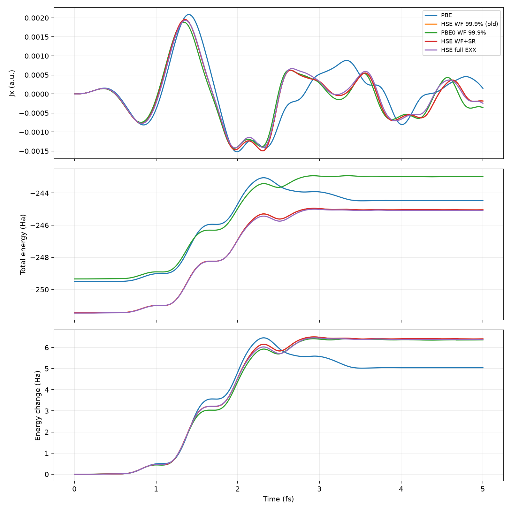
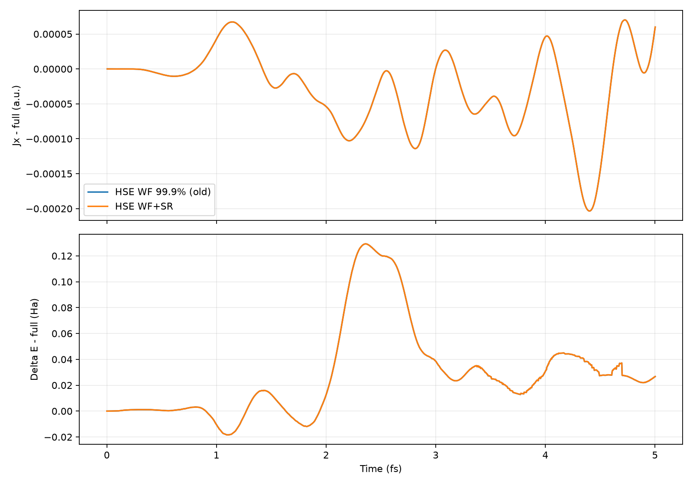
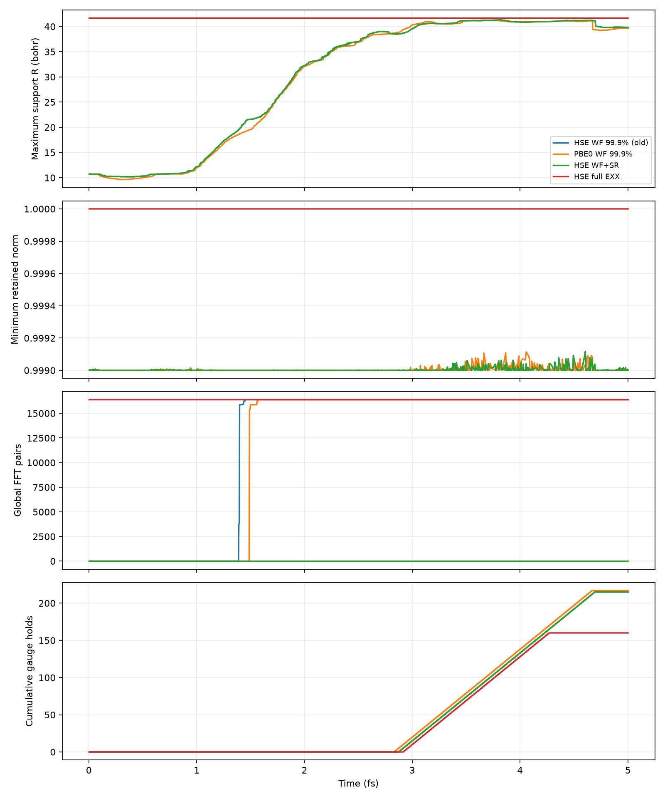
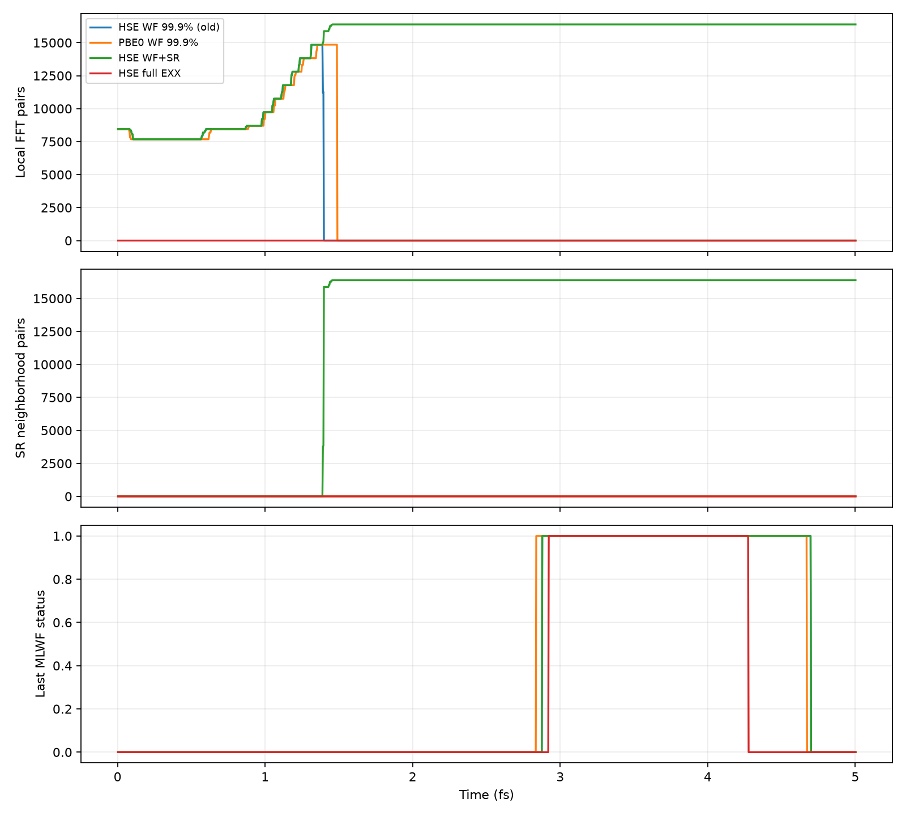
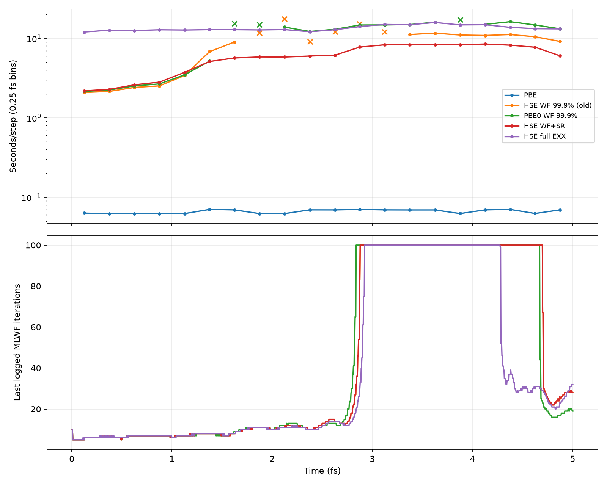

# Si 8×1×1 レーザー励起：5 fs比較と全領域EXX参照

全5条件が1477ステップ（5.001769 fs）を正常終了した。ハイブリッドの全条件でACE拒否は0。全領域EXX参照に対してWF99.9%＋遮蔽併用は約2.26倍速いが、電流Jxの相対L2差は8.57%であり、この強励起条件で99.9%保持を十分な精度と断定できない。

## 条件と比較の意味

Si 64原子、占有128軌道・256電子、8×1×1セル（82.08×10.26×10.26 bohr）、実空間96×12×12メッシュ、DCバッファ6,0,0。MPI8×OMP2、空間分割8×1×1、固定原子、Taylor4、dt=0.14 au。x方向Acos2、3.1 eV、1e13 W/cm²、パルス長4 fs。無外場電流の差し引きなし。

HSE全領域参照とWF＋SRは同一GS・同一バイナリc46fa3d2。全領域参照はWF保持1、radius=0、hse_sr_tolerance=0、exx_local_fft='off'。HSE06本来のerfcカーネルとsource-support ACEを維持する。ACE無効の参照でも、GS/DC・メッシュ・時間刻みの収束参照でもない。SR条件はWF保持.999、radius=0、hse_sr_tolerance=1e-3、局所FFT自動選択。erfc(omega R)=epsilonからR=21.1523 bohr。epsilonは交換エネルギー誤差保証ではない。固定R=10 bohrと対密度打ち切りは本計測から除外した。

## 時間・メモリ

|条件|5 fs壁時計 s|RTタイマー s|RT平均 s/step|GS読込・再構成タイマー s|最大rank RSS MiB|
|---|---:|---:|---:|---:|---:|
|PBE|98.679|98.111|0.06643|0.06855|130.016|
|HSE WF 99.9% (old)|13452.468|13449.000|9.10562|1.86690|235.938|
|PBE0 WF 99.9%|16576.544|16574.000|11.22139|1.80730|245.625|
|HSE WF+SR|8796.807|8794.200|5.95410|1.73910|237.469|
|HSE full EXX|19888.636|19881.000|13.46039|6.37010|193.578|

RT平均はSALMONの最大rank `rt iterations` /1477。旧HSEとPBE0のタイマーには開発中の停止・競合が含まれるので、上表を純粋な汎関数の速度比較としない。開発記録との重複時間（区間を合併）は旧HSE1705.109 s、PBE0 341.857 s。これは停止と競合の両方を含むため、一律に差し引いた値を純RT時間として扱わない。SR・全領域参照には記録された開発負荷との重複なし。未記録のOS・他アプリ負荷は補正していない。

初期化は単一タイマーで完全には分離できない。`reading lda data`はGS読込・再構成等の区間、`rt initialization`は非常に狭い区間であり全準備時間ではない。壁時計−RTは起動・準備・終了等も含む。これらの値をsummary.jsonに個別保存した。タイマーの出力桁数にも限界がある。

同一版のSR対全領域参照は13.4604→5.95410秒/step（2.261倍）。一方、RSSは最大193.578→237.469 MiBへ増加した。この小さい系では局所処理用の作業配列を含む実測ピークが増えており、速度向上と同時のメモリ削減は確認できない。

各rankのピークRSS（MiB、rank0→7）：

- PBE: 128.641, 130.016, 128.781, 127.656, 128.000, 127.734, 129.062, 128.641

- HSE WF 99.9% (old): 235.938, 234.609, 231.234, 233.812, 231.953, 230.156, 233.406, 233.844

- PBE0 WF 99.9%: 244.844, 241.422, 237.344, 240.875, 242.750, 245.625, 240.734, 241.609

- HSE WF+SR: 235.219, 236.875, 235.594, 235.312, 235.469, 237.469, 235.188, 236.688

- HSE full EXX: 193.578, 190.641, 190.781, 192.250, 190.016, 191.438, 190.531, 190.562

## 精度

相対L2差は全1477点について ||Jx−Jx_ref||₂/||Jx_ref||₂。全エネルギーはセル全体のHa単位。異なる汎関数間の差を打ち切り誤差とは呼ばない。

|参照との差|Jx最大絶対差 au|Jx相対L2差|E最大絶対差 Ha|ΔE最大絶対差 Ha|最終E差 Ha|
|---|---:|---:|---:|---:|---:|
|HSE WF 99.9% (old)|0.000203405|8.5707%|0.139857|0.129256|0.0372936|
|HSE WF+SR|0.000203406|8.5710%|0.139872|0.129271|0.0373325|

全領域との初期E差は約0.01060085 Ha。初期値を引いたΔEでも最大0.129271 Haの差が残るので、定数オフセットだけでは説明できない。

SRと旧WF99.9%の差はJx最大7.9721e-8 au、相対L2 2.5068e-5（0.002507%）、E最大2.23617e-4 Ha。全領域との差より小さい。この比較には版差があるため、遮蔽単独の誤差を厳密に分離した試験ではないが、大きな差はWF打ち切りを含む側で現れている。100%と99.9%の軌道の時間発展・ゲージ更新履歴も異なるため、単一時刻の交換作用の誤差だけを測ったものではない。

## WF支持と経路・反復の時間変化

半径はログの**最大支持半径**であり、平均・軌道別の広がりではない。99.9%の半径は初期約10.7 bohrから最大約41.3 bohrへ拡大。100%参照の41.6763 bohr一定は全格子を含む支持を表し、物理的なWF幅が一定という意味ではない。軌道別の自由電子化やVBM近傍だけの非局在化はこのログから判断できない。

旧HSE・PBE0は初期8448局所対から終盤16384全領域対へ移行。SR併用は終盤も16384遮蔽近傍対、FFT窓64×12×12を使用した。全領域参照は全期間16384全領域対。SR併用の高速化は終盤の対数削減ではなく、1対あたりの処理領域等の違いによる。

step時間はログ観測時刻から0.25 fs区間内の最初と最後のステップで計算した区間平均。出力バッファリングがあるため厳密な各ステップ実行時間ではない。開発負荷と重なる区間は実線系列から除外し、未補正値を×印で表示。線は測定点を結んだもので補間実測値を追加していない。MLWF反復・statusは最後に出力されたrefresh値を保持した表示で、全ステップで新たに測定された値ではない。各ステップの全診断はJSONに保存した。ACE拒否は全ハイブリッドで0なので専用のゼロ曲線は省略した。

|条件|ゲージ保持回数|最大電子数ノルム誤差|
|---|---:|---:|
|PBE|0|3.383e-05|
|HSE WF 99.9% (old)|215|4.039e-05|
|PBE0 WF 99.9%|217|4.259e-05|
|HSE WF+SR|215|4.039e-05|
|HSE full EXX|160|3.701e-05|

ゲージ保持は未収束時に受理済み輸送ゲージを維持した回数。旧HSEの963step SIGPIPE停止とは同一原因と断定しない。今回の完了結果にはSIGPIPE再発なし。

## 出自・再現・未検証点

入力・GS・原始ログは `work/si-laser-8x1x1-mesh12` の各folder名（summary.json）を参照。PBEは旧版、HSE WFのみはa4dd8744、PBE0はsalmon-mixed-20260930（ソースpatch込み）、SRと全領域はc46fa3d2。正確なbinary SHA256をsummary.jsonに保存した。PBE0のbase commitだけでは未コミットpatchを表現しないため、latest-followup-binary.jsonとlatest-followup-source.patchも参照する。

集計再現：同じホストで `python3 analyze.py` をこの報告ディレクトリで実行（numpy、matplotlibが必要）。スクリプト内Rは原始データの絶対パス。実行は既存ログを読み取るだけでSALMONを起動しない。summary.json、各条件diagnostics.json、external-load-events.jsonとPNGを保存した。時間軸は1 au=0.024188843265857 fsで換算。

短時間0.488 fsのdt=.08/.14比較は初期安定性の確認であり、5 fsの時間刻み収束保証ではない。全領域参照も同じdt・GS・DC近似・ACEを使う。メッシュ/GS/DCバッファ収束、ACEなし参照、強励起での時間刻み収束、WF保持率の5 fs依存性、同一版WFのみ対SRの厳密比較は未検証。ここでは追加計算を起動せず、上の8.57%差を精度上の制限として記録する。
