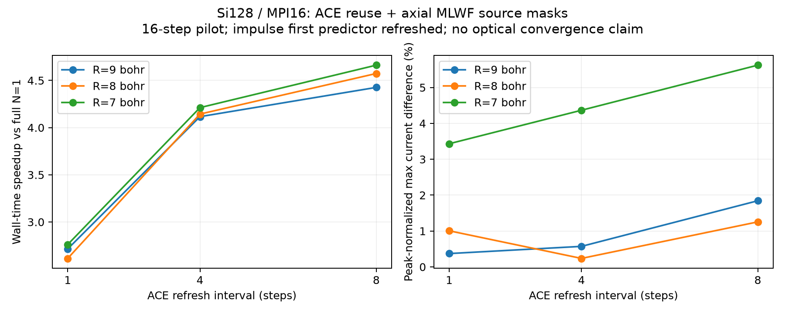

# ACE再利用＋MLWF局所範囲：併用効果

## ACE再利用とMLWF局所範囲を併用した測定（2026-09-26）

Si128・16フラグメント、MPI16/OpenMP1/BLAS1。16ステップ、dt=0.16 a.u.、計0.06192 fs。前回と同じバイナリ・初期状態・初期U・励起強度を使用し、連続性診断を無効にして全9条件を逐次実行した。impulseの最初の予測伝播前には全条件でACEを再構築する。

局所範囲は初期WF中心からの全体系の周期的x距離±R bohr。y,z方向は保持する。交換のソースWFのみを切り、フラグメント全体の周期的FFTカーネルは維持する。FFT格子自体を縮小した試験ではない。密度・Hartree・半局所XC・MLWF位相追跡は継続する。

基準は前回の全範囲・毎ステップ更新（336.73秒、RT部分324.19秒）。全範囲で同じ更新間隔の測定も再利用し、二つの効果を分ける。各条件1回で統計誤差は未測定。

| x半幅 R (bohr) | ACE間隔 N | 全実測秒 | RT部分秒 | 全範囲N=1比の高速化 | 同じNで局所化を加えた高速化 | E∞ (16ステップ) | D_T (16ステップ終端) | 同じRのN=1からの最大差 / 全範囲ピーク |
|---:|---:|---:|---:|---:|---:|---:|---:|---:|
| 9 | 1 | 124.05 | 115.57 | 2.715倍 | 2.715倍 | 0.3718% | +0.3718% | 0.0000% |
| 9 | 4 | 81.81 | 72.86 | 4.116倍 | 1.873倍 | 0.5722% | -0.5722% | 0.9439% |
| 9 | 8 | 76.07 | 66.49 | 4.426倍 | 1.568倍 | 1.8435% | -1.8435% | 2.2152% |
| 8 | 1 | 128.83 | 119.27 | 2.614倍 | 2.614倍 | 1.0062% | +1.0062% | 0.0000% |
| 8 | 4 | 81.26 | 72.31 | 4.144倍 | 1.885倍 | 0.2366% | +0.0477% | 0.9584% |
| 8 | 8 | 73.62 | 64.39 | 4.574倍 | 1.620倍 | 1.2545% | -1.2545% | 2.2606% |
| 7 | 1 | 121.96 | 113.18 | 2.761倍 | 2.761倍 | 3.4325% | -3.4325% | 0.0000% |
| 7 | 4 | 79.95 | 70.73 | 4.212倍 | 1.916倍 | 4.3657% | -4.3657% | 0.9332% |
| 7 | 8 | 72.23 | 63.47 | 4.662倍 | 1.651倍 | 5.6223% | -5.6223% | 2.1898% |

電流差はx電流の全時刻における最大絶対差を、全範囲N=1のピーク電流で規格化したもの。無励起差引き前の比較であり、誘電関数誤差ではない。局所範囲とACE保持の誤差は符号が逆なら相殺し得るため、合計誤差が小さいだけで精度が向上したとは判断しない。

ソースマスクは非変分的な近似で、保持したACEと局所電流の整合性は未検証。今回は速度の実測と短時間の軌道比較に限定し、採用可能な積分範囲・更新間隔は未確定。再利用中の半トレースエネルギーは診断値であり、保存エネルギーの誤差とは解釈しない。

元の1024ステップ計算はプロセスを一時停止して保存し、今回の測定終了後に同じプロセスを再開する。この長時間計算の経過時間には停止時間が含まれるため、そのまま速度比較には使わない。

相殺の実例：8 bohr・N=4の最終時刻では、局所範囲だけによる電流差が +2.783117e-08 a.u.、ACE保持による追加差が -2.651099e-08 a.u.、合計が +1.320178e-09 a.u.となる。これは各時刻の最大差を示す上表とは別の量である。

### 同一定義での評価窓と最終時刻の補助指標

主指標E∞は全時刻の最大差を基準ピークで規格化した量。最終時刻の補助指標D_Tも同じ分母を使う（Jref(T)では割らない）。E∞の8ステップ列は初期範囲比較と評価窓を揃えたものである。

| R (bohr) | N | 実測秒 | 高速化率（16ステップ） | E∞・最初の8ステップ (%) | D_T・16ステップ終端 (%) |
|---:|---:|---:|---:|---:|---:|
| 9 | 1 | 124.05 | 2.715倍 | 0.19196 | +0.37177 |
| 9 | 4 | 81.81 | 4.116倍 | 0.27617 | -0.57215 |
| 9 | 8 | 76.07 | 4.426倍 | 0.96085 | -1.84346 |
| 8 | 1 | 128.83 | 2.614倍 | 0.46714 | +1.00616 |
| 8 | 4 | 81.26 | 4.144倍 | 0.18516 | +0.04773 |
| 8 | 8 | 73.62 | 4.574倍 | 0.68886 | -1.25446 |
| 7 | 1 | 121.96 | 2.761倍 | 0.82320 | -3.43248 |
| 7 | 4 | 79.95 | 4.212倍 | 1.30278 | -4.36568 |
| 7 | 8 | 72.23 | 4.662倍 | 1.97511 | -5.62233 |

