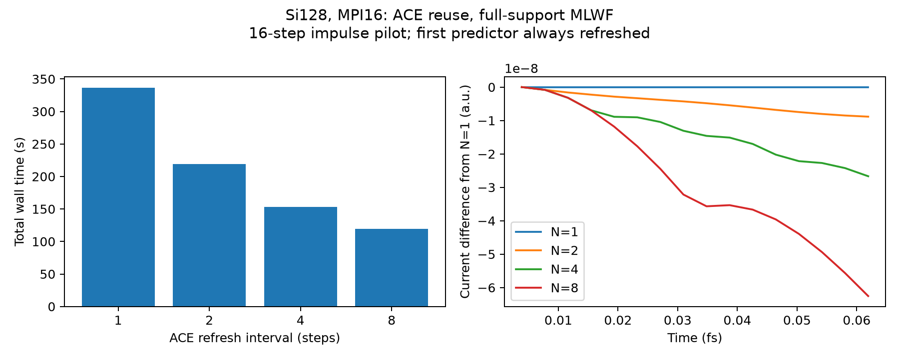

# Si128・16×1×1：MLWF積分範囲の短時間比較

> 過去の測定条件・実装段階を含む時系列記録です。最新の状況・比較表は[統合ノート](../../../DEVELOPMENT_NOTES.md)を参照してください。旧x方向カット、3次元球カット、異なるステップ数の速度比は相互に混在させません。

2026-09-26。実装 `87d3f0d`。MPI16、OpenMP1、BLAS1、計算は逐次実行。

## 条件

Si128、256占有軌道、16フラグメント。既存DC/LCFO初期状態を使用し、再SCFは行っていない。時間刻み0.16 a.u.、8ステップ、合計0.03096 fs、x方向のインパルス1e-4 a.u.。全条件で同じ初期MLWF変換と初期係数を使用。時間発展では前の受理済みWFへの極分解によるU追跡を行う。Hartree・半局所XC・電流・時間積分は既存ルーチンを使用。

範囲は初期WF中心からの**全体系の周期的x距離の半幅**。y,z方向は切らない。マスクは交換のソースWFにのみ適用し、再規格化しない。密度・Hartreeは切らない。

## 結果

| x半幅 (bohr) | 除去したWFノルムの最大割合 | E∞：全時刻の最大差 / 基準ピーク | 非ゼロのフラグメント×ソース数 | 実測秒 | 高速化率（8ステップfull比） | 交換の局所連続性残差 L1最大 (電子/a.u.) |
|---|---:|---:|---:|---:|---:|---:|
| full | 0.0000% | 0.00000% | 4096/4096 | 227.6 | 1.000倍 | 4.0315e-15 |
| 9 | 0.1281% | 0.19196% | 960/4096 | 101.3 | 2.248倍 | 1.0448e-04 |
| 8 | 0.2183% | 0.46714% | 896/4096 | 90.8 | 2.508倍 | 1.3568e-04 |
| 7 | 0.4991% | 0.82320% | 832/4096 | 87.3 | 2.607倍 | 2.0300e-04 |

ソース数は交換ペア数そのものではない。実測時間には初期局在化と毎回の連続性診断が含まれるため、長時間計算での高速化率とは区別する。

## 解釈と未完了事項

fullは交換による局所連続性の打ち消しが丸め誤差程度。有限範囲では全空間の符号付き積分は約1e-17電子/a.u.だが、局所的には相殺しない項がある。したがって、エルミート性と全粒子数保存だけでは光学応答の妥当性は確認できない。

有限範囲の交換は非変分的なソースマスク近似であり、出力するエネルギーは診断量。ここでの電流差には初期状態からの無励起応答も含まれる。次に無励起電流を引き、時間刻み半減・励起強度半減を確認する。

この0.031 fsの計算から誘電関数の収束や許容半径は判断しない。長時間の励起／無励起ペアから同じ窓関数で応答を比較する。有限範囲のスペクトルは、交換電流との整合性が未検証の近似モデルの診断結果として扱う。

[機械可読の測定結果](status.json)

<!-- ACE_REUSE_20260926 -->
## ACEを複数ステップで再利用した測定（2026-09-26）

実装 `a9e3716`。Si128・16フラグメント、MLWF全範囲、MPI16/OpenMP1/BLAS1、16ステップ、dt=0.16 a.u.（合計0.06192 fs）。同じ初期状態・U・励起1e-4 a.u.、1計算ずつ実行。連続性診断は全条件で無効とし、診断コストを含めずに比較。

impulseでは第1ステップの最初の予測伝播前に必ずACEを再構築し、そのステップの予測・修正状態でも更新する。以後は1+N、1+2N…ステップで更新。再利用中も密度・Hartree・半局所XCとMLWFの極分解による位相追跡は継続する。滑らかなレーザーでは初段更新を省き、GS軌道から初期化時に構築したACEを再利用できる（保存済みGSのACE因子の読み込みではない）。

| 更新間隔 N | ACE構築回数 | 全実測時間 s | 全時間の高速化率 | RT部分 s | RT部分の高速化率 | E∞：全時刻の最大差 / 基準ピーク | 診断エネルギー幅 Ha |
|---:|---:|---:|---:|---:|---:|---:|---:|
| 1 | 35 | 336.73 | 1.000倍 | 324.19 | 1.000倍 | 0.00000% | 3.73290e-08 |
| 2 | 19 | 219.16 | 1.536倍 | 203.07 | 1.596倍 | 0.31990% | 1.67213e-04 |
| 4 | 11 | 153.20 | 2.198倍 | 136.51 | 2.375倍 | 0.96453% | 4.29557e-04 |
| 8 | 7 | 119.28 | 2.823倍 | 103.02 | 3.147倍 | 2.26090% | 7.39916e-04 |

旧版と更新間隔1の最初の8ステップの電流差は最大 5.477e-18 a.u.。小規模試験で更新間隔1と既定動作の一致、impulseの予測前更新、レーザー初段再利用、無効間隔の拒否を確認。既存回帰7件とMLWF位相追跡試験も通過。

再利用中の交換エネルギーは、現在の軌道と保持したACEによる半トレースの診断値。瞬時の自己無撞着HSEエネルギーや保存すべき凍結Hamiltonianエネルギーではないため、この幅を物理的なエネルギー保存誤差と解釈しない。

電流差は無励起差引き前の同一初期状態の軌道比較。短時間・各条件1回の測定であり、速度の統計誤差、長時間の誘電関数の誤差、採用可能な更新間隔は未確定。既存の局所連続性診断は交換を再構築した時点を測るものであり、再利用中ACEの連続性を検証したことにはならない。長時間の範囲比較は更新間隔1を基準として維持する。

[ACE再利用の測定データ](../si128-ace-reuse/status.json)

<!-- CURRENT_ERROR_DEFINITION_20260926 -->
## 電流誤差の定義の統一（2026-09-26訂正）

旧版の最初の範囲比較は最終時刻の相対差 `(J(T)-Jref(T))/Jref(T)`、ACE比較は最大差を基準ピークで規格化した量で、指標が不統一だった。最初の表を生データから再計算し、主指標を全表で次に統一した。

- `Jpeak = max_t |Jref(t)|`
- **主指標 `E∞ (%) = 100 max_t |J(t)-Jref(t)| / Jpeak`**（非負）
- 補助指標 `D_T (%) = 100 [J(T)-Jref(T)] / Jpeak`（符号付き）

E∞は「ピーク値同士の差」でも「最終時刻だけの誤差」でもない。D_Tも同じ分母を使い、Jref(T)で割らない。対象はx電流・無励起差引き前である。

各比較は同じ時刻列の全範囲・ACE間隔1を参照する。最初の範囲比較は8ステップ（0.03096 fs）、ACE単独・併用試験は16ステップ（0.06192 fs）。窓が異なるE∞を直接順位比較しない。以下の補助表とcurrent-error-metrics.jsonに評価窓・基準ピーク・最大差の発生時刻も記録した。

| 試験 | 条件 | ステップ数 | 実測秒 | 高速化率 | E∞ (%) | D_T (%) |
|---|---|---:|---:|---:|---:|---:|
| 範囲比較・8ステップ | R=full | 8 | 227.62 | 1.000倍 | 0.00000 | +0.00000 |
| 範囲比較・8ステップ | R=9 | 8 | 101.25 | 2.248倍 | 0.19196 | +0.19196 |
| 範囲比較・8ステップ | R=8 | 8 | 90.77 | 2.508倍 | 0.46714 | +0.46714 |
| 範囲比較・8ステップ | R=7 | 8 | 87.31 | 2.607倍 | 0.82320 | -0.82320 |
| ACE比較・16ステップ | 全範囲・N=1 | 16 | 336.73 | 1.000倍 | 0.00000 | +0.00000 |
| ACE比較・16ステップ | 全範囲・N=2 | 16 | 219.16 | 1.536倍 | 0.31990 | -0.31990 |
| ACE比較・16ステップ | 全範囲・N=4 | 16 | 153.20 | 2.198倍 | 0.96453 | -0.96453 |
| ACE比較・16ステップ | 全範囲・N=8 | 16 | 119.28 | 2.823倍 | 2.26090 | -2.26090 |

高速化率は各試験群の全範囲・N=1を基準とする。8ステップ群は227.62秒（連続性診断あり）、16ステップ群は336.73秒（同診断なし）。異なる群の時間・高速化率を直接比較しない。

<!-- ACE_LOCAL_COMBINED_20260926 -->
## ACE再利用とMLWF局所範囲を併用した測定（2026-09-26）

Si128・16フラグメント、MPI16/OpenMP1/BLAS1。16ステップ、dt=0.16 a.u.、計0.06192 fs。前回と同じバイナリ・初期状態・初期U・励起強度を使用し、連続性診断を無効にして全9条件を逐次実行した。impulseの最初の予測伝播前には全条件でACEを再構築する。

局所範囲は初期WF中心からの全体系の周期的x距離±R bohr。y,z方向は保持する。交換のソースWFのみを切り、フラグメント全体の周期的FFTカーネルは維持する。FFT格子自体を縮小した試験ではない。密度・Hartree・半局所XC・MLWF位相追跡は継続する。

基準は前回の全範囲・毎ステップ更新（336.73秒、RT部分324.19秒）。全範囲で同じ更新間隔の測定も再利用し、二つの効果を分ける。各条件1回で統計誤差は未測定。

| x半幅 R (bohr) | ACE間隔 N | 全実測秒 | RT部分秒 | 全範囲N=1比の高速化 | 同じNで局所化を加えた高速化 | E∞ (16ステップ) | D_T (16ステップ終端) | 同じRのN=1からの最大差 / 全範囲ピーク |
|---:|---:|---:|---:|---:|---:|---:|---:|---:|
| 9 | 1 | 124.05 | 115.57 | 2.715倍 | 2.715倍 | 0.3718% | +0.3718% | 0.0000% |
| 9 | 4 | 81.81 | 72.86 | 4.116倍 | 1.873倍 | 0.5722% | -0.5722% | 0.9439% |
| 9 | 8 | 76.07 | 66.49 | 4.426倍 | 1.568倍 | 1.8435% | -1.8435% | 2.2152% |
| 8 | 1 | 128.83 | 119.27 | 2.614倍 | 2.614倍 | 1.0062% | +1.0062% | 0.0000% |
| 8 | 4 | 81.26 | 72.31 | 4.144倍 | 1.885倍 | 0.2366% | +0.0477% | 0.9584% |
| 8 | 8 | 73.62 | 64.39 | 4.574倍 | 1.620倍 | 1.2545% | -1.2545% | 2.2606% |
| 7 | 1 | 121.96 | 113.18 | 2.761倍 | 2.761倍 | 3.4325% | -3.4325% | 0.0000% |
| 7 | 4 | 79.95 | 70.73 | 4.212倍 | 1.916倍 | 4.3657% | -4.3657% | 0.9332% |
| 7 | 8 | 72.23 | 63.47 | 4.662倍 | 1.651倍 | 5.6223% | -5.6223% | 2.1898% |

電流差はx電流の全時刻における最大絶対差を、全範囲N=1のピーク電流で規格化したもの。無励起差引き前の比較であり、誘電関数誤差ではない。局所範囲とACE保持の誤差は符号が逆なら相殺し得るため、合計誤差が小さいだけで精度が向上したとは判断しない。

ソースマスクは非変分的な近似で、保持したACEと局所電流の整合性は未検証。今回は速度の実測と短時間の軌道比較に限定し、採用可能な積分範囲・更新間隔は未確定。再利用中の半トレースエネルギーは診断値であり、保存エネルギーの誤差とは解釈しない。

元の1024ステップ計算はプロセスを一時停止して保存し、今回の測定終了後に同じプロセスを再開する。この長時間計算の経過時間には停止時間が含まれるため、そのまま速度比較には使わない。

相殺の実例：8 bohr・N=4の最終時刻では、局所範囲だけによる電流差が +2.783117e-08 a.u.、ACE保持による追加差が -2.651099e-08 a.u.、合計が +1.320178e-09 a.u.となる。これは各時刻の最大差を示す上表とは別の量である。

### 同一定義での評価窓と最終時刻の補助指標

主指標E∞は全時刻の最大差を基準ピークで規格化した量。最終時刻の補助指標D_Tも同じ分母を使う（Jref(T)では割らない）。E∞の8ステップ列は初期範囲比較と評価窓を揃えたものである。

| R (bohr) | N | 実測秒 | 高速化率（16ステップ） | E∞・最初の8ステップ (%) | D_T・16ステップ終端 (%) |
|---:|---:|---:|---:|---:|---:|
| 9 | 1 | 124.05 | 2.715倍 | 0.19196 | +0.37177 |
| 9 | 4 | 81.81 | 4.116倍 | 0.27617 | -0.57215 |
| 9 | 8 | 76.07 | 4.426倍 | 0.96085 | -1.84346 |
| 8 | 1 | 128.83 | 2.614倍 | 0.46714 | +1.00616 |
| 8 | 4 | 81.26 | 4.144倍 | 0.18516 | +0.04773 |
| 8 | 8 | 73.62 | 4.574倍 | 0.68886 | -1.25446 |
| 7 | 1 | 121.96 | 2.761倍 | 0.82320 | -3.43248 |
| 7 | 4 | 79.95 | 4.212倍 | 1.30278 | -4.36568 |
| 7 | 8 | 72.23 | 4.662倍 | 1.97511 | -5.62233 |

[併用試験の詳細・生データ](../si128-ace-local-combined/report.md)

<!-- LCFO_RT_OPTIMIZATION_20260926 -->
## WF更新・分散ACE・行列演算の効率化（2026-09-26）

同じSi128・16フラグメント・MPI16/OpenMP1/BLAS1、R=9 bohr、16ステップ、dt=0.16 a.u.で新旧バイナリを逐次比較した。今回は両方とも既存の `&analysis out_rt_energy_step=10` を設定した。密度・Hartree・XC・電流の更新間隔は変更していない。GNU Fortran15/AArch64では従来どおりループベクトル化を無効化した。

変更は、(1) ACE保持中はMLWF係数の位相追跡のみ行い未使用の実空間ソースを作らない、(2) ACEの重なりをMPI集約し担当コアの出力行だけ計算する、(3) 局所Hamiltonianの射影と交換作用の加算を係数空間でまとめて1回だけ再構築する、の3点。B†との積には複素共役転置をBLASへ直接指定し、大きな転置一時配列を避けた。物理近似、初期U、impulse第1ステップでのACE再構築、更新スケジュールは維持した。

| ACE間隔 N | 実装 | 全実測秒 | RT部分秒 | 同一入力・旧実装比の高速化 | E∞ (%) | D_T (%) |
|---:|---|---:|---:|---:|---:|---:|
| 1 | 旧 | 125.55 | 116.71 | 1.000倍 | 0.37177 | +0.37177 |
| 1 | 最適化後 | 117.94 | 108.59 | 1.065倍 | 0.37177 | +0.37177 |
| 4 | 旧 | 67.49 | 59.44 | 1.000倍 | 0.57215 | -0.57215 |
| 4 | 最適化後 | 58.20 | 49.41 | 1.160倍 | 0.57215 | -0.57215 |

E∞とD_Tは既存表と同じ16ステップ窓・全範囲N=1のピークで規格化した無励起差引き前のx電流。高速化率は今回の同じN・同じエネルギー間隔の旧実装を基準（旧時間／新時間）としており、上の全範囲N=1基準の倍率とは異なる。各条件1回の測定で、ばらつきは未評価。

N=1の新旧電流最大差は 9.190e-18 a.u.（基準ピーク比 3.322e-10%）。RT部分のみの高速化は1.075倍。

N=4の新旧電流最大差は 7.970e-18 a.u.（基準ピーク比 2.881e-10%）。RT部分のみの高速化は1.203倍。

N=4のHamiltonian全体の最大ランク時間は24.488秒→16.155秒（1.516倍）。この計時には交換作用・射影に加えて差分演算と擬ポテンシャルも含まれる。

エネルギー計算間隔だけを変えた旧実装との比較：

| N | 旧実装・間隔1（前回）秒 | 旧実装・間隔10（今回）秒 | 参考倍率 |
|---:|---:|---:|---:|
| 1 | 124.05 | 125.55 | 0.988倍 |
| 4 | 81.81 | 67.49 | 1.212倍 |

上の参考倍率は別時点の単回測定であり、エネルギー間隔の効果の厳密な統計評価ではない。今回の最適化速度にはこの間隔変更を混ぜていない。

ACE適用1回のMPI集約要素数は旧1024×256複素数から、通常256×256、中点512×256へ減少（それぞれ1/4、1/2）。各ランクが出力する係数行も1024行から担当64行へ限定した。これは配列寸法からの計算で、通信時間の個別プロファイルではない。再構築・エネルギー評価・位相追跡時の全係数集約は残る。

検証：不均等2+3行分割の複素数ACE試験（ACEランク2/4/6）は従来の密行列作用＋射影と約4e-16で一致。MLWFの位相不変性、予測子巻き戻し、保持中のフレーム追跡、native LCFO RTの間隔1/2/4、impulse/laser再構築規則の回帰試験を通過した。短時間の演算同等性と速度を検証したもので、長時間の誘電関数精度の検証は別途継続する。

追加のCTest 7件（LCFO core、複素DC-LCFO、DC-HSE）も全件成功。コードレビューで重大な指摘はなく、初期化直後の不要な位相輸送は除去した。測定と検証の終了後、停止していた長時間スペクトル計算を元のプロセス・元のバイナリで再開した。長時間計算には今回の最適化はまだ適用していない。

<!-- MLWF_SPHERICAL_SUPPORT_20260926 -->
## WF積分範囲を三次元球状カットへ変更（2026-09-26）

`SALMON_LCFO_RT_RADIUS=R` は、ここから初期WF中心からの三次元周期距離の半径R（bohr）を表す。直交セルで各軸の最小像変位を求め、dx²+dy²+dz² > R² のソースWFをゼロにする。y,z方向も判定に含む。半径0は全範囲、半径がセルの半対角長以上でも全範囲になる。中心はxyzの周期的モーメントから求め、時間発展中は初期中心に固定する。いずれかの軸で中心信頼度が0.1未満なら、そのWF全体を切らずに保持する。

ソースWFと破棄ノルムの診断には同じ三次元判定を使う。密度・Hartreeの範囲、交換カーネル、初期Uの局在化と位相追跡、ACE更新スケジュールは従来どおり。初期診断ファイル `lcfo_mlwf_initial.bin` はversion 2へ更新し、centers(3,no)をFortran配列順で記録する。旧version 1はx中心のみ。linksファイルはversion 1のまま。

検証：異方的な格子間隔を持つセルで、周期境界をまたぐWF、R=1.51、x半セル長を超えるR=4.1、R=0と十分大きなR=9、弱いy中心の保護を確認した。xyz中心と保護フラグのバイナリ保存も検証した。既存の位相不変性、予測子巻き戻し、ACE保持中のWF追跡試験は成功。

MPI2のnative LCFO RT回帰試験も成功。全範囲MLWF経路と基準の最大差は約9.0e-21、十分大きな半径は全範囲と一致し、有限半径では異なる有限応答を確認した。ACE間隔1/2/4、impulse第1予測子前の再構築、レーザー初期ACE再利用も検証した。この試験の16×8×8 bohrセルの半対角長は約9.80 bohrのため、全範囲試験の半径は旧8から10へ変更した。

**これより前のSi128の9/8/7 bohrの表はx方向だけのカットであり、三次元球状カットの速度・精度を表さない。** 三次元版のSi128の速度・電流差・誘電関数はまだ再測定していない。既存の長時間計算は旧バイナリによるx方向カットの比較として保持し、試験終了後に元のプロセスを再開した。

<!-- LCFO_TRACE_OPENMP_20260926 -->
## 分散ACE診断とWFマスクのOpenMP化（2026-09-26）

保持中ACEの診断エネルギーを、全係数のACE作用Wを各MPIランクで再構築する方法から、各ランクのF_local†C_localを集約してそのノルムから求める方法へ変更した。E = -dv/2 Σ_n f_n ||Σ_rank F_local†C_local||² は従来の半トレースと同じ量であり、追加近似はない。診断値は引き続き各refresh時点で計算する。out_rt_energy_stepでこの診断自体を間引いたわけではなく、同じ値の計算方法を軽くした。

三次元マスクをWF列ごとの連続メモリアクセスへ並べ替え、WF間をOpenMP並列化した。格子位置はWFループの外で一度作り、破棄ノルムはWFごとに集計して固定順序で合算する。MPI通信は並列領域の外で行う。局在範囲、球状マスク、保護WF、ACE更新時刻は維持している。

Si128・16フラグメント・三次元球R=9 bohr・ACE間隔4、16ステップ、dt=0.16 a.u.、energy間隔10。同じGSデータ、初期Uと中心、MPI16/OMP1/BLAS1で新旧を逐次比較した。

| 実装 | 全実測秒 | RT部分秒 | 旧実装比の全時間高速化 | E∞ (%) | D_T (%) |
|---|---:|---:|---:|---:|---:|
| 変更前 | 63.63 | 54.85 | 1.000倍 | 0.31977 | +0.31977 |
| 変更後 | 63.52 | 53.78 | 1.002倍 | 0.31977 | +0.31977 |

E∞とD_Tは既存の16ステップ窓・全範囲N=1のx電流ピークで規格化した指標。今回は三次元球の結果であり、以前のx方向カットと区別する。新旧の出力電流と出力エネルギーの最大差はともに0（ファイルの出力精度内）。RT部分は約1.020倍だが、全時間は約1.002倍で、単回測定から明確な高速化とは判断できない。局所範囲とACE保持の誤差は相殺し得るので、この短時間のE∞だけでは誘電関数の精度を保証しない。

このマシンは物理18コア。16フラグメントに必要なMPI16を維持してOMP2にすると32スレッドになるため、Si128の比較ではOMP1とした。追加したOpenMPのスケーリングは、この大系では未測定。BLASも1スレッドに固定した。

検証：分散半トレースは不均等MPI分割・複素数・dv=0.7・分数占有で従来のACE作用と最大2.22e-16の差。球状マスクと2WFの時間追跡をOMP1/2/4で検証し、native MPI2の回帰試験はOMP1/2で成功。同じGSデータを再利用する三次元有限半径のMPI2時間発展では、OMP1対2/4で初期診断ファイルがバイト一致し、出力電流差も0だった。

別々のOMP設定でGSから作り直す比較では、中心の微小差で鋭い半径境界のマスクが変わり、有限半径の電流に最大1.19e-7 a.u.の差が生じた。同じGSを用いた比較では解消したため、今後もスレッド数や速度の比較には同じGS・初期U・中心を使う。マスクは現時点で鋭い切断のままである。

短時間試験終了後、元の長時間計算を旧バイナリのまま再開した。今回の計算は逐次実行し、数値ジョブの同時実行は行っていない。

<!-- LCFO_TWO_LEVEL_MPI_20260926 -->
## フラグメント×軌道の2段階MPI（2026-09-26）

LCFO RTで既存の `icomm_r`（同じ軌道群を持つフラグメント間）と `icomm_o`（同じフラグメント内の軌道群間）を利用する。native波動関数、Hamiltonian作用、時間発展は `io_s:io_e` の担当軌道だけを保持・処理し、密度・Hartree・半局所XC・電流の更新は既存ルーチンを使う。軌道グループ0が各フラグメントの全軌道係数を受け取り、MLWF・交換行列・ACEを一度構築する。構築時だけ交換行列とACE因子を同じフラグメントの他軌道群へ配布する。保持ステップでは因子を再配布しない。

Gamma点・非スピン分極・直交セル・1空間ランク/フラグメントという条件は維持する。全体の交換行列とACE係数因子は各ランクに複製され、再構築担当には全ソースWFが残る。したがって全交換処理の完全分散ではない。DC-HSE基底状態計算のフラグメント内部の軌道MPI制限は今回変更していない。

### Si64・8×1×1比較

通常セル8個を直列配置したSi64、82.08×10.26×10.26 bohr、格子128×16×16、8フラグメント、buffer=8,0,0、LCFO基底64/フラグメント、占有128軌道。共通のDC-HSE基底状態は1148回、密度差9.9821446e-8で収束し、複素LCFO固有方程式残差は2.1988e-16。共通の保存LCFOデータを使い、追加SCFなしでRTを開始した。

三次元球R=9 bohr、ACE間隔4、impulse=1e-4 a.u.、16ステップ、dt=0.16 a.u.、energy出力間隔10。両ケースOMP1/BLAS1、GNU Fortran15/AArch64のループベクトル化無効。数値ジョブは常に1本ずつ実行した。以前キャンセルした長時間Si128計算は再開していない。

MPI8は `nproc_rgrid=8,1,1; nproc_ob=1`、MPI16は `nproc_rgrid=8,1,1; nproc_ob=2`、両方 `nproc_k=1`。MPI16でも `num_fragment` と `nproc_rgrid_tot` は8,1,1のままとする。

| フラグメント×軌道 | MPI | 全実測秒 | RT部分秒 | 全時間高速化 | 最大ランクRSS MiB | ランク別ピーク平均 MiB | 同時合計RSS最大 MiB | E∞ (%) | D_T (%) |
|---|---:|---:|---:|---:|---:|---:|---:|---:|---:|
| 8×1 | 8 | 24.46 | 21.545 | 1.000倍 | 451.4 | 444.7 | 3557.5 | 0 | 0 |
| 8×2 | 16 | 26.93 | 23.602 | 0.908倍 | 402.9 | 284.6 | 4553.2 | 1.734e-10 | +1.734e-10 |

ここでのE∞ = 100 max_t|Jx_MPI16−Jx_MPI8|/max_t|Jx_MPI8|、D_T = 100(Jx_MPI16(T)−Jx_MPI8(T))/max_t|Jx_MPI8|。**比較基準は同じR=9・ACE4のMPI8であり、全範囲ACE1に対する物理近似誤差ではない。** 電流3成分の最大差7.943e-18 a.u.、出力時刻のエネルギー差0（出力精度内）、16ステップ目の密度最大差2.102e-15 a.u.。初期U・中心・占有係数の診断ファイルはバイト一致し、ACE構築11回と全更新時刻も一致した。impulse第1予測子前の再構築を維持している。

RSSは約0.5秒間隔の観測値で、厳密な瞬間ピークではない。ランクごとに複製されるライブラリ・格子配列なども含む。MPI16では8ランクが約397–403 MiB、残る8ランクが約169–171 MiBのピークだったが、PIDだけからランク役割を同定してはいない。最大ランクは約11%減、ピークのランク平均は約36%減、同時合計は約28%増。波動関数1配列のコア部分だけなら、4096点×128軌道×16 byte=8 MiBから4 MiBへ半減する（haloや作業配列を除く）。

この系では全時間は約10%増え、高速化は得られなかった。Hamiltonian全体の最大ランク時間は5.7582→4.0236秒（約1.43倍）へ改善した一方、RT全体は21.545→23.602秒。伝播作用の軌道分割には効果があるが、ソース・ACE再構築を8つの軌道グループ0で行う部分と、新たな群間通信は残る。再構築と通信の寄与の個別計測は未実施で、今回の全時間差の原因割合は断定しない。各条件1回の短時間測定であり、大系・長時間のスケーリングや誘電関数精度は未検証。

### 回帰試験

2フラグメントのMPI2対MPI4を、ACE間隔1/4、有限球R=3、`process_allocation='orbital_sequential'`、滑らかなレーザーで比較した。電流・エネルギー・最終密度・更新時刻を確認し、行数と時刻も照合した。3占有軌道を2+1へ不均等分割する試験では、共通の保存基底を両側で同じように再占有して演算同等性を確認した（この試験はGSの物理精度の評価ではない）。最大差は電流9.632e-15、エネルギー1.022e-14、密度4.902e-14。既存の半時間刻み、全範囲・大半径一致、有限半径応答、連続性診断、restart拒否、impulse/laser更新規則も成功した。2段階MPIでのACE棄却→全交換行列へのフォールバックを意図的に誘発する統合試験は未実施。

## Diamondでの積分半径比較

基本実装を固定してC64・8×1×1、コア16³、dt=0.02 a.u.で比較した。詳細と速度・精度の同一表は[diamondの測定ノート](../diamond64-mlwf-support/report.md)を参照。

## LCFO交換構築の空間分散（2026-09-26）

係数C・輸送後WF・W=HxC・ACE因子を各コアの行だけ保持する形に変更した。近傍フラグメントが必要とする行を通信し、交換作用の寄与を所有ランクへ戻して加算する。全体系Hxの複製も廃止した。輸送のSVDとACEの固有値計算は、128占有軌道以上でScaLAPACKにより分散する。

旧版b1773c78と新コードを同一GS・R9・ACE4・dt=0.16・16ステップ・energy間隔10で逐次測定した。MPI8/16、OMP1、BLAS1。GNU Fortran15/AArch64のループベクトル化を無効化し、同じOpenBLASを使用した。

| 系 / MPI | 旧RT 秒 | 新RT 秒 | RT高速化 | 旧全時間 秒 | 新全時間 秒 | E∞ % | D_T % | 最大ランクRSS 旧→新 MiB |
|---|---:|---:|---:|---:|---:|---:|---:|---:|
| Si64 / 8 | 20.780 | 19.847 | 1.047 | 23.179 | 22.332 | 2.402e-10 | +1.987e-10 | 448.1 → 438.3 |
| Si128 / 16 | 48.339 | 43.238 | 1.118 | 57.800 | 53.412 | 2.622e-10 | +9.463e-11 | 662.0 → 652.1 |

E∞とD_Tは旧版のx電流ピークで規格化。旧新の初期MLWFファイルはバイト一致、ACE構築はどちらも11回。最大電流差は7.26e-18 a.u.、密度差は2.51e-15、出力された全エネルギー差は0。RSSは0.25秒ごとの観測最大値で、厳密なピークではない。単回測定なので数%の差を普遍的な高速化率とはしない。

| 新コードの構築フェーズ合計 秒 | Cの収集 | WF輸送・再構築等 | 交換作用・射影等 | ACE構築 |
|---|---:|---:|---:|---:|
| Si64 | 0.3632 | 1.6412 | 13.2771 | 0.0468 |
| Si128 | 1.0171 | 10.1490 | 21.8347 | 0.3270 |

フェーズ値は各呼び出しの空間ランク最大値を足した診断値で、別々のランクが最大になり得る。初回MLWF最適化もWFフェーズに含む。保持ステップのWF欄には凍結交換のtrace評価を含む。フェーズ合計を全実行時間と同一視しない。

分散化だけで弱スケーリングが解消したわけではない。Si64→Si128の新RT時間比は2.18で、旧版2.33より改善したが1には近くない。残る全占有ソース列のWF再構築、複製されたU・metric・変換行列、初回root MLWF最適化、軌道group0のみの交換構築が制限となる。ACE分解自体は今回の時間の小部分だった。

検証：MPI2/MPI4、129軌道の端数ブロックと密unitary輸送、Halo随伴加算、局所ゼロ・全体ゼロ交換、非正定値/特異ACE棄却、輸送と3D球状切断、native fragment×orbital MPI、impulse初回再構築・レーザー初期再利用を通過した。native全HXへの強制切替は今回追加しておらず、棄却時の直接演算は行列単体テストで検証している。

## Diamondの半径依存性：詳細な解釈

全範囲から8 bohrで約1.61倍、6 bohrで約1.86倍となり、誘起電流のE∞はそれぞれ0.0183%、0.0758%。4 bohrでは約2.11倍だが0.647%、3 bohrは約1.97倍で1.65%、2 bohrは約2.35倍で1.96%となった。3 bohrと4 bohrでは非ゼロソース数が同じ384/1024で、ソース数の削減は起きていない。速度差には単回測定の変動も含まれると考えられる。

| 半径 bohr | 誘起電流 E∞ % | 高速化 | 無励起電流の最大値 a.u. | 基準誘起電流ピークに対する無励起電流 % |
|---|---:|---:|---:|---:|
| 全範囲 | 0 | 1.000 | 1.773192e-07 | 1.680 |
| 8 | 0.0182954 | 1.615 | 1.550441e-07 | 1.469 |
| 6 | 0.0757775 | 1.862 | 2.309800e-07 | 2.188 |
| 4 | 0.646991 | 2.111 | 2.510289e-06 | 23.779 |
| 3 | 1.65013 | 1.969 | 3.404243e-06 | 32.247 |
| 2 | 1.95983 | 2.355 | 1.031013e-05 | 97.665 |

無励起電流は初期状態と時間発展演算子のずれを含む診断で、誘起応答では各半径に対応した無励起計算を差し引いている。4 bohr以下ではこの背景電流が大きくなる。差し引き後のE∞だけが小さくても、生の電流や定常性まで同じ精度になったとは言えない。密度差を織り込み済みとして、そのままRTした条件を維持した結果である。

初期WFの外側ノルム平均は8/6/4/3/2 bohrで0.02634/0.10697/1.1102/4.2712/13.3871%。99/99.9/99.99%を含む半径のWF中央値は4.157/6.065/8.864 bohr、最大は4.158/6.072/8.910 bohr。保護WFは0/128で、今回のノルム解析では全WFが実際に切断の対象になった。

したがって、今回の短時間スクリーニングでは6 bohr付近が次の精査に使う自然な候補である。8 bohrを高精度側の比較点として残し、4 bohr以下を単に高速という理由で採用しない。これは16³/コア・Γ点・細長い周期セル・総時間1.28 a.u.での傾向であり、長時間誘電応答の許容半径の確定ではない。全範囲でdtを半分にした差0.000403%は、今回の半径差より小さい。

初期ノルムの照合はSALMONのES14.6出力（有効7桁）に丸めて一致を確認した。2 bohrの再構築値0.133870534…と表示値0.1338705の差は表示丸めによる。

[全条件・WFノルム表・図・入力を含むdiamond測定ノート](../diamond64-mlwf-support/report.md)

### 電流の時間依存性と実装上の切断範囲

今回の全半径では誤差最大が観測最終時刻に現れたため、表のE∞と|D_T|が一致する。定義を同じにしたのではなく、この短時間軌道で一致した結果である。長時間では一般に一致しない。

半径は三次元最小像距離によるソースWFのマスクである。現実装ではフラグメントのFFT格子32×16×16そのものは半径で縮めない。非ゼロソース×対象基底について同じ大きさのFFTを行い、ソース全体がゼロなら省略する。そのため4→3 bohrのように非ゼロソース数が変わらない区間では、ノルムをさらに捨てても交換FFT数を減らせない。

## Diamond：8×1×1→16×1×1の弱スケーリング

分散化実装33dbea5aを固定し、C64/8 MPIとC128/16 MPIを逐次比較した。通常セルをx方向へ並べ、各フラグメントは8原子、コア16³、buffer=8,0,0、FFT領域32×16×16、格子間隔0.42 bohr。dt=0.02 a.u.、16ステップ、ACE1、energy出力間隔40、密度出力は最終16ステップ。全範囲と6 bohrを同じ条件で計算した。性能測定用の短い区間であり、上の64ステップの半径精度試験とは別の試験である。

C64の収束済みGSを再利用し、C128は同じDC-HSE条件で新規SCFを行った。両方とも閾値1e-7を満たしたLCFO初期状態から、追加の全体系SCFを挟まず時間発展した。各サイズ内の全範囲/6 bohrで初期MLWFファイルは一致した。

OMP1/BLAS1。18物理コアの単一ホストMac17,9上でMPI8→16とした。OSの性能クラスは6コア＋12コアであり、異機種ノードを増やすクラスタ弱スケーリングとは区別する。前の半径試験はOMP2・旧実装だったので、そちらの秒数をこの比較の分母に流用していない。

| 半径 | 系 / MPI | 全時間 秒 | RT 秒 | RT 秒/step | RT以外 秒 | 最大ランクRSS MiB | 初期非ゼロソース/fragment | 最大破棄ノルム % |
|---|---|---:|---:|---:|---:|---:|---:|---:|
| 全範囲 | C64 / 8 | 108.283 | 104.530 | 6.5331 | 3.753 | 437.7 | 128.00 | 0 |
| 6 bohr | C64 / 8 | 60.439 | 57.684 | 3.6052 | 2.755 | 438.2 | 60.00 | 0.106967 |
| 全範囲 | C128 / 16 | 321.269 | 304.010 | 19.0006 | 17.259 | 644.9 | 256.00 | 0 |
| 6 bohr | C128 / 16 | 111.497 | 100.370 | 6.2731 | 11.127 | 650.2 | 60.00 | 0.107011 |

RT以外には入力・初期化・初回MLWF構築・I/O等を含む。RSSは0.25秒間隔の観測最大値。単回測定。原子数とMPI数を同時に2倍とする弱スケーリングなので、理想RT時間比は1で、効率η=100 T8/T16。2 T8/T16は系全体の処理量の増加率で、効率そのものではない。

| 半径 | RT時間比 T16/T8 | 弱スケーリング効率 % | 原子数込みの処理量比 2T8/T16 | 全時間比 |
|---|---:|---:|---:|---:|
| 全範囲 | 2.9084 | 34.38 | 0.6877 | 2.9669 |
| 6 bohr | 1.7400 | 57.47 | 1.1494 | 1.8448 |

| 系・半径 | 初回 C収集 / WF / 交換 / ACE 秒 | 初回以外 C収集 / WF / 交換 / ACE 秒 | ACE構築回数 |
|---|---|---|---:|
| C64・全範囲 | 0.011 / 0.713 / 2.459 / 0.005 | 0.337 / 1.859 / 95.684 / 0.161 | 35 |
| C64・6 bohr | 0.011 / 0.743 / 1.364 / 0.006 | 0.360 / 2.622 / 47.967 / 0.166 | 35 |
| C128・全範囲 | 0.032 / 7.655 / 8.345 / 0.030 | 0.915 / 5.314 / 278.583 / 0.777 | 35 |
| C128・6 bohr | 0.028 / 7.723 / 2.049 / 0.034 | 0.977 / 7.845 / 71.477 / 1.068 | 35 |

各フェーズ値は呼び出しごとの空間ランク最大時間の合計であり、RT全時間の厳密な加算分解ではない。初回MLWF最適化を初回欄へ分けた。

| 系 | 占有軌道数 | 局所C行数 | 全C行数 | Halo行数 |
|---|---:|---:|---:|---:|
| C64 | 128 | 64 | 512 | 192 |
| C128 | 256 | 64 | 1024 | 192 |

固定しているのは原子数・実空間格子点数／フラグメントである。この試験はnproc_ob=1なので、ランクごとの占有軌道列数は128→256に増える。局所C行・Halo行が固定でも、全占有軌道のWF再構築、C†C等の軌道行列、ACE作用やnative軌道更新の仕事量は固定ではない。U・metric・変換行列はまだ全ランクに複製されている。ScaLAPACKは分解を分散するが、これらのサイズ増加そのものはなくさない。

全範囲の場合は各フラグメントの非ゼロソース数も系サイズとともに増える。6 bohrでこの数が抑えられているかを上表で確認し、交換部分とWF/ACE部分を分けて評価する。この測定だけでNに対する漸近次数やクラスタでの効率を確定しない。

[弱スケーリング測定データ](../diamond64-mlwf-support/weak-scaling-summary.json) / [C128 GS収束情報](../diamond64-mlwf-support/weak-scaling-gs128.json)

## WF再構築の第1段高速化：必要な列を先に選択

実装：[c9abacb9](https://github.com/SALMON-TDDFT/SALMON2/commit/c9abacb94f97da483b6693804af3fbe4ca1f07fa)。既存の球状マスクを先に評価し、フラグメントと交わるWF列だけを実空間へ再構築する。中心・半径・protected判定はRT中固定なので、点ごとのマスクもキャッシュする。遠方の全ゼロソース列を交換ループから除外する。保護対象WFは常に残す。

ノルム診断は、全WFをコア格子上へ再構築して外側ノルムを足す方法から、全ノルム−保持ノルムへ変更した。全ノルムはtrace(F† G F)、G=B†Bを一度作って使用する。Gを単位行列と仮定しないので、複素・非直交基底にも成り立つ。切断条件と交換演算は数学的に同じで、新しい物理近似は導入していない。極小の破棄ノルムでは差し引きの丸めがあるため、機械精度付近の値に意味を持たせない。

測定は直前のC64/8 MPI・C128/16 MPI、6 bohr、16³コア、dt=0.02、nt=16、ACE1、OMP1/BLAS1、同じGSで比較した。WF時間は初回を除いたWFフェーズの合計。密なU輸送・係数回転は今回も同じ処理を行う。

| 系 / MPI | WF 秒 旧→新 | WF高速化 | RT 秒 旧→新 | RT高速化 | E∞ % | D_T % |
|---|---:|---:|---:|---:|---:|---:|
| C64 / 8 | 2.6216 → 1.2369 | 2.120 | 57.684 → 56.595 | 1.019 | 3.693e-11 | +3.693e-11 |
| C128 / 16 | 7.8446 → 2.7070 | 2.898 | 100.370 → 94.138 | 1.066 | 2.082e-11 | -1.231e-11 |

この表の誤差は、同じ6 bohrの旧実装の生のx電流ピークで規格化した実装一致の測定である。前の「全範囲に対する誘起電流の切断誤差」とは比較対象が異なる。初期U/係数のファイルはバイト一致、最大電流差3.90e-18 a.u.、密度差2.00e-15。出力エネルギーと7桁表示の破棄ノルムは一致し、ACE構築は両方35回。

| 系 | 旧再構築列 | 新フラグメント再構築列 | 新コア診断列 | 初回WF処理 秒 |
|---|---:|---:|---:|---:|
| C64 | 128 | 60 | 44 | 0.6975 |
| C128 | 256 | 60 | 44 | 7.0302 |

最適化後の6 bohrの弱スケーリング効率は60.12%（旧57.47%）。局所WFの実空間再構築列数を系サイズから切り離せた一方、全RTの改善はC64で約2%、C128で約6.6%にとどまる。交換処理とnative軌道更新も依然として重い。

### 大規模化に残るWFの課題

係数フレームC_local Uは依然として全占有列を持ち、U・重なりmetric・変換行列は密である。今回一定にしたのは実空間再構築の列数であり、U輸送や全データ量を線形スケーリングに変えたわけではない。初回のroot MLWF最適化もC128で約7秒残る。マスク初期化の一時配列も全WF列を含む。

次の優先順位は、必要WF列に限定したHalo通信と初期マスク判定の省メモリ化、続いて密なU輸送・局在化そのものの見直しである。後者を局所ブロックや低頻度更新に置き換える場合はゲージの追跡精度が変わり得るので、電流、ノルム、交換演算のエルミート性、長時間応答を別に検証する。現状の小系でWFだけを減らせば全時間も同じ倍率で速くなる、とは言えない。

参考設計として、PTゲージでの時間積分とACEを組み合わせた先行研究がある。[Jia and Lin, CPC 240 (2019), 21–29](https://doi.org/10.1016/j.cpc.2019.02.009)。現在のコードは交換ソース用にpolar輸送したUを使う一方、nativeの時間発展器を維持しており、このPT時間積分法そのものの実装ではない。文献の高速化率を今回へ直接適用したり、PTだけで疎な局所WF演算が保証されると解釈したりしない。

[WF最適化の測定データ](../diamond64-mlwf-support/wf-active-summary.json)

## WF通信の第2段最適化：必要な列だけを交換

実装：[35d1d38e](https://github.com/SALMON-TDDFT/SALMON2/commit/35d1d38e0a21f2ffba38e1f984bdebbfbf14a1df)。

フラグメントに必要なWF列番号を初回に共有し、その後は既存の行Haloに必要列だけを載せて通信する。列番号と送受信バッファを保存し、受信したコンパクトな係数から直接WFを再構築する。U、中心、球状マスク、protected判定、コア全ノルム診断は同じで、追加の物理近似はない。列の要求集合・行Halo・占有数が変わる場合は通信計画の作り直しが必要。現在のRTではいずれも固定。

前節の実装c9abacb9を保存したバイナリと今回の実装を、C64旧→新→C128旧→新の順に一件ずつ実行した。同じGS、R6、core16³、dt=0.02、nt=16、ACE1、OMP1/BLAS1、ループベクトル化無効。以下の旧時間は今回測り直した値であり、前節の測定値と混在させない。各条件1回なので小さな時間差に統計的有意性は主張しない。

| 系 / MPI | WF 秒 旧→新 | WF高速化 | RT 秒 旧→新 | RT高速化 | E∞ % | D_T % |
|---|---:|---:|---:|---:|---:|---:|
| C64 / 8 | 1.2069 → 1.2237 | 0.986 | 56.062 → 57.873 | 0.969 | 3.125e-11 | +1.137e-11 |
| C128 / 16 | 2.6375 → 2.5944 | 1.017 | 100.290 → 99.992 | 1.003 | 4.073e-11 | -2.368e-11 |

WF時間は初回を除くWFフェーズの合計で、通信単独のタイマーではない。E∞・D_Tは同じ6 bohrの旧実装の生のx電流ピークで規格化した実装一致の指標であり、全範囲計算に対する切断誤差ではない。

| 系 | 各ランクのWF列 旧→新 | 各ランク受信値数 旧→新 | 削減率 |
|---|---:|---:|---:|
| C64 | 128 → 60 | 24576 → 11520 | 53.12% |
| C128 | 256 → 60 | 49152 → 11520 | 76.56% |

値数は1回のソース構築当たりの複素倍精度数で、自己ランク分を含むMPI Alltoallvの受信配列サイズである。通信相手・Halo行数は変えない。ネットワーク越しの転送量だけを直接計測した数字ではない。

初期MLWFファイルは全ケースでバイト一致。電流の最大絶対差は4.301e-18 a.u.、密度差は1.998e-15、エネルギー差は0.000e+00、表示上の破棄ノルム差は0.000e+00。

今回の同条件測定の弱スケーリング効率η=T(C64,MPI8)/T(C128,MPI16)は、旧55.90%→新57.88%。通信量は確実に減るが、密なU輸送、全占有係数の回転、初回のroot MLWF最適化、交換計算は残るため、全RTが通信削減率に比例して速くなるわけではない。

検証：列通信のMPI2/4テスト（ランクごとに異なる列順、重複要求、ゼロ局所行、空要求、全列、繰り返し使用）、複素非直交基底でのcompact再構築、OMP1/2/4の輸送・3Dマスク、nativeのフラグメント×軌道MPI2/4、ACE1/2/4、impulse/laser、不均等軌道分割を通過。

[WF列通信の測定データ](../diamond64-mlwf-support/wf-column-summary.json)

今回の小規模な共有メモリ機上では、通信量削減による明確なRT高速化は確認できなかった。C64は約3.2%遅く、C128は約0.3%速いだけで、各1回の測定から性能向上とは判断しない。WFフェーズもC64は1.207→1.224秒、C128は2.638→2.594秒でほぼ同じ。C128の交換フェーズは約75.6秒とRT全体の約76%を占める（フェーズごとの最大値の合計なので厳密な分解ではない）。当面の全体速度では交換処理が支配的であり、今回の意義はWF通信・バッファの系サイズ依存を抑えたことにある。別ノード間の通信効果や、さらに大きな系での効果は未測定。

## ノード間比較の準備（未測定）

比較入力と[測定手順](../diamond64-mlwf-support/multinode/README.md)を保存した。C128・16 MPIを1ノードと2ノードで比較し、続いてC64・8 MPIとの弱スケーリングを測る。ユーザー指定により複数ノード試験は別途扱いとして保留。未投入・未測定。ノード内の結果からノード間の高速化率を推定値として掲載しない。

## 交換FFTの削減：厳密ゼロのペアを除外

実装：[beccb272](https://github.com/SALMON-TDDFT/SALMON2/commit/beccb2724fc5477940ff94a0ef6efcdbcd4aa971)。

各ソースWFと対象LCFO基底の積（ペア密度）が全格子点で厳密にゼロの場合、そのペアの順・逆FFTと交換作用の加算を省く。非ゼロの値に閾値を設けない。非常に小さい非ゼロ値も従来通り扱い、U、球状マスク、HSEカーネル、ACEスケジュールを変更しない。ペア積を作る前に対象軌道全体の絶対値を毎回走査していた処理も不要になった。

交換の畳み込みが非局所でも、入力ペア密度がゼロならその畳み込み結果はゼロである。この省略は追加の物理近似ではない。各スレッドのFFTバッファと64bit reductionでペア数を集計し、ソースの加算順は維持する。

比較は直前の35d1d38eを保存したバイナリと新実装。C64旧→新→C128旧→新の順で、一度に一つだけ実行した。共通GS、6 bohr、core16³、dt=0.02、nt=16、ACE1、OMP1/BLAS1、GNUループベクトル化無効。各条件1回の測定。交換時間は初回を除く交換フェーズの合計で、投影・通信も含む。

| 系 / MPI | 交換 秒 旧→新 | 交換高速化 | RT 秒 旧→新 | RT高速化 | E∞ % | D_T % |
|---|---:|---:|---:|---:|---:|---:|
| C64 / 8 | 47.321 → 34.274 | 1.381 | 55.846 → 42.923 | 1.301 | 3.977e-11 | -1.895e-11 |
| C128 / 16 | 72.940 → 46.706 | 1.562 | 96.865 → 71.234 | 1.360 | 2.272e-11 | +2.272e-11 |

E∞=100 max|J新−J旧|/max|J旧|、D_T=100(J新(T)−J旧(T))/max|J旧|。同じ6 bohrの旧実装の生のx電流を基準にした実装一致の誤差であり、全範囲に対する局所積分誤差とは別。

| 系 | 1ランク・1構築の実行／候補ペア範囲 | 全構築の候補数 | 実行数 | FFTペア削減率 |
|---|---:|---:|---:|---:|
| C64 | 7424–7424 / 11520–11520 | 3225600 | 2078720 | 35.56% |
| C128 | 7424–7424 / 11520–11520 | 6451200 | 4157440 | 35.56% |

ペア数は初回を含む35回の構築・全フラグメントを合計。各実行ペアには順・逆の2FFTがある。候補はソース数×対象基底数×並進セル数で、旧実装にも全ゼロのソース／対象を省く処理はあったため、一般には候補数を旧実行数と同一視しない。今回のLCFO基底と非ゼロソースの設定では、相互に支持が重ならない組を追加で除外する。

初期MLWFファイルはバイト一致。最大電流差4.200e-18 a.u.、密度差1.998e-15、出力エネルギー差0.000e+00、表示上の破棄ノルム差0.000e+00。

今回のRT時間から求めた弱スケーリング効率は旧57.65%→新60.26%。全体の高速化と弱スケーリング効率は別の指標であり、両サイズが速くなっても比が必ず改善するわけではない。

直接DFTで構成した周期畳み込みとの複素作用比較、離れた支持、全ゼロ、極小非ゼロ、エルミート性、OMP1/2/4、K点・分数占有・ACEの既存テスト、native MPI2/4の時間発展・ACE1/2/4・impulse/laser・不均等軌道分割を検証した。複数ノード試験はユーザー指定により保留し、本測定には含めていない。

[厳密ゼロペア除外の測定データ](../diamond64-mlwf-support/exchange-exact-pair-summary.json)

## FFTまとめ処理と非ゼロブロック投影

実装：[19b9333c](https://github.com/SALMON-TDDFT/SALMON2/commit/19b9333c53fe6eb8f23670714409bc481b8f05bd)。

交換FFTは、各スレッドが非ゼロのペア密度を少数列ずつ詰めてFFTW plan_manyで処理できるようにした。実際の非ゼロ列数ごとのplanを保存し、端数も余分なゼロFFTなしで処理する。ソース加算順、HSEカーネル、正規化、厳密ゼロ判定は維持する。

一方、現在のマシンではまとめても速くならなかったため、**既定のまとめ幅は1**を維持した。LCFO RTで試す場合だけ `SALMON_LCFO_RT_FFT_BATCH=4` などで1〜32を指定できる。小さい問題や複数スレッドでは実効幅をtarget数／worker数に応じて縮める。ログのwidthは実効幅、callsは順逆2回を一組とした実行数である。

### FFT単独の比較

32×16×16格子、60source、192target、複素合成データと局所支持を用いた小試験。各幅の計時前にwarm-up、1→4→8→8→4→1→4の順に測定。OMP1/BLAS1、GNU O2・ループベクトル化無効。これは実RTの入力データではなく、サイズと支持構造を合わせた性能試験。

| 要求幅 | 1作用の時間中央値 秒 | 測定範囲 秒 | 実行ペア数 | 順逆FFT呼び出し組数 |
|---|---:|---:|---:|---:|
| 1 | 0.437292 | 0.435057–0.439528 | 7424 | 7424 |
| 4 | 0.445675 | 0.442243–0.446069 | 7424 | 1856 |
| 8 | 0.444030 | 0.443672–0.444388 | 7424 | 928 |

この試験では作用の差は表示上0。幅4/8の呼び出し数は減るが、処理時間は幅1よりわずかに長い。別CPUやFFTライブラリでの効果は未測定であり、バッチ化を一律の高速化とは扱わない。

### 投影の変更

従来の `scale B_core† action` はゼロ領域も含めて計算していた。固定B_coreの非ゼロ行・列だけを保存し、小さい行列積の結果を元の位置へ配置してから同じエルミート平均を取る。閾値は設けず、複素・非直交基底をそのまま扱う。

今回のフラグメントでは8192格子点・192列の基底から、コア4096格子点・64列だけを左側の投影に使用する。主要な行列積の演算量は1/6となる。全投影行列の192×192という出力サイズや、右側の対象192列を切り捨てたわけではない。

同サイズの複素合成データによる投影単独試験（3組、各10回平均）では、密な投影0.0509657秒→compact投影0.0082957秒、各組の速度比6.11〜6.27倍。最大行列要素差は7.105e-14。

GNU Fortran15/AArch64のO2＋external BLASでは、ベクトル添字付き出力へのMATMUL直接代入が、非ゼロ列の減ったテストでSIGBUSを起こした。O0またはexternal BLASなしでは通った。連続配列へ行列積を受けてから行を配置する形に変更し、O2/O3＋BLASを維持して検証した。過去のループベクトル化無効フラグは引き続き維持している。

### Diamond RTでの比較

同じGS・R6・core16³・dt=0.02・nt16・ACE1・OMP1/BLAS1。直前のbeccb272と今回の既定値（FFT幅1）をC64旧→新→C128旧→新の順で一件ずつ測定した。各条件1回。比較は非ゼロブロック投影と今回の既定実装全体の効果であり、幅4/8による効果ではない。

C64変更後の測定中、別のSALMONジョブはなかったがfileproviderd・OneDrive・suggestdなどのCPU使用を確認した（1時点の観測）。今回の基準時間も過去の測定から変化しているため、下表は負荷を排除した確定的な高速化率ではない。過去の時間とは混ぜず、今回の前後を記録する。

| 系 / MPI | 交換 秒 旧→新 | RT 秒 旧→新 | 高速化率 | E∞ % | D_T % |
|---|---:|---:|---:|---:|---:|
| C64 / 8 | 93.676 → 90.768 | 113.040 → 110.360 | 比較不採用 | 4.547e-11 | +1.609e-11 |
| C128 / 16 | 84.108 → 35.783 | 285.550 → 57.364 | 比較不採用 | 4.545e-11 | +3.882e-11 |

交換時間は初回を除いたフェーズのrank最大値の合計。E∞とD_Tは同じR6の旧実装の生のx電流ピークで規格化し、全範囲に対する切断誤差とは分ける。

| 系 | 新実装の作用 秒 | 新実装の投影 秒 |
|---|---:|---:|
| C64 | 89.6551 | 1.0732 |
| C128 | 35.2053 | 0.5296 |

詳細時間も初回を除く。作用時間にはFFTのほかsource変換・作用の加算などを含む。各フェーズのrank最大を別々に足すため、全wall時間の厳密な分解にはならない。旧実装に同じ詳細タイマーがないため、この表から投影の実RT高速化率だけを逆算しない。

初期MLWFファイルは全ケースでバイト一致。最大電流差5.763e-18 a.u.、密度差1.998e-15、出力エネルギー差0.000e+00、表示上の破棄ノルム差0.000e+00。

C128の基準実行の前半では未変更のU輸送が約12〜14秒／構築、ACEが約8秒／構築に伸び、その後の変更後実行ではサブ秒へ戻った。基準バイナリのSHA256は前回の検証済みバイナリと一致している。原因は未確定だが、実装以外の実行条件の変化が大きいため、この前後比をコード高速化率として採用しない。C64とC128の負荷条件も揃わないため、今回の弱スケーリング効率は評価しない。正しい精度比較と小試験の結果は別に保存する。

検証：直接DFTからの畳み込み参照、12targetの全重なりと端数、要求幅1〜8、OMP1/2/4、ゼロ・微小非ゼロ、エルミート性、複数K点・分数占有、native MPI2/4・ACE・impulse/laser・不均等軌道分割、RT幅4の軌跡一致と無効幅の拒否。投影は複素・非直交・飛び飛びのゼロ行列・全ゼロを検証。静的レビューでFFTW stride、cache破棄、OMP分離、scaleとHermitizeを確認。

[測定データ](../diamond64-mlwf-support/batch-projection-summary.json) / [FFT小試験](../diamond64-mlwf-support/fft-batch-benchmark.txt) / [投影小試験](../diamond64-mlwf-support/projection-benchmark.txt)

## 負荷を確認した再計測（開始待ち）

[再計測手順](../diamond64-mlwf-support/controlled-timing-protocol.md)を固定し、実行ファイルと入力を同期対象外へ移した。開始前120秒の確認でも計算外CPU負荷が135〜314%で、計算は投入していない。新しい時間や高速化率はまだ未測定。

## 2026-09-27：条件をそろえた投影最適化の再計測

変更前beccb272と変更後19b9333cを同じGNU Fortran15・Release/O3・外部BLAS・ループベクトル化無効・MPI/ScaLAPACK設定でクリーンビルドした。実行ファイルとGS/入力は同期対象外の/private/tmpへコピーしてSHA256を保存した。CPU固定はmacOS/hwlocが非対応のため行えず、MPIのmap-by slot・bind-to none・oversubscribe禁止を明示した。

共通条件はDiamond R6、core16³、dt=.02、nt16、ACE1、FFT幅1、OMP1/BLAS1。C64/MPI8とC128/MPI16を、旧→新、新→旧の順を交替して各3回（計12回）逐次実行した。低負荷を待つ開始条件は測定0件の時点で撤廃し、各実行前と実行中の背景負荷を記録した。遅いWF/ACEフェーズも除外せず集計した。他のアプリは停止していない。初回の負荷確認ではSpotlight等が高く、開始せず待機してから再開した。

開始前に決めた安定性条件は、各版3回のRT時間の範囲が中央値の10%以内、未変更WFフェーズの前後中央値比が0.8〜1.25、背景CPU中央値の前後差が50ポイント以内。開始上限は100%から200%へ修正したが成立せず、ユーザーの指示により待機条件を撤廃した。これを満たしても統計的有意性を証明するものではない。下表の範囲は実測の最小〜最大で、信頼区間ではない。

| 系 / MPI | 旧RT 中央値［範囲］秒 | 新RT 中央値［範囲］秒 | 中央値の速度比 | 安定性条件 |
|---|---:|---:|---:|---|
| C64 / 8 | 42.980 [41.729–47.326] | 41.956 [40.557–45.073] | 1.024 | 不通過・速度比は参考のみ |
| C128 / 16 | 69.033 [64.313–70.668] | 66.004 [57.666–66.629] | 1.046 | 不通過・速度比は参考のみ |

| 系 | 旧交換 中央値 秒 | 新交換 中央値 秒 | 交換速度比 | 旧／新WF 中央値 秒 |
|---|---:|---:|---:|---:|
| C64 | 34.9974 | 33.6240 | 1.041 | 1.2016 / 1.2142 |
| C128 | 45.5916 | 42.6980 | 1.068 | 2.4536 / 2.3502 |

| 系 | 1組目 旧/新 | 2組目 旧/新 | 3組目 旧/新 | 最大E∞ % |
|---|---:|---:|---:|---:|
| C64 | 1.0244 | 1.0500 | 1.0289 | 7.577e-11 |
| C128 | 1.1153 | 1.0459 | 1.0606 | 8.619e-11 |

全6組で新版のRT時間が短かった。ただし実行間のばらつきが事前基準を超えており、速度比はこの通常負荷下での参考値とする。旧版を基準にした中央値の時間短縮率はC64で2.38%、C128で4.39%。CPU競合、コア配置、温度等の影響をこの測定から分離することはできない。

交換・WFは初回構築を除く34構築の各フェーズのrank最大値を合計した値。全RTの厳密な内訳ではない。FFT幅は両方1なので、これはバッチ幅4/8の高速化測定ではない。

| 系 | 最大電流差 a.u. | 最大密度差 | 最大出力エネルギー差 | 最大E∞ % | 最大絶対D_T % |
|---|---:|---:|---:|---:|---:|
| C64 | 8.001e-18 | 1.055e-15 | 0.000e+00 | 7.577e-11 | 6.250e-11 |
| C128 | 9.101e-18 | 1.998e-15 | 0.000e+00 | 8.619e-11 | 8.429e-11 |

E∞とD_Tは対応する旧版の生のx電流ピークで規格化。全範囲に対するR6切断誤差とは別。全実行で16ステップ、35ACE構築、対応する初期MLWFファイルのバイト一致を確認した。

| 系 | 旧の平均背景CPU 範囲 | 新の平均背景CPU 範囲 |
|---|---:|---:|
| C64 | 183.2–187.8% | 185.3–205.0% |
| C128 | 168.4–173.1% | 166.2–184.4% |

CPU100%は概ね1コア分。psによるサンプリング値で、専有ノードやCPU固定の試験ではない。前回の負荷が変動した1回測定の比率とは混ぜない。

安定性条件を満たさないケースがあるため、今回の弱スケーリング効率は評価しない。

[再計測の全データ](../diamond64-mlwf-support/controlled-timing-results.json)
