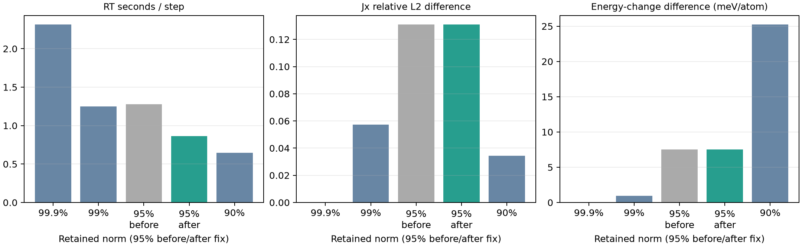

# Si HSE06: WF保持ノルム閾値の依存性

2026-09-30。99.9%を参照として99%、95%、90%を比較した。参照自体も切断されており、非切断解に対する誤差ではない。これは既存のGSから同じ実空間RTを開始したときの交換・source-support ACE構築用WFの切断比較であり、各閾値でGSを再収束した比較ではない。

## 条件

Si 4×1×1、32原子、64軌道、HSE06、Γ点、メッシュ64×16×16、MPI2×OMP2（2×1×1空間分割）、Acos2、dt=0.08 au、16ステップ（0.03096 fs）。exx_mlwf_radius=0としexx_mlwf_norm_fractionのみ変更。初回4条件には4本FFTバッチ版work/si-batch-fft/salmon-batch4を使用。追記した95%のみ周期軸選択修正版work/si-mixed-periodic/salmon-mixedを使用した。他の閾値は修正版では再計測していない。99.9%は直前の計測を再利用した。各1回。8セルの本計測は比較中のみ停止し、終了後に再開した。

## 時間と支持

RT時間は初期化を除くrt iterations最大ランク値。RSSは各ランク観測ピークの最大。半径・対数は最終交換更新時のログ値（半径は全WFの最大、対数はorbital group 0）。

|保持ノルム|s/step|速度比|RSS MiB/rank|最大半径 bohr|局所/全領域FFT対|
|---|---:|---:|---:|---:|---:|
|99.9%|2.318|1.00|271.5|10.52|0/4032|
|99%|1.250|1.85|259.8|6.82|2560/0|
|95% 修正前|1.277|1.82|253.4|4.84|0/1792|
|95% 修正後|0.862|2.69|250.7|4.84|1792/0|
|90%|0.644|3.60|249.9|3.33|960/0|

## 99.9%との差

電流相対L2差は16時刻のJxベクトルの差のノルムを参照のノルムで割る。絶対差は全時刻・全3成分の最大。エネルギー初期差と、初期値を引いた変化量の最大差を分ける。後者も外場下の量であり、エネルギー保存誤差とは呼ばない。

|保持ノルム|電流最大絶対差 au|Jx相対L2差|初期E差 meV/atom|ΔE最大差 meV/atom|
|---|---:|---:|---:|---:|
|99.9%|0.000e+00|0.00%|0.000|0.000|
|99%|2.067e-08|5.72%|46.794|0.921|
|95% 修正前|5.472e-08|13.11%|311.946|7.502|
|95% 修正後|5.472e-08|13.11%|311.946|7.502|
|90%|1.078e-08|3.43%|581.683|25.272|

## 追記：周期軸選択修正の効果

各軸で元の周期長nとゼロ詰め長smooth_size(2*box-1)の小さい方を選び、周期長を選んだ軸のカーネルを0:n-1に配置するよう修正した。支持球や保持ノルムは変えていない。95%のRT時間は20.427→13.787秒、約32.5%短縮（1.48倍）。ペア数1,792は不変で、全領域から局所FFTへ切り替わった。

修正前95%との差は電流最大3.12e-17 au、エネルギー最大5.69e-14 Ha。したがって99.9%に対する精度差は表示桁で変わらず、計算方法の改善による短縮である。交換作用216条件と独立の直接周期畳み込み試験を通過。詳しい検証は[周期軸修正ノート](../si4-mixed-periodic-2026-09-30/report-ja.md)に記載。

表と図は初回4条件と修正後95%を併記したもの。全閾値を同じ修正版で測り直した比較ではない。99.9%・99%・90%の修正版速度は未測定である。

## 解釈と限界

99%は約1.85倍速いが、初期Jxにも約5.7%の差がある。95%は周期軸選択修正後に99.9%比約2.69倍速くなり、99%より短時間になった。ただしエネルギーと電流の近似誤差は増える。修正前に述べた「95%は99%より速くならない」という評価は更新する。90%は約3.6倍速いが、初期E差約582 meV/atom、ΔE差約25 meV/atomと大きい。電流差が95%より小さくても、90%の方が高精度とは判断できない。

修正前は95%で全領域FFTに戻った。旧実装はbox==nの軸には周期長nを使い、それ以外にはsmooth_size(2*box-1)を使い、パディング後体積が全領域以上なら局所方式を採用しない。この分岐は箱の縮小に対して単調ではなく、局所・全領域切り替えによる時間変化の要因となる。各軌道の箱寸法は今回のログにはないため、個々の軌道の分岐理由までは実測していない。

全条件で両ランク正常終了、ACE拒否0、輸送ゲージ保持0、出力は有限。これは初期の弱い外場での短い試験であり、励起後の非局在化、スペクトル、5 fsの精度を保証しない。閾値の推奨値の確定にはパルス中の比較が必要。製品既定99.9%は変更していない。次の精度・効率候補としては99%を優先できるが、許容誤差を満たすとはまだ言えない。計算時間は単回測定で、機種やセル形状依存がある。

## 再現

作業ルートでpython3 work/si-support-threshold/run.pyを実行。再実行時は既存出力を保護するため新しい出力先を用意する。norm99/norm95/norm90に入力・生ログ・ランクRSS・終了コード、参照はwork/si-batch-fft/batch4-omp2。analyze.pyで集計しreport.pyで図とノートを生成。comparison.jsonに支持・対数の初回/最終/最小/最大/平均を保存。無外場差引きは行っていない。

追記の再現：初回report.pyの生成後にwork/si-support-threshold/update_mixed_report.pyを実行。統合集計はcomparison-with-mixed.json、初回比較はcomparison.jsonとして保持。修正版実行・生ログはwork/si-mixed-periodic。
