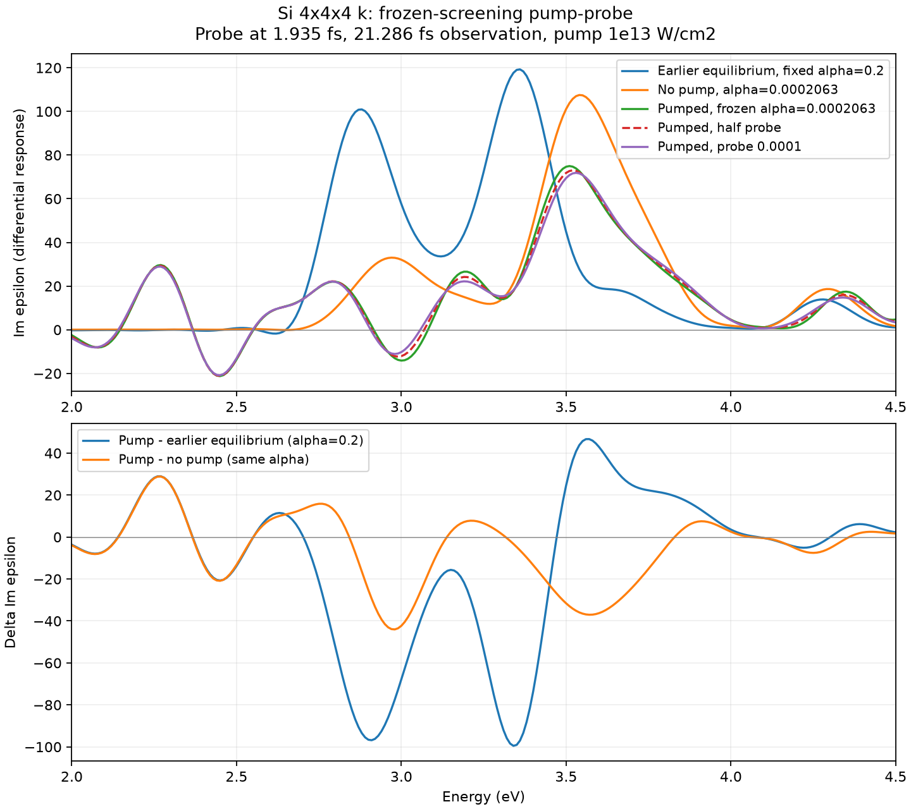

# Si pump-probe: alpha0=1, K0=0, frozen pump screening

## What is being measured

A z-directed impulse is applied at absolute time80 a.u. (1.93511 fs), which is
20 a.u. (0.48378 fs) after the pump ends. The pump is unchanged: Acos2,
omega=.2 a.u. (5.4423 eV), full envelope60 a.u., intensity1e13 W/cm².
Si8 atoms, PZ,12³ real-space grid,4³ k points, dt=.08 a.u., nt12000.
The common post-probe observation interval is880 a.u. (21.2862 fs).
No k convergence scan was performed.

The existing instantaneous bare-K prescription is retained during the pump:
alpha=1/[1+4*pi*max(K,0)/omega²], K0=0, absolute field floor2e-5.
The estimator is stopped after60 a.u.; K and alpha are held, while P,J,Axc
continue to evolve through the polarization closure E_xc=alpha P.
This is a **frozen-screening partial response**, not the full dynamic model's
linear response. The probe-induced variation of alpha is excluded.

For pumped trajectories, delta J = J(pump+probe)-J(pump only), using the existing
bare-K strong_long trajectory as the reference. Equality before the probe and
constant post-pump alpha are checked numerically. Ground-state references have
no pump and zero physical current before the probe; that numerical zero is checked.
The signed probe step is .001 a.u.; .0005 is the linearity check.
All Fourier transforms use the same polynomial window 1-3(t/T)^2+2(t/T)^3,
energy step.01 eV and no scissor shift. Window checks use600,720,880 a.u.
The .01 eV sampling is not the physical spectral resolution (~.19 eV for21.3 fs).

## Why the full-feedback spectrum is excluded

Short calculations `diagnostic_full` and `diagnostic_half` retain alpha updates
through the probe. Both return alpha from0.000206291 to1 after the kick. The
normalized differential currents differ by50.61% when the probe is halved.
This is not a linear probe response. See `diagnostic_metrics.json`.
An impulse leaves a nonzero A step and reactivates the existing A/E estimator.

## References and exclusions

- `pumped`: pump-prepared electrons, alpha held at0.000206291.
- `pumped_half`: same, half probe amplitude.
- `ground_screened`: unexcited electrons with the same held alpha. This isolates
  excitation-state effects within this frozen-alpha comparison.
- `ground_one`: no pump, alpha held at1. This attempted reference fails at step3064
  (~5.93 fs absolute time), after severe norm breakdown. No spectrum is extracted.
  This does not establish instability of the full evolving-alpha model, because
  its probe-dependent screening was deliberately excluded here.
- `old_alpha02`: earlier equilibrium fixed-alpha=.2 impulse, truncated to the same
 880-a.u. observation window. This is a different coefficient prescription; a
 shift relative to this reference is not solely a carrier-population effect.

The old alpha=.2 exciton-like peak is3.36 eV at this window. Neither this coarse
calculation nor differential peak tracking establishes an exciton binding energy.
The previously identified absolute-threshold sensitivity of final alpha remains.

## Reproduction

`run_diagnostic.py diagnostic_full` and `diagnostic_half` reproduce the short
full-feedback check. `run.py pumped`, `pumped_half`, `ground_one`, and
`ground_screened` run the frozen-screening cases. Existing completed cases are
retained; a file lock prevents duplicate execution. `analyze.py` checks outputs,
forms differences and writes spectra/metrics/figures. Paths to the existing
MPI executable, GS restart and pump-only reference are explicit in the scripts.

## 結果（最小プローブ0.0001を採用）

| 条件 | 主ピーク (eV) | Im epsilonの高さ | 2–4 eV積分 | 見かけのFWHM (eV) |
|---|---:|---:|---:|---:|
| 以前の未励起、固定alpha=.2 | 3.36 | 119.25 | 62.621 | 0.249 |
| 未励起、alpha=.000206291 | 3.54 | 107.52 | 47.700 | 0.328 |
| ポンプ後、同じalpha | 3.53 | 71.86 | 34.597 | 0.336 |

同じalphaでは、ポンプ後のピーク高さは33.16%低下、2–4 eVの積分は27.47%低下。
ピーク移動は-0.01 eVで、観測窓による変化より小さい。幅の差も小さく、
今回の主な結果はブリーチングであり、明確なピーク移動・寿命短縮の証拠ではない。
表の積分は符号付きIm epsilonの積分で、正の部分だけの吸収強度ではない。
励起後の応答には負の領域もあり、ここから利得や励起子解離を断定していない。

以前のalpha=.2の結果に対してはピークが+0.17 eV、高さ-39.74%、積分-44.75%。
この比較にはalphaの低下と電子状態の変化の両方が含まれる。
新しい完全動的モデルの平衡励起子を確立した結果ではない。

プローブ振幅.001/.0005/.0001でピークは3.51/3.52/3.53 eV、
高さ74.98/73.00/71.86、積分34.806/34.691/34.597。
.0005から.0001への変更では高さ1.58%、積分0.27%の差。
2–4 eVスペクトル全体の相対L2差は4.19%、時間領域の規格化電流全体では48.69%。
したがってピーク・帯域積分の傾向は比較的安定だが、全周波数にわたる
線形応答収束が得られたとは言えない。追加の小さいプローブ・対称差分等は未実施。

観測窓600/720/880 a.u.で、最小プローブのピークは3.55/3.54/3.53 eV、
積分は34.554/34.631/34.597。積分減少は観測窓を変えても維持される。
FWHMは窓の影響を含む見かけの値で、物理的寿命への換算はしない。

有効な4本は12000ステップ正常終了。最大電子数ノルム誤差は3e-7以下。
ポンプありのプローブ前差分電流は1e-17以下、同じalphaの未励起電流は
3.8e-13以下。ポンプ後のalphaは一定で、既存pump-onlyと一致する。
計算本体・再始動の回帰テストおよびフーリエ解析の既存テストは合格。
独立レビューで電流差、符号、プローブ時刻、観測窓の処理に重大な問題なし。

全スペクトルCSVには.01–8 eVを保存し、図は2–4.5 eVを拡大している。
低周波の大きな成分を除去してフーリエ変換したわけではない。
