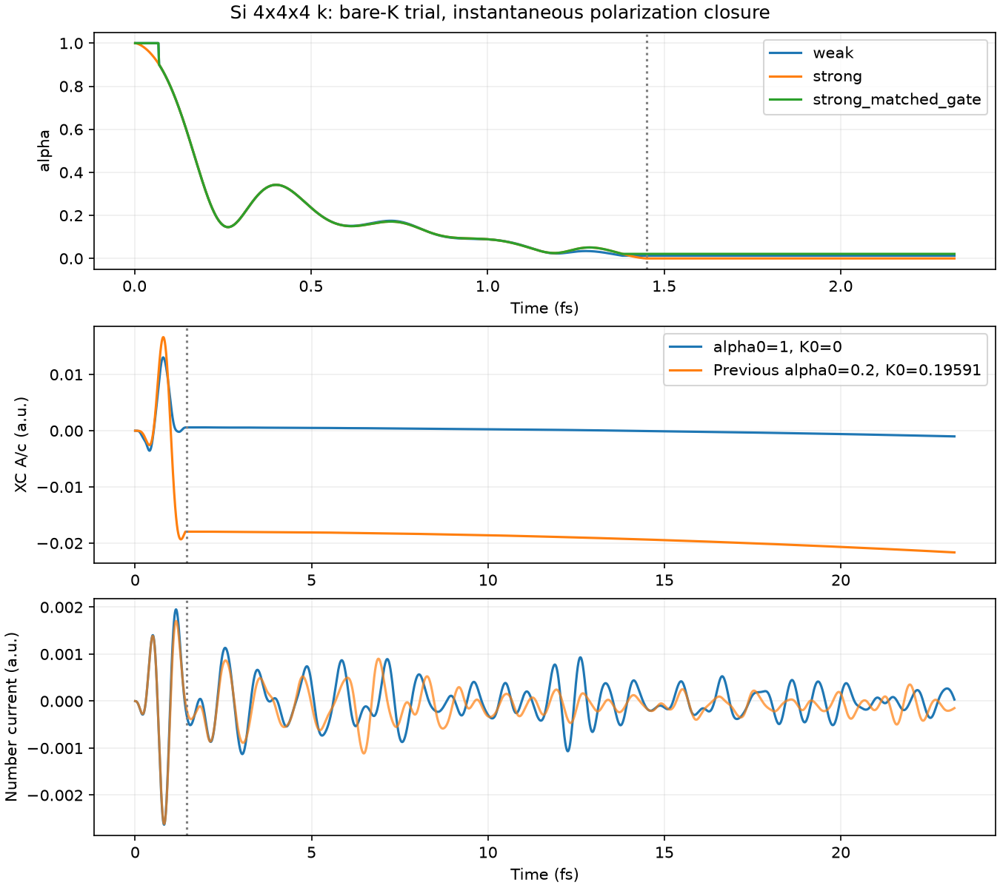

# Si: alpha0=1, K0=0の試験

ユーザー提案に沿い、基準K0を引かずに既存の瞬時推定Kを使用する。

```
K = (a.J - E.P)/(a.a + E.E/omega²)
alpha = 1/(1 + 4*pi*max(K,0)/omega²)
E_xc = alpha P, P = -integral J dt
```

ここで「裸のK」は基準値を差し引かない意味。既存実装の負値クリップは保持する。
符号付きKをそのまま分母へ入れる方式は今回試していない。
alpha0=1をハイブリッド汎関数の全交換と同一視するものでもない。
本式は研究用の現象論的補正式である。

## 条件

Si 8原子、4³ k点、12³実空間格子、PZ。既存GSを使用。
Acos2、omega=0.2 a.u. (5.4423 eV)、全幅60 a.u. (1.4513 fs)、dt=0.08 a.u.。
弱励起1e8、強励起1e13 W/cm²。beta=gamma=0。
主比較は既存の絶対値しきい値2e-5を保持し、alpha0とK0だけを変更。
弱・強の短時間計算は1200ステップ、強励起長時間計算は12000ステップ。
時間平均やK点収束試験は実施していない。計算本体の変更はない。

追加のstrong_matched_gateは、強励起のしきい値をsqrt(1e5)倍の
0.0063245553にして、弱励起と同じ相対外場条件で推定を止める対照計算。
これは新しい物理的しきい値の校正ではない。

## 検証

analyze.pyは正常終了、出力の有限性・時刻一致・ステップ数を確認し、
出力Kからalphaを再構成して一致を検証する。
パルス後のE_xc-alpha P、ノルム誤差、弱応答を316倍した電流との差を記録。
全数値はmetrics.json、実行状態は各status.jsonに保存する。

再現はrun.py weak / strong / strong_long / strong_matched_gate、続いてanalyze.py。
既存のMPI実行ファイルとGS再始動データが必要。

## 短時間の結果

| 条件 | 最終alpha (2.3221 fs) |
|---|---:|
| 弱励起、絶対しきい値2e-5 | 0.0129912 |
| 強励起、絶対しきい値2e-5 | 0.000206291 |
| 強励起、弱励起と相対しきい値を揃えた対照 | 0.0212865 |

強励起の二つのしきい値で、電流の相対L2差は約0.508%。
alphaの差は約103倍あり、短時間の電流差の小ささだけではalpha推定の妥当性を確認できない。
また新しい弱励起軌道のA,E,J,Pを一律316倍し、絶対しきい値を変えずに
推定だけ行うと、最終alphaは約0.000120878になる（新たな電子時間発展ではない）。
K0をなくしても、既知の終端の振幅依存は残る。

今回の結果は、K0差し引きをやめた補正式の動作確認である。
既存の固定alpha=0.2によるimpulseスペクトルを、この新条件の線形応答と
見なすことはできない。新条件での励起子ピークの評価は未実施。

## 長時間の結果

主比較の強励起は23.2213 fsまで正常終了。短時間版の最初1200点と一致。
最大電子数ノルム誤差は2.9e-7。パルス後の|E_xc-alpha P|は2.4e-18以下。

| 指標 | 以前: alpha0=0.2, K0=0.19591 | 今回: alpha0=1, K0=0 |
|---|---:|---:|
| 最終alpha | 0.000100982 | 0.000206291 |
| 最終A_xc/c (a.u.) | -0.0216562 | -0.00101109 |
| 最終E_xc (a.u.) | 8.1221e-6 | 2.9844e-6 |
| 最後3 fsの平均J (a.u.) | -1.2021e-4 | -5.6590e-6 |
| 最後3 fsの平均E_xc (a.u.) | 7.4024e-6 | 3.1188e-6 |

パルス後の電子エネルギー変化は0.0006168 a.u.（モデル全体の保存エネルギーではない）。
Aや平均電流は以前より小さくなったが、電流振動と残留XC電場は残る。
しきい値を揃えた対照の長時間計算および今回条件の時間刻み収束は未実施。
alphaのしきい値感度が大きいため、数値的改善を物理的な遮蔽改善とは断定しない。


