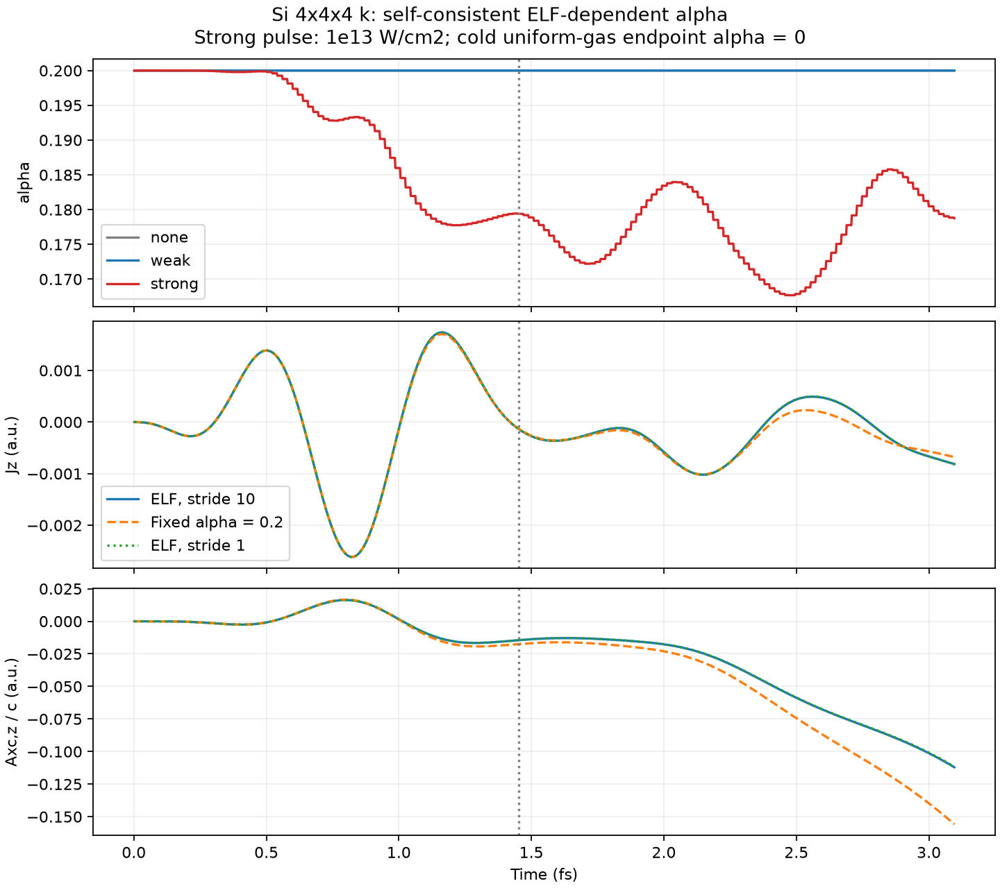
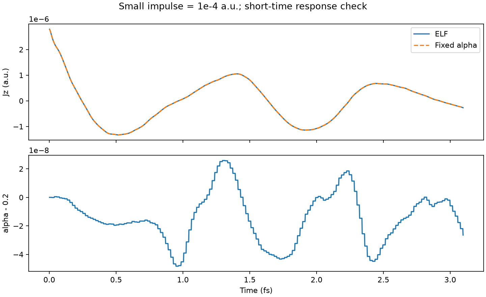

# Native time-dependent alpha from ELF

This opt-in experiment feeds the instantaneous electronic state back into the
macroscopic XC vector potential. It is a new self-consistent trajectory, not a
rescaling of the earlier bare-K trajectory.

## Definition and input

Use the electron-density-weighted squared deviation from the cold uniform-gas ELF:

\[
 Q(t)=\frac{\int n(\mathbf r,t)[\mathrm{ELF}(\mathbf r,t)-1/2]^2d\mathbf r}
             {\int n(\mathbf r,t)d\mathbf r},\qquad
 \alpha(t)=\alpha_0\frac{Q(t)}{Q(0)}.
\]

This gives alpha0 at the initial state, zero if ELF is 1/2 everywhere with nonzero
density, and allows alpha above alpha0 if Q increases. There is no upper clipping,
field-ratio estimator, laser gate, temporal averaging, or fitted damping/restoring.
Squaring the local deviation before integration prevents cancellation between
ELF above and below 1/2. This choice is a model assumption, not a unique mapping
from localization to dielectric screening. In particular, low-ELF regions also
contribute to Q, and a hot spatially uniform electron distribution need not have
ELF=1/2. Neither Q nor alpha alone proves metallic transport.

```fortran
&functional
  xc='PZ'
  tdcdft='lrc'
  tdcdft_alpha=0.2
  tdcdft_screening='elf'
  tdcdft_elf_stride=10
/
```

Requires atomic units, periodic transverse response, unpolarized PZ, frozen ions,
no SOC or symmetry reduction, CPU execution and the middlepoint propagator, as
with the existing experimental LRC path. Pulse and impulse inputs are supported.
The default ELF stride is 10. Q(0) is evaluated once from the initial state;
Q is then measured on the propagated orbitals at absolute steps 10,20,...,
with alpha held between measurements. No MLWF minimization or gauge transport
is needed. The existing `tdcdft_screen_stop` can optionally freeze the last
measured Q after a chosen atomic-unit time; the default -1 keeps updating even
after the laser ends. The A/J estimator parameters are not used by this mode.

For one spin, with occupation and k weights included in all orbital sums,

\[
 C=\tau-\frac{|\nabla n|^2}{4n}-\frac{|\mathbf j_p|^2}{n},\quad
 C_{\rm UEG}=\frac35(6\pi^2)^{2/3}n^{5/3},\quad
 \mathrm{ELF}=\frac1{1+(C/C_{\rm UEG})^2}.
\]

Here tau has no factor 1/2, and jp is the summed local paramagnetic orbital
current, not the macroscopic nonlocal-pseudopotential current. Gradients use
SALMON's native eighth-order central finite difference plus the Bloch ik term.
A consistently included spatially uniform vector potential cancels between
tau and jp²/n; omitting it from both is equivalent. Orbital/k moments are reduced
before forming nonlinear ELF; density-weighted integrals are then reduced over
spatial domains. The spin factor and grid cell volume cancel in Q. Points with
one-spin n<=1e-14 bohr^-3 use ELF=1/2; this floor is far below the Si densities.
Negative roundoff in the nonnegative Pauli curvature is clamped to zero.
An initial Q<=1e-14 is rejected because the requested normalization is undefined.
The legacy `write_elf` output routine is not used or modified.

With a=Axc/c and electron-number current J, P is integrated as P'=-J and the
XC field follows a'=-alpha P. Each interval uses the held alpha, without
extrapolating across an update jump. Thus E_xc=alpha P on each held interval.
The centered diagnostic E_xc at a jump samples both adjacent intervals and need
not equal the new alpha times P exactly. Alpha changes do not require Aext or
Eext to remain nonzero. This closure is not a dissipative lifetime model, so
post-pulse current is allowed to persist.

## Restart and output

`Si_rt_xc.data` has 13 columns in ELF mode: time, a_xyz, E_xc_xyz, alpha, Q,
P_xyz, Q_initial. Units are atomic units; alpha and Q are dimensionless in this
convention. Existing modes retain their previous output columns.

Version-4 `tdcdft.bin` stores Q_initial and stride as well as alpha, held Q, P,
current history and XC field state. ELF restart requires v4 and matching stride;
alpha above alpha0 is explicitly allowed. Earlier checkpoints remain readable
for their original modes. Use `checkpoint_interval` and shared checkpoint files.
The unrelated legacy `write_rt_wfn_k` final-output path was not validated here.

Testing a non-update checkpoint at step 37 exposed an existing restart error:
initialization loads spsi_in, but the main loop selected its input by absolute
step parity. The loop and its checkpoint writer now alternate relative to the
restart step. This fixes odd-step restart for both ELF and fixed alpha, while
ELF measurement cadence continues to use the absolute step.

## Reproduction

`run.py EXE mpiexec -n 4` runs seven cases with two local jobs at a time and stores
raw checkpoints under `/private/tmp/salmon-si-elf-feedback`. `ELF_CASES` optionally
selects comma-separated case names. Completed jobs are reused. Inputs are retained
here. `analyze.py` reads those checkpoints and writes the figures, metrics,
compressed full rt/xc arrays (`*.npz`) and every-ten-step traces (`*.csv`).

All cases use the existing Si ground state: 8 atoms, 32 electrons, 12³ real-space
grid, spacing .855 bohr, 4³ k points, dt=.08 a.u., 1600 steps (3.09617 fs).
The pulse has omega=.2 a.u., duration60 a.u. (1.45133 fs), z polarization,
and intensities0,1e8,1e13 W/cm². Fixed-alpha strong and impulse controls use
alpha=.2. The impulse kick is1e-4 a.u. A strong-pulse stride 1 control isolates
ELF sampling cadence. This short window checks dynamics, not a resolved exciton
peak; no k-point convergence study is included.

## Results

| Case | Minimum alpha | Final alpha |
|---|---:|---:|
| No pump | 0.199999999863 | 0.200000000081 |
| Weak, 1e8 W/cm² | 0.199999665454 | 0.199999716004 |
| Strong, 1e13 W/cm² | 0.167688721737 | 0.178755254698 |
| Small impulse, 1e-4 a.u. | 0.199999951740 | 0.199999973532 |
| Strong, evaluated every step | 0.167698657359 | 0.178736660596 |

The strong-pulse alpha falls by up to 16.16%, then partially recovers and
oscillates; its final decrease is 10.62%. Its maximum is0.200001814, consistent
with the deliberately unclipped rule. No-pump drift stays below 1.72e-10.
The weak-pulse change stays below 3.35e-7, avoiding the earlier field-ratio
model's large weak-excitation collapse.

Over this entire 3.09617 fs window, the strong current differs from the
fixed-alpha0.2 control by 10.691% in relative L2 norm. The small-impulse current
differs by 7.28e-8. Thus this test preserves the short-time weak response while
changing the strong response; it does not yet establish improved exciton
energies or linewidths.

Every-step evaluation changes the strong current by 0.1303% relative to stride 10;
final alpha differs by 1.86e-5. The maximum instantaneous alpha difference is
0.001317, mainly from holding values across a rapidly changing interval. This
supports stride 10 for this exploratory run, not convergence for arbitrary pumps.

At the final step, Axc,z/c is -0.11210 with ELF feedback versus -0.15583 with
fixed alpha. The post-pulse current RMS is 5.069e-4 versus 4.790e-4 a.u.; residual
current is not reduced by this model in this window. Neither Axc nor J has
relaxed to zero, and the 3.1 fs test cannot establish long-time stability.





## Derivative and uniform-gas checks

Native Q(0)=0.0751859750465. The earlier symmetric spectral derivative gives
0.0748988028671 on the same ground state. Normalizing the native Q by its own
initial value avoids mixing discretizations. Independent NumPy finite-difference
postprocessing matches native Q at the initial state and nine checkpoints
(none/weak/strong, steps 200/800/1600) to better than 3e-14.

On the final strong checkpoint, spectral postprocessing would give alpha=0.179526
instead of the native0.178755; the reduction persists. This is a derivative
comparison on the same trajectory, not a self-consistent spectral-feedback run.

A finite-mesh cold Fermi sea at the same mean density has ELF=0.500113348 with
the native derivative. With the Si normalization its residual alpha is 3.42e-8.
The continuum ELF=1/2 endpoint is exactly zero algebraically; the finite-mesh
quadrature is not exact, and no offset was fitted to force numerical zero.

## Validation completed

- Serial and MPI builds succeed; selected CTest suite: 10/10 pass (TDCDFT unit
  update, Si ground state, Si response and their verification fixtures).
- `testsuites/142_Si_tdcdft/test_elf.py`: serial and MPI4 pass normalization,
  held cadence, odd37/even74/chained restart, unclipped alpha>.2 restart,
  malformed normalization and changed-stride rejection, and screen-stop behavior.
- With `SALMON_ELF_TEST_RSPACE=1` and MPI4, a 2×1×1 real-space split with 2 k ranks
  agrees with the unsplit-space run at absolute 1e-11 / relative 1e-8 tolerances.
- Fixed-alpha odd-step restart reproduces its continuous trajectory after the
  parity fix; the same test failed before the fix.
- `test_regression.py` passes disabled/zero-alpha equivalence, finite coupling,
  Proca normalization and units, legacy restart, instantaneous and polarization
  modes, weak-response linearity, time-step and input guards.
- `test_screen_stop.py` passes delayed-probe freeze, restart, v2 compatibility,
  and changed-stop rejection. Independent code review found no blocking issue.

The initial CTest invocation could not locate an executable named `python` for
two legacy verification scripts. With a local alias to the installed Python3,
the final complete 10-test run passes; no simulation or reference data was changed
for that environment issue.
