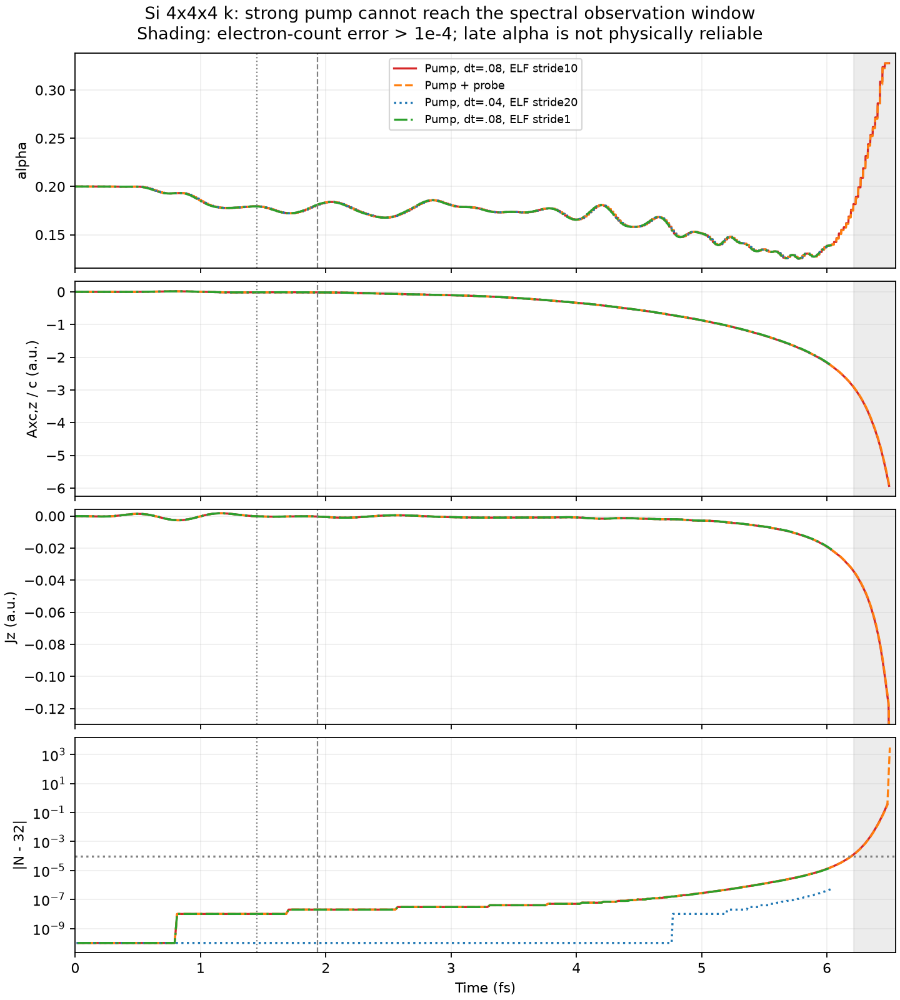
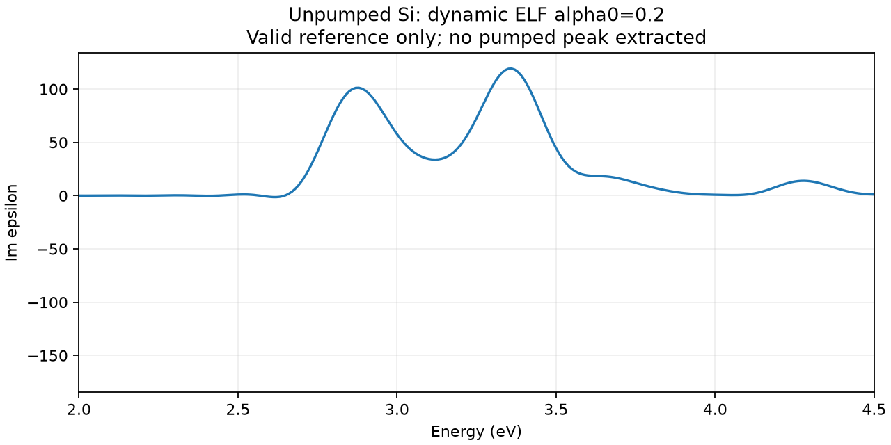

# ELF-dependent-alpha pump-probe: initial unstabilized control

This directory records the first control with beta=gamma=0. It is not the final
stabilized pump-probe model. The user correctly identified Proca stabilization
as necessary; the completed finite-window comparison is in [proca](proca/README.md).

Si8 atoms,32 electrons,12³ real-space grid,4³ k points, dt=.08 au,
alpha0=.2, ELF sampled every10 steps without upper clipping. Pump: Acos2,
intensity1e13 W/cm², omega=.2 au, duration60 au. Delayed probe: positive1e-4
step in A/c at80 au (1.9351 fs). Requested12000 steps, giving21.2862 fs
of post-probe observation. No k convergence scan.

The original lrc+elf mode integrates a'=-alpha P with P'=-J. Both pump-only
and pump+probe fail the electron-number check at steps3358 and3360, respectively
(about6.50 fs). Prior to the probe their currents agree exactly. The pump-only
external A and E are zero after the pulse; the growing field is the XC field.
The first1600 pump-only steps reproduce the earlier short trajectory exactly.

| Approximate time | alpha | Axc,z/c | Jz |
|---|---:|---:|---:|
| 3 fs | .18048 | -.10120 | -.000666 |
| 4 fs | .16559 | -.33331 | -.000823 |
| 5 fs | .15137 | -.87138 | -.002851 |
| 6 fs | .13857 | -2.16898 | -.019162 |

The field already grows while alpha is below its initial value. The later
rise toward alpha=.328 occurs as electron-number errors become large and is
not evidence of physical localization. The logged electron-number error first
exceeds1e-4 electrons at6.2117 fs. Only about4.28 fs of clean post-probe data
remain, with a rough finite-window scale near1 eV, insufficient to compare the
previous narrow exciton-like peak. No pumped spectrum is extracted from these
failed trajectories.

Two controls through6.03754 fs reproduce the field growth:

- dt=.04 and stride20, preserving the.8-au ELF update interval: current relative
  L2 difference0.1473%, XC potential difference0.0592% from dt=.08,stride10.
- dt=.08 and stride1: current difference1.2668%, potential difference0.5225%.

These show that the early growth is robust to these numerical changes; they
are not a proof of a continuum instability or of the specific zero-force
mechanism. Both short controls complete normally. The unstabilized unpumped
reference completes12000 steps and gives a3.36 eV peak (height119.298,
signed2–4 eV integral62.955, apparent FWHM.2492 eV). This is only the reference
for beta=gamma=0, and cannot be used as the sole baseline for Proca spectra.

`run.py` reproduces initial and short control cases (`ELF_PROBE_CASES`).
`diagnose.py` writes `diagnostic_metrics.json`, the valid unpumped spectrum and
plots; `analyze_probe.py` contains the central-probe analysis intended before
the instability was found, and refuses failed/missing trajectories. The negative
and half-amplitude probes were not run for the failed zero-gamma model.
Raw calculations are in `/private/tmp/salmon-si-elf-pump-probe`; inputs, statuses
and compressed current/alpha/norm traces are retained here. Three new synthetic
central-difference/width tests and the three existing Fourier tests pass.

