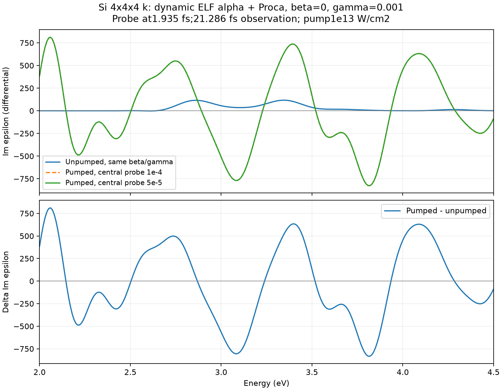
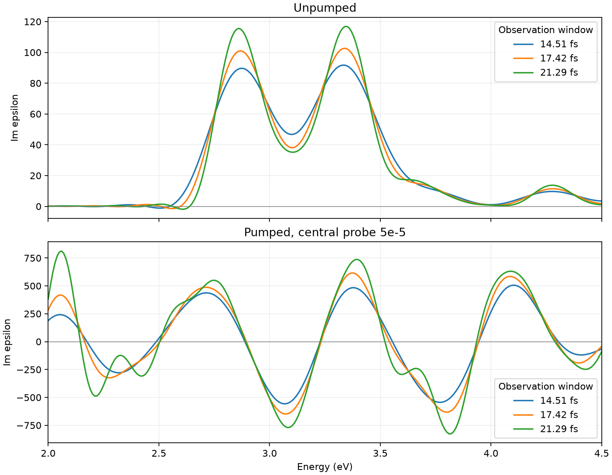
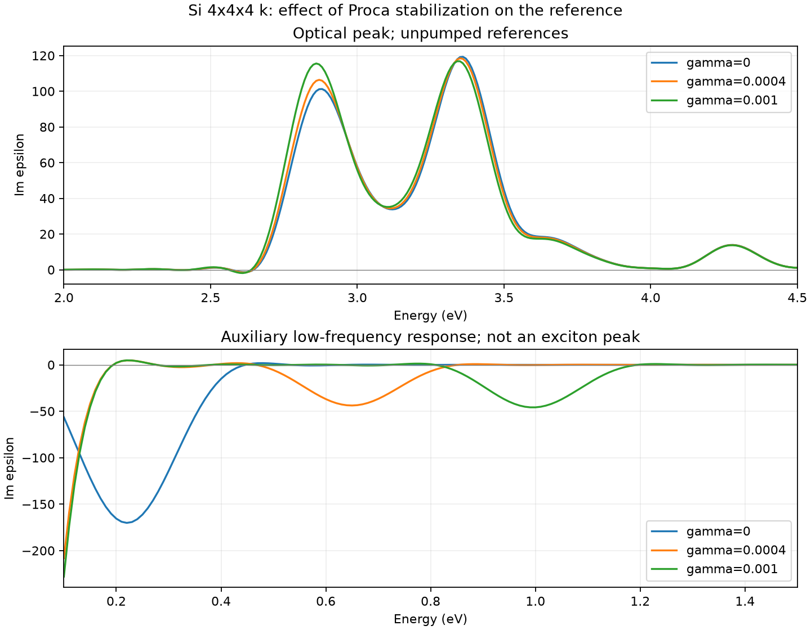
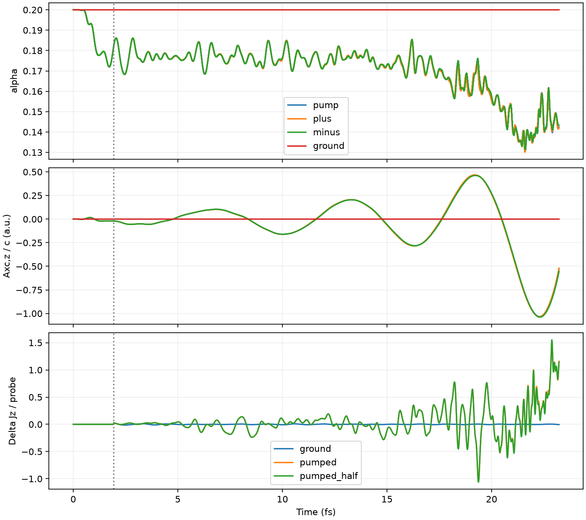

# ELF alpha with Proca stabilization: pump-probe

Completed finite-window experiment. Proca stabilization prevents the original
electron-number failure through23.22 fs, but a converged change of an exciton
peak is not established. The pumped spectrum has large signed oscillatory
structures and significant observation-window dependence.

## Model

The user's stabilization correction is implemented as a separate supported
combination:

```fortran
&functional
  xc='PZ'
  tdcdft='proca'
  tdcdft_alpha=0.2
  tdcdft_screening='elf'
  tdcdft_elf_stride=10
  tdcdft_damping=0.0
  tdcdft_restoring=0.001
/
```

The normalized field equation is

    a'' + beta a' + gamma a = alpha(t) J,
    alpha(t) = alpha0 Q(t)/Q_initial,
    Q = integral n (ELF-.5)^2 / integral n.

This extends Williams-Ullrich Eq.(26) by making alpha depend on the instantaneous
ELF; that extension is this experiment's assumption, not a prescription from
the paper. Alpha is held between measurements, without upper clipping. Beta and
gamma are constant normalized coefficients. Only normalized alpha/beta/gamma
input is accepted with ELF; direct a2/a0 is rejected in this mode.

The earlier `lrc+elf` mode remains a'=-alpha P. These two closures are different
when alpha changes: differentiating the latter would give alpha J-alpha'P.
Proca here uses alpha J and does not add that derivative term. For constant
alpha the stabilized equation reduces to the existing Proca implementation.
Checkpointv4 already saves tdcdft, beta, gamma, Q_initial and stride, so changing
between these models or changing gamma on restart is rejected.

The stabilization scan starts with beta=0 and gamma1e-4,4e-4,1e-3 au. Their free
auxiliary resonance scales are0.272,0.544,0.861 eV. The initial screen is5000
steps (9.676fs); successful short runs alone do not establish long stability.
Full pump-probe requires12000 steps. All cases retain the same Si ground state,
4³ k points, dt=.08 au, pump60 au at1e13 W/cm² and probe80 au. The final
comparison must use an unpumped reference with identical beta/gamma and ELF mode.

Williams and Ullrich find gamma to be the main stabilizing term and use beta=0
in their time-domain DGSS calculations; the resulting kernel has an auxiliary
low-frequency resonance. We use this as guidance, not as a material-specific
calibration for Si or a physical scattering lifetime. See
[Eq.(26), Sections IV.2 and IV.4](https://arxiv.org/html/2501.13290v2).

`run.py EXE mpiexec -n 4` uses `ELF_PROCA_CASES` to select comma-separated case
names. Prefixes g1/g4/g10/g40 mean gamma=.0001/.0004/.001/.004. Suffixes screen,
pump, plus, minus, halfplus, halfminus, ground, groundhalf select the preparation
and probe. Full positive/negative amplitudes are±1e-4; half amplitudes±5e-5.
Raw outputs are in `/private/tmp/salmon-si-elf-proca-probe`.

## Differential response convention

For a pumped background, linearizing the field equation gives

    delta a'' + beta delta a' + gamma delta a
      = alpha_pump delta J + J_pump delta alpha.

The trajectories retain both terms. Freezing alpha during the probe would omit
the second term and measure a different partial response. The central finite
difference [J(+eta)-J(-eta)]/(2eta) removes the pump background and even probe
orders; comparison with eta/2 tests the remaining nonlinear contamination.
At equilibrium, J_background=0 and the scalar ELF normalization changes only
beyond linear order in this centrosymmetric test, so the reference is expected
to approach constant-alpha Proca response in the small-probe limit.

The Fourier convention uses the signed A/c step, electron-number current,
exp(+i omega t), and the same cubic window 1-3(t/T)^2+2(t/T)^3 for every curve.
Sampling at.01 eV does not imply.01 eV spectral resolution. Reported area is the
signed integral of differential Im epsilon over2–4 eV; apparent FWHM contains
the finite observation window and is not a calibrated lifetime.

## Implementation checks

The new ELF-Proca integration test passes in serial and MPI4: variable-alpha
oscillator recurrence, Q normalization, odd-step restart, stopped alpha updates,
changed-gamma rejection and invalid-alpha rejection. The LRC-ELF integration
test still passes. The selected CTest suite passes10/10 and the full existing
TDCDFT regression script passes. No existing LRC closure or checkpoint layout
was changed. Independent review found no blocking mode-selection issue.


## Results and limits

All coefficients below are normalized atomic-unit coefficients; beta=0 throughout
this physical scan. Gamma was screened for stability, not fitted to a desired
optical bleaching. This is not a calibration of Si damping or a claim that the
chosen gamma is minimal.

| gamma | Pump-only 9.676 fs screen | Unpumped optical maximum (21.286 fs window) |
|---:|---|---:|
| 0 | original LRC-ELF fails near6.50 fs | 3.36 eV |
| .0001 | Proca fails near6.75 fs | not calculated |
| .0004 | completes | 3.35 eV |
| .001 | completes; selected for full comparison | 3.34 eV |

The gamma=0 row uses the previous polarization closure, whereas the nonzero rows
use the variable-alpha oscillator. Thus their difference is not a pure gamma
sweep when alpha varies. The .0001/.0004/.001 rows share the same Proca closure.
No full pumped spectrum at .0004 or nonzero-beta physical scan was performed.

For gamma=.001, all six trajectories (pump, +/-probe, +/-half-probe, unpumped)
complete12000 steps (23.2213 fs). The largest logged electron-number error is
1.142e-5 electrons out of32; the unpumped error is1e-8. Pump-only alpha reaches
.130634 and ends at.142349. This is finite-time numerical survival, not proof of
bounded long-time dynamics: the XC field still has a growing oscillation envelope.

The central probes +/-1e-4 and +/-5e-5 give a relative L2 difference of0.2122%
in Im epsilon over2–4 eV. Their unwindowed differential currents differ by3.235%
over the post-probe interval, concentrated toward later times. The one-sided
response differs from the half-size central result by5.427% spectrally and27.91%
in current, supporting use of the central derivative. The optical finite-window
response is consistent across the two probe sizes to this accuracy; full
late-time current convergence is weaker. These tests do not prove convergence
with respect to time step, real-space grid, k mesh or gamma.

At the longest window, the unpumped maximum is3.34 eV with height116.792 and
signed2–4 eV area65.5727. The pumped half-probe response has a local maximum
near3.39 eV with height736.895, alongside large negative lobes. Its global2–4 eV
maximum is instead2.06 eV. These are numerical extrema, **not identified exciton
peaks**, and the negative portions are not by themselves evidence of optical gain.

| Post-probe window | Unpumped maximum | Pumped local maximum in2.8–3.8 eV | Pumped local height | Pumped signed2–4 eV area |
|---:|---:|---:|---:|---:|
| 14.513 fs | 3.33 eV | 3.38 eV | 483.928 | -62.6281 |
| 17.416 fs | 3.34 eV | 3.37 eV | 615.258 | -62.6935 |
| 21.286 fs | 3.34 eV | 3.39 eV | 736.895 | -50.8384 |

Finite observation broadens even the unpumped peak, whose height also grows with
window length. In the pumped case the signed line shape, additional structures
and integrated area change as well. It would be misleading to report the local
maximum as a measured+.05 eV exciton shift or a sixfold exciton enhancement.
The appropriate conclusion is a strong, nonstationary finite-delay differential
response, with no clean bleaching or converged excitonic peak change established.
A decision about physical peak evolution requires separating this coherent/model
field response from a robust optical feature, including sensitivity to stabilization
and delay. Do not silently freeze alpha, suppress negative values, or add spectral
damping solely to obtain a preferred peak shape.

The same-coefficient unpumped reference changes only modestly versus zero gamma:
peak -.02 eV, height -2.10%, area +4.16%. This does not imply that the strongly
pumped response is equally insensitive to gamma. All plots include the actual
signed transforms without scissor shifts or added Lorentzian damping.

## Artifacts and reproduction

- `analyze_scan.py`: short-screen status and dynamics, `gamma_scan.json/png`.
- `analyze_results.py g10`: six-trajectory validation, central response,
  `g10_metrics.json`, spectra CSV, current NPZ and figures.
- `reference_compare.py`: same-window unpumped gamma sensitivity.
- `*_trace.npz`: full rt/xc arrays and logged norm history; `*.inp` and
  `*_status.json` retain the inputs and process outcomes.

Independent analysis review found no blocking sign or normalization issue and
agreed that the finite-window signed structure cannot yet be called a converged
exciton peak change. The synthetic central-difference and Fourier tests pass3/3
each. Serial/MPI ELF-Proca integration and legacy tests are described above.








