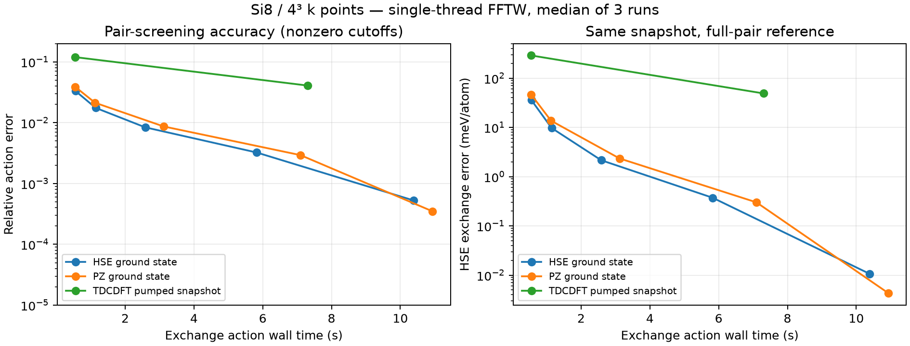

# Si: self-consistent HSE06 and localized exchange timings

## What was computed

An independent Python/Libxc HSE06 driver uses SALMON's exported discrete kinetic, ionic, and nonlocal pseudopotential operators. Native SALMON HSE is not enabled. Si8, 32 electrons, 16 occupied spatial orbitals, shifted 4³ k mesh, 12³ primitive grid (spacing 0.855 bohr), fixed ions; no k-point convergence study. HSE06 mixing=0.25, omega=0.11 bohr^-1. No ELF/TDCDFT alpha enters this calculation.

The occupied SCF solution converged in **61 iterations / 476.5 s**, with final residual **7.93035e-7 Ha**, total energy **-31.31474671494 Ha**, and HSE Fock contribution **-1.65293882461 Ha**. Intermediate phases used pair screening; the final phase used every orbital pair and no spatial truncation. This is an occupied stationary solution, not a solved unoccupied band structure or experimental validation.

Mean MLWF spread is **1.89772 Ų/orbital**, compared with the preceding PZ value 2.05768 Ų. Exported native Hψ is reproduced to relative error **4.39e-15**. Full MLWF screened exchange agrees with the independent direct Bloch calculation to **1.41e-15** on this discrete grid.

## Efficiency

Apple M5 Pro, 18 physical/logical cores, 64 GiB RAM; macOS 26.6.2, Python NumPy 2.4.6. Measurements here use **one FFTW thread and one BLAS thread**, not all cores. Optimized MLWF measurements are medians of three runs after a convolution warm-up, include pair screening, and exclude initial localization and Bloch-to-Wannier setup. The direct Bloch comparison is one timing, not an optimized production baseline. Reciprocal pair reuse reduces 16,384 directed pairs to 8,256 convolutions without an approximation.

| HSE GS pair threshold | EXX action time (s) | Speedup vs full MLWF | Relative action error | HSE exchange error (meV/atom) |
|---|---:|---:|---:|---:|
| 0 (all pairs) | 11.572 | 1.00 | 0 | 0 |
| 1e-7 | 10.390 | 1.11 | 0.000527 | 0.0106 |
| 1e-6 | 5.825 | 1.99 | 0.00324 | 0.373 |
| 1e-5 | 2.583 | 4.48 | 0.00839 | 2.157 |
| 1e-4 | 1.141 | 10.14 | 0.01754 | 9.724 |
| 1e-3 | 0.555 | 20.86 | 0.03326 | 35.767 |

The no-truncation MLWF path takes 11.57 s versus 35.79 s for the independent direct Bloch implementation (**3.09×**, same numerical action). Pair cutoff 1e-6 offers another ~2×, but its 0.32% operator error must be tested in dynamics; the small energy error alone does not justify it for exciton shifts. No system-size scaling or parallel efficiency has been established.

Spatial support truncation was also profiled on the PZ ground state. On this small supercell, tight supports discard relevant tails; larger padded convolution boxes can be slower than full-grid FFTs. The source-only truncation's exchange trace is not a variational SCF energy. These exploratory timings are in `initial_local_benchmark.json`; late large-box runs overlapped a separate SCF job and are not used for headline speedups.

`initial_optimized_benchmark.json` is a PZ ground-state test. `strong_optimized_benchmark.json` uses an older TDCDFT pump snapshot at 3.096 fs to test locality under excitation: **it is not a propagated HSE state**. Every cutoff's error is relative to its own untruncated snapshot.

## Short real-time validation and remaining work

All-pair self-consistent RK4 was run at zero field and at signed impulses A_z=±1e-4 a.u., with dt=0.08 a.u.; the positive impulse was repeated for two dt=0.04 steps. Total elapsed physical time is only **0.001935 fs**. Energy changes were below 2e-13 Ha. Halving the time step changes the final orbital array by relative 9.46e-10 and current by 1.10e-7. This checks the implementation locally in time; it is not an optical spectrum or a long-time stability result.

The full reference costs **about 46 s/RT step** (four current-state Hamiltonian evaluations). At that measured rate, 12,000 steps would take **about 6.4 days per trajectory**, excluding additional localization/checkpoint overhead. This is an extrapolation, not a completed run. Long-time impulse spectra, a laser driver, pump–probe spectra, and the HSE comparison of exciton peaks remain unfinished. The next compute choice is local parallel optimization, HPC, or a multi-day local reference run.

Raw SCF, pilot, and benchmark JSON files in this directory preserve the measured values. Large export/checkpoint arrays remain local and are not committed.

## Excited-snapshot cost and storage

At threshold 1e-6, the HSE ground state retains 8,160/16,384 directed pairs, while the old strongly pumped TDCDFT snapshot retains all 16,384. The latter takes 11.40 s; even threshold 1e-4 still takes 7.31 s and incurs 4.08% action error and 48.94 meV/atom exchange error. Thus the ground-state pair-screening speedup does not persist in this excited snapshot. Direct Bloch/MLWF agreement remains 1.37e-15. Observed process peak RSS is 0.29 GiB for the PZ benchmark and 0.26 GiB for the pumped snapshot; HSE GS peak RSS was not captured in that benchmark run. These are benchmark process values, not peak memory for long SCF/RT jobs.

The export and converged/short-RT checkpoint arrays are also preserved under `calculations/si_hse_reference/` (ignored by Git), in addition to the temporary working copies. Existing PZ restart and localization artifacts are required by the current initializer; see the sample README. Fresh verification: 33 Python tests passed, including the native-export field/current fixture.

The 10 selected native regression checks (Si GS, Si RT, TDCDFT Si, and field unit test) also passed. Their first verification attempt could not find an executable named `python`; rerunning with a temporary `python`→Homebrew `python3` PATH shim passed all 10. No source change was needed for that environment issue. Independent review found no material blocker for the documented GS/benchmark/short-pilot scope.
