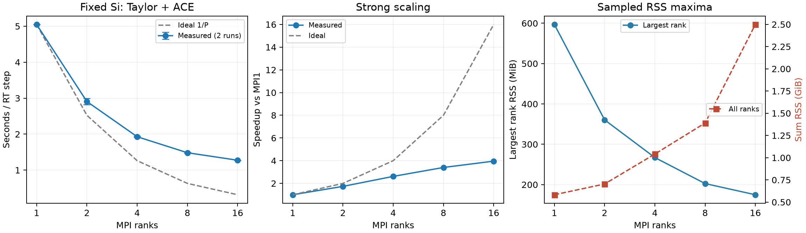

# Taylor＋ACEの時間・メモリ強スケーリング

2026-09-24、実装 `4a962f4c`。Si8・32電子・占有16軌道・12³実空間格子・4³ k点を固定し、MPI数だけを1/2/4/8/16に変更した。`hse_taylor4`、dt=0.16 au、同じ初期状態とz方向impulse=1e-4 auから5ステップ。PT-CNや大規模系の強スケーリング試験ではない。

## 測定条件

Apple M5 Pro（Mac17,9）、64 GiB、18 CPUコア（Super 6、Performance 12）。Open MPI 5.0.9、gfortran 15.2、FFTW、OpenBLAS。OpenMP/BLAS各1スレッド。専用のCPU affinity設定は追加せずMPI/OSの既定配置を使用した。異種コア構成なので、同一性能のPコアという理想条件ではない。

各条件を2回、1→16と16→1の逆順で実行。既存Python MPI8参照計算は測定中のみ一時停止し、終了時に9プロセスすべてを再開した。再開後の実行状態も確認済み。他の通常のOS・アプリ活動は残るため、完全な専有ノード測定ではない。

時間はSALMONの全ランク最大RTループ時間を5で割り、2回平均。初期化を除き、出力と最終チェックポイントを含む。エラーバーは2回の最小〜最大で、統計的信頼区間ではない。メモリは初期化から終了まで `ps` を約0.1秒＋収集時間ごとに観測し、2回のうち大きい値を採用。ランク最大RSSと全ランク同時合計RSSの最大は必ずしも同時刻ではない。共有ページを重複計上し得るRSSであり、固有物理メモリや保証されたピークではない。

## 結果

| MPI | 秒/step | 速度向上率 | 並列効率 | 最大ランクRSS (MiB) | 合計RSS (GiB) |
|---:|---:|---:|---:|---:|---:|
| 1 | 5.048 | 1.00× | 100.0% | 597.0 | 0.583 |
| 2 | 2.907 | 1.74× | 86.8% | 360.5 | 0.704 |
| 4 | 1.929 | 2.62× | 65.4% | 267.1 | 1.041 |
| 8 | 1.483 | 3.40× | 42.5% | 202.6 | 1.390 |
| 16 | 1.275 | 3.96× | 24.7% | 174.9 | 2.500 |

速度向上率は T(1)/T(P)、並列効率は速度向上率/P。



- 16並列で1並列の約3.96倍。並列効率は約24.7%。
- 8→16並列では約1.16倍速（所要時間は約14%減）だが、合計RSSは約80%増える。この小系では8並列が速度・メモリ・使用コア数のバランスを取りやすい。最短経過時間を優先するなら、測定範囲では16並列。
- 最大ランクRSSは597→175 MiBへ減少する一方、合計RSSは0.583→2.500 GiBへ増える。担当軌道の分散だけでは、各プロセスの共通配列・ライブラリ・SALMON基盤データ・核やタイル領域の費用を消せない。RSS増加をすべて交換配列の複製に帰属させることもできない。
- 4³ k点固定なので、MPI16では担当k点は4点。仕事が小さくなり通信や共通処理が目立つ。今回のデータだけで、通信・メモリ帯域・異種コア配置の寄与を定量分離してはいない。
- 実装既定の行ブロック幅はMPI1/2/4で16、MPI8で8、MPI16で4。物理問題は固定だが、並列数に応じた既定タイル調整を含む実装全体の強スケーリングである。

5ステップ終点の軌道はMPI1基準で相対差4.94e-12未満。並列数による数値の一致を確認した。短いRT試験であり、長時間の熱状態・I/O頻度・SCF・励起子スペクトル精度や大系への外挿を保証しない。

前回のメモリ改修比較は背景のPython MPI8を動かしたまま測定していた。そのMPI8の2.09秒/stepと今回の1.48秒/stepの差を、追加のコード高速化と解釈しない。今回、計算カーネルは変更していない。

## 再現とデータ

[ビルド方法](../../../samples/hse_native/README.md)に従い、共通の `calculations/si_hse_native/reference_restart` と従来比較の `memory_tuned_hse_taylor4_dt0.16/inputfile` を用意する。入力は `input_template.inp` に保存した。擬ポテンシャルの絶対パスを実環境に修正し、共通GSチェックポイントを使う。

```sh
python3 samples/hse_mlwf_reference/benchmark_strong_scaling.py \
  --executable /absolute/path/to/salmon
python3 samples/hse_mlwf_reference/plot_strong_scaling.py
```

`--pause-reference PID` は、このリポジトリの既知のPython MPI8参照ジョブを一時停止するための明示オプション。指定しない場合は他プロセスに触れない。スクリプトはジョブ構成を確認し、終了時に自身が停止したプロセスだけを再開する。

[runs.json](runs.json) は全10計測、[summary.json](summary.json) は集計、[scaling.pdf](scaling.pdf) は図のPDF。元の入力と実行ログは `calculations/si_hse_native/strong_taylor_n*_r*/` に保持し、短い時間内訳も `logs/` に保存する。計測中の参照ジョブの停止・再開記録は `reference_pause.json` に残した。
