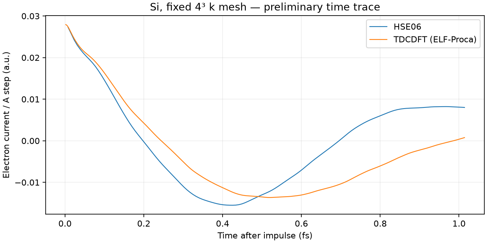

# Si HSE–TDCDFT linear-response comparison

This directory initially contains a **preliminary time trace only**. The HSE
trajectory is being extended to2750 steps before generating the spectrum.
When the sequential job finishes, `RESULTS.md`, `comparison.json`, `spectra.csv`,
`spectra.png` and `spectra.pdf` contain the completed finite-window comparison.
Their absence means the final comparison has not been produced.

## Comparison conditions

| Property | HSE | TDCDFT |
|---|---|---|
| Model | HSE06, mixing0.25, omega0.11bohr^-1 | PZ + ELF-Proca, alpha0=.2, beta=0, gamma=.001 |
| Ground state | Self-consistent full HSE | Self-consistent PZ |
| Atoms / electrons | Si8 /32 | same |
| Cell | cubic10.26bohr | same |
| Real-space grid | 12³, spacing0.855bohr | same |
| k grid | shifted4³ | same GS grid; no convergence scan |
| Impulse | positive A_z/c step1e-4au | same |
| Propagation | PT-CN + ACE, dt=.32au | native SALMON, dt=.08au |
| Observation window | 880au =21.28618fs | same, after probe at80au |
| Spectral window | 1−3(t/T)²+2(t/T)³ | same |
| Energy shift / extra broadening | none | none |

The pseudopotential SHA256 is identical for both source calculations. Native
TDCDFT first has nonzero external A at80.08au, so the probe origin is80au. The
TDCDFT source completed normally with12000 steps to960au. A local immutable copy
of the current/input/status is retained in
`calculations/si_hse_reference/comparison_tdcdft`; its provenance is embedded in
the preview and final comparison JSON.

HSE continues the existing full-kernel trajectory after step130. The blocked
density-matrix backend is used **without a distance cutoff**, so the converged
ground state and the existing response remain consistent. This changes the
algorithm, not the exchange kernel. Actual resume to step131 passed the endpoint
gate with residual9.26e-12, energy drift−6.27e-12Ha and Gram error9.62e-11.
That step took24.84s; approximately19–22 hours of further computation were
estimated at launch. No MLWF optimization is needed by the blocked backend.

## Analysis and interpretation

Both currents are divided by the signed external A step and transformed with
the same response convention. Each trace retains its native time sampling; no
interpolation enters the Fourier transform. Exact common endpoints are used at
440,659.84 and880au to show observation-window dependence. The final output
spacing is0.01eV, whereas the scale2πℏ/T is about0.194eV for the full window.

The report includes Im epsilon, maxima in2–4 and4–6eV, heights and signed areas,
with boundary-maximum flags. Maxima are optical features, not automatically
bound excitons. Differences between HSE and TDCDFT also contain changes in their
ground-state band structures. Neither k convergence nor long-time timestep
convergence is established by this calculation. The dt=.32 choice was accepted
from earlier short pilots, and remains a limitation for the long comparison.

The approximately1fs preview must not be interpreted as a resolved spectrum:



## Execution and recovery

The sequential worker runs `propagate_ptcn` to2750 with `--exchange-method
blocked`, then performs the comparison. Every5 steps, and on handled failure,
the coherent accepted state is saved atomically. `status.json` tracks physical
propagation; `job_status.json` tracks propagation versus analysis and errors.
The detached launch command and PID are saved in `launch_comparison.json`, and
output goes to `comparison_run.log`, all under
`calculations/si_hse_reference/linear_response`.

```
OPENBLAS_NUM_THREADS=1 PYTHONDONTWRITEBYTECODE=1 /opt/homebrew/bin/python3 \
 samples/hse_mlwf_reference/run_linear_comparison.py \
 calculations/si_hse_reference/export calculations/si_hse_reference/scf/state.npz \
 calculations/si_hse_reference/linear_response \
 calculations/si_hse_reference/comparison_tdcdft docs/results/si-hse-tdcdft-linear
```

Do not start a duplicate process; advisory locks reject it. An analysis-only
retry verifies the completed checkpoint's export/initial-state fingerprints and
physics, then avoids rerunning propagation. No recurring automation or external
notification is configured.

Tests cover different sampling rates, amplitude normalization, delayed impulse
origin, short/nonuniform traces, incomplete-HSE rejection, full synthetic report
generation, driver failure checkpoints, analysis-only recovery and changed-input
rejection. Independent review found no launch blocker. Raw long HSE results and
the eventual spectrum are required before any final peak comparison is claimed.
