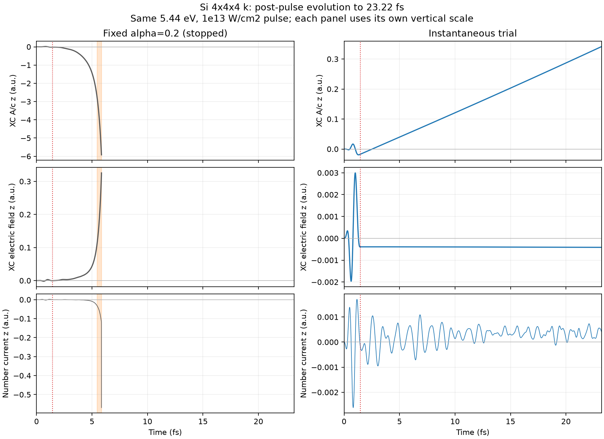

# Same-pulse extension to 23.22 fs

Only nt was changed from 1200 to 12000. Pulse, GS, 4³ k grid, dt=0.08 a.u., alpha0=0.2,
beta=gamma=0, reference K0 and estimator floor remain identical to the short comparison.
Both outputs reproduce their original 1200-step prefixes exactly at printed precision.

## Observations

| Quantity | Fixed alpha | Instantaneous correction |
|---|---:|---:|
| Completed time | stopped at step 3025, about 5.854 fs | 23.2213 fs |
| Last recorded XC A/c z | -5.9206 | +0.34165 |
| Last recorded XC E z | +0.32557 | -0.00041388 |
| First post-pulse Axc zero crossing | none | 2.5354 fs |
| Printed electron-count error | exceeds 1e-4 at 5.457 fs | maximum 3.5e-7 electrons |

The fixed-alpha run develops rapid growth and loses orbital normalization. At step 3025
SALMON reports Ne=720.249 instead of 32 and stops; values near this breakdown are numerical
failure diagnostics, not physical predictions. Orange shading in the figure starts at the first
printed electron-count deviation over 1e-4.

The corrected calculation avoids that breakdown over the simulated interval. It does not relax
to Axc=0 or J=0. In the final 20–23.22 fs window the mean current is 3.44e-4 a.u., RMS current
3.87e-4 a.u.; mean XC electric field is -4.1143e-4 a.u. The fitted Axc slope is +4.1143e-4
in atomic units, confirming approximately linear drift rather than relaxation.

## Why a field remains after the external pulse

The classical external vector potential and electric field are zero after the pulse. The current
code does not continue dividing by them: the estimator returns below its field threshold and
holds K and alpha. Polarization and the XC field continue to evolve.

For the implemented beta=gamma=0 equation and the electron-number current convention,

    a_xc'' = alpha(t)*j
    P' = -j
    E_xc = -a_xc'

therefore

    d/dt [E_xc - alpha(t)*P] = -alpha'(t)*P.

Once alpha is frozen after the pulse, C=E_xc-alpha*P is constant. In this calculation:

    C = -3.90136766805e-4 a.u.
    post-pulse variation of C < 1.2e-14 a.u.
    final alpha*P = -2.3743e-5 a.u.

Thus most of the residual XC electric field is the integration offset created while alpha changed.
The constant-alpha reference instead has C approximately zero (to about 1e-13).
Reducing alpha in the acceleration equation suppresses feedback but does not erase the field's
existing first derivative. This is distinct from falsely applying a nonzero external field.

If the intended constitutive law is E_xc=alpha(t)*P, differentiating it instead gives

    a_xc'' = alpha*j - alpha'*P.

That would be a different model requiring implementation and verification; it was NOT silently
substituted in this extension. Nor were fields/currents forcibly reset when the pump ended.
Switching off the pump does not generally remove coherent electronic polarization or populations.

## Reproduction and limits

`run_long.py` extends the saved short-run inputs and records `long_status.json`, including the fixed
run's nonzero exit code. `analyze_long.py` verifies the zero external fields, compares post-pulse
windows, and writes `long_metrics.json` and the figure. Raw files are in
`calculations/si_tdcdft_k4/instant_long/`. The 4³ k grid was not changed or scanned.

This comparison demonstrates avoidance of one numerical failure, not quantitative accuracy,
complete relaxation, or unconditional stability. Electronic energy output excludes a conserved
energy functional for the model XC field, so it is not a total-energy-conservation test.
