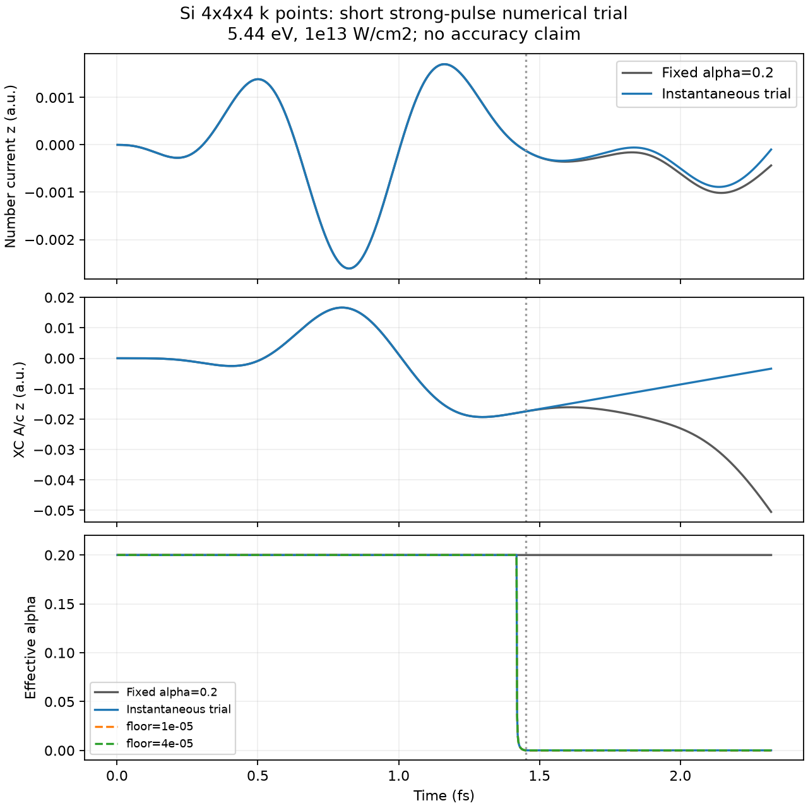

# Si: instantaneous-screening numerical trial

## Result

The requested no-time-average A,J,E,P estimator and an explicitly phenomenological alpha closure
are implemented and tested. This first trial does **not** establish improved physical screening.
With the classical external field as estimator input, alpha reduction occurs mainly at the pulse
tail, where residual polarization remains while the external field vanishes. The smaller XC field
therefore cannot be interpreted as proof of physically correct stabilization.

## Conditions

- Same Si 8-atom, PZ, 12³ real-space grid, 4³ k grid and GS as the previous impulse comparison.
- k grid fixed by user request; no k convergence scan.
- alpha0=0.2, beta=gamma=0. Both runs use the same XC-enabled current evaluation.
- Acos2 pump omega=0.2 a.u. (5.44 eV), full envelope 60 a.u. (1.4513 fs).
- dt=0.08 a.u., 1200 steps (2.3221 fs); 4 MPI processes, 2 OpenMP threads each.
- Weak reference 1e8 W/cm², strong trial 1e13 W/cm².
- This short pulse is a numerical diagnostic, not the original 1.6 eV / 10 fs physics calculation.
- K0=0.19591042214256474 chosen as the upper envelope of weak-run K plus 1e-12.
  This is a conservative calibration to preserve that same weak waveform, not an independent
  validation or a material constant. It may absorb pulse-tail artifacts in the reference.
- Screening strength s=1; field-norm threshold 2e-5 a.u. P integrated from t=0.

## Comparison

| Quantity | Result |
|---|---:|
| Weak screened vs reference maximum current difference | 0 at printed precision |
| Strong screened vs fixed relative current L2 difference | 0.07594 |
| max absolute XC A/c, fixed | 0.05052 a.u. |
| max absolute XC A/c, screened | 0.01933 a.u. |
| Minimum effective alpha | 0.00010053 |

All runs completed with finite outputs. Neither the short duration nor the bounded alpha proves
long-time stability. A smaller XC field is not by itself an accuracy improvement.

## Pulse-tail sensitivity

At the same calibrated K0, changing the field threshold gives:

| Threshold | Final alpha | Relative current change from default |
|---|---:|---:|
| 1e-5 | 0.00002342 | 0.00002456 |
| 2e-5 | 0.00010053 | reference |
| 4e-5 | 0.00010053 | 0 |

The current over this short interval is relatively insensitive, but the post-pump alpha is not.
For a compact smooth pulse, a~delta² and E~delta near its end; if P remains finite,
K~-omega² P/E can grow before the field threshold is reached. The current implementation holds
this tail-contaminated value after the pulse. A lower threshold is not necessarily a better estimate.
Do not use this result as a calibrated pump–probe model. The choice of driving field and the mapping
from its instantaneous response to a screened electron–hole interaction require further work.

## Reproduction

`run_smoke.py` runs the weak calibration, strong fixed/screened pair and calibrated weak check.
`run_smoke.py --floor-check` runs the two additional thresholds. SALMON_EXE can override the executable;
Open MPI is currently selected at /opt/homebrew/bin/mpiexec. Run from any directory with access to
this repository and the previously generated `calculations/si_tdcdft_k4/gs/data_for_restart`.
`plot_smoke.py` produces the figure. NumPy and Matplotlib are needed.

Input and raw data are under `calculations/si_tdcdft_k4/instant_smoke/` (ignored generated data).
`metrics.json` and `floor_sensitivity.json` preserve the numerical summaries.
