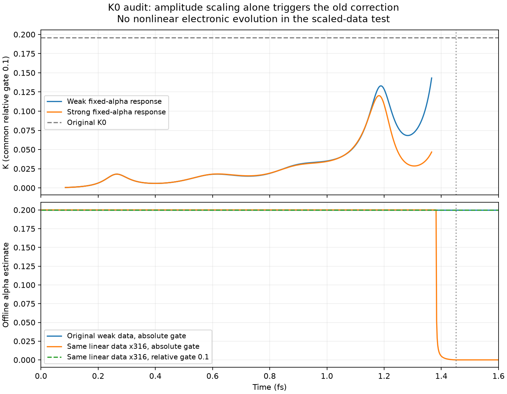

# K0の再検討：振幅依存のしきい値による誤判定

## 結論

これまでのK0=0.1959104221と絶対値しきい値の組合せでは、**線形応答データを一律に
拡大するだけでもalphaが急減する**。したがって、以前の強励起でのalpha低下を
自由キャリアによる遮蔽増大の証拠とは解釈できない。

E_xc=alpha(t)Pへの変更が余分な一定電場を除去した事実は変わらないが、そのalphaを
決める推定式の物理的妥当性は別問題である。今回の結果を受けて、K0の単なる数値置換や
新しい物理的校正値の採用は行っていない。既存モードは研究用の比較実装として保持した。

## 振幅スケーリングの検査

同じ4³ k点・固定alpha=0.2の既存弱励起データ（1e8 W/cm²）を使用した。
A、E、J、Pをすべてsqrt(1e13/1e8)=316.2278倍し、推定だけを再評価した。
これは実際の強励起電子状態を計算したものではなく、線形性の対照検査である。
外場の波形は既存1e13 W/cm²入力と一致することも確認した。

```
K = (a.J-E.P)/(a.a+E.E/omega²)
```

そのためKそのものは振幅の一律拡大で不変である。しかし絶対値しきい値2e-5では、
評価できる最終時刻が以下のように変わる。

| 指標 | 弱励起データ | 線形のまま316倍したデータ |
|---|---:|---:|
| 場のノルム最大値 | 0.000266884 | 0.0843961 |
| 評価する最終時刻 | 1.38167 fs | 1.44940 fs |
| 最終alpha推定 | 0.2 | 0.00002768 |

パルス終端は1.45133 fs。大きな振幅ほど終端近くの小さい分母を拾い、
弱励起で除外されたKをしきい値超過と判断する。新たな非線形電子応答を与えなくても
1.38360 fsから補正が作動することが確認された。

## 同じ相対しきい値での比較

場のノルム最大値の10%をしきい値とすると、振幅拡大前後で有効時刻が同一となり、
alpha推定の差は0になった。これはオフラインの感度検査で、実時間の時間平均ではない。
10%自体が物理から導いた値という意味ではない。

既存の実際の強励起固定alphaデータも、この同じ相対しきい値で比較した。

| 指標 | 弱励起 | 強励起 |
|---|---:|---:|
| Kの最大値 | 0.14325 | 0.12023 |
| 場のノルム二乗で重み付けしたK | 0.021809 | 0.021376 |

元のK0=0.19591では、相対しきい値を使った強励起にも補正は働かない。
本検査では、分母の小さい終端を除いた強励起Kの増加を確認できなかった。
全応答にはバンド間分極なども含まれるため、これをキャリア遮蔽がない証拠とも解釈しない。

## K0候補の比較

K0を固定値として決める以下の候補を、同じ相対しきい値0.1で比較した。

| 基準の決め方 | K0 | 弱励起でも生じる最小alpha | 強励起固定軌道上で推定する最小alpha |
|---|---:|---:|---:|
| 旧・絶対しきい値での最大値 | 0.19591 | 0.2 | 0.2 |
| 弱励起の場の二乗で重み付けした値 | 0.02181 | 0.00511 | 0.00627 |
| 平衡光学応答の実部から換算 | 0.06478 | 0.00780 | 0.01086 |
| 共通相対しきい値での弱励起最大値 | 0.14325 | 0.2 | 0.2 |

重み付けはオフラインで弱励起から単一の基準を求める最小二乗的な検査であり、
実時間推定に平均処理を追加したものではない。

光学応答の換算は単色の定常線形応答で
K=Re[J(omega)/a(omega)]=omega²[1-Re(epsilon(omega))]/(4*pi)
となることを利用し、既存の23.22 fsのimpulse結果を5.44228 eVで補間した。
Re(epsilon)=-19.3497、Im(epsilon)=14.3935。有限観測窓・粗い格子の値であり、
1.45 fsの短いパルスの瞬時応答を単一周波数の定数で表せることを保証しない。

どの候補も、現在の単一K0と正の増分だけを取る補正式のままで、弱励起を保ちつつ
強励起のキャリア遮蔽を抽出できることを示してはいない。次のモデル化では、
まず振幅スケーリング不変性を満たし、その上で束縛電子の線形応答と励起による変化を
区別する必要がある。フィット値だけを変えて安定化させても物理的検証にはならない。



## 再現

`analyze.py` を実行。NumPy・Matplotlibと既存のweak_reference / strong_fixedの
rt.data・rt_xc.data、および `docs/results/si-k4/lrc.csv` を使用する。
新たなTDDFT計算は実施せず、既存データの解析のみ。4³ k点は変更していない。
スクリプトは振幅拡大に対するK不変性、相対しきい値での時刻集合の一致、旧式の
誤作動を数値的に確認する。全数値はmetrics.jsonに保存した。
