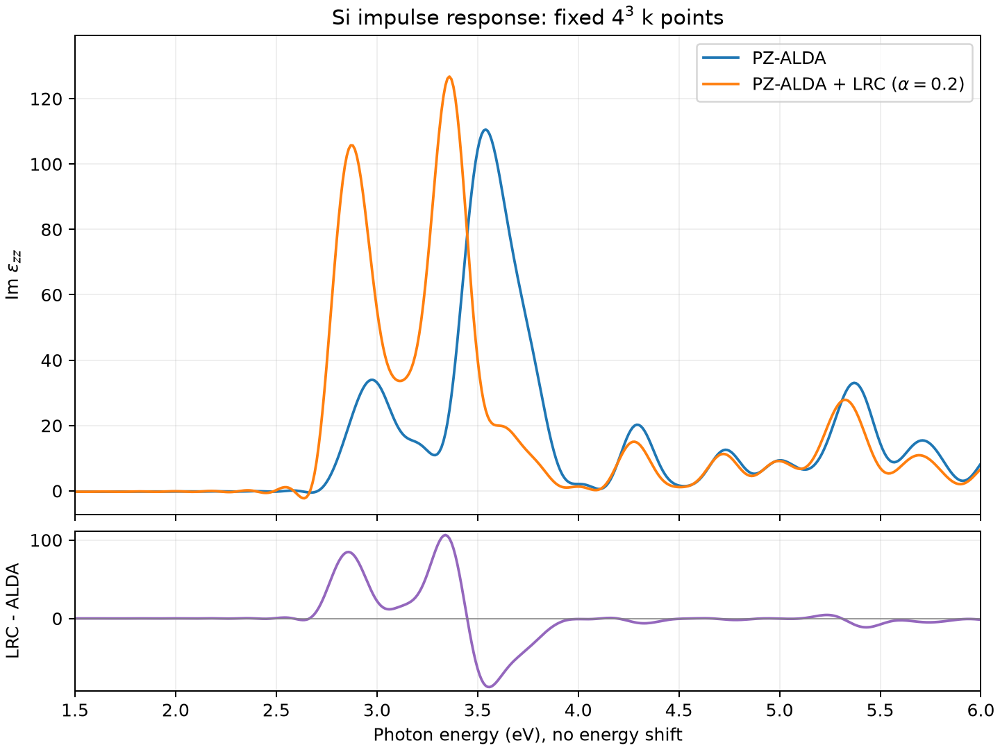
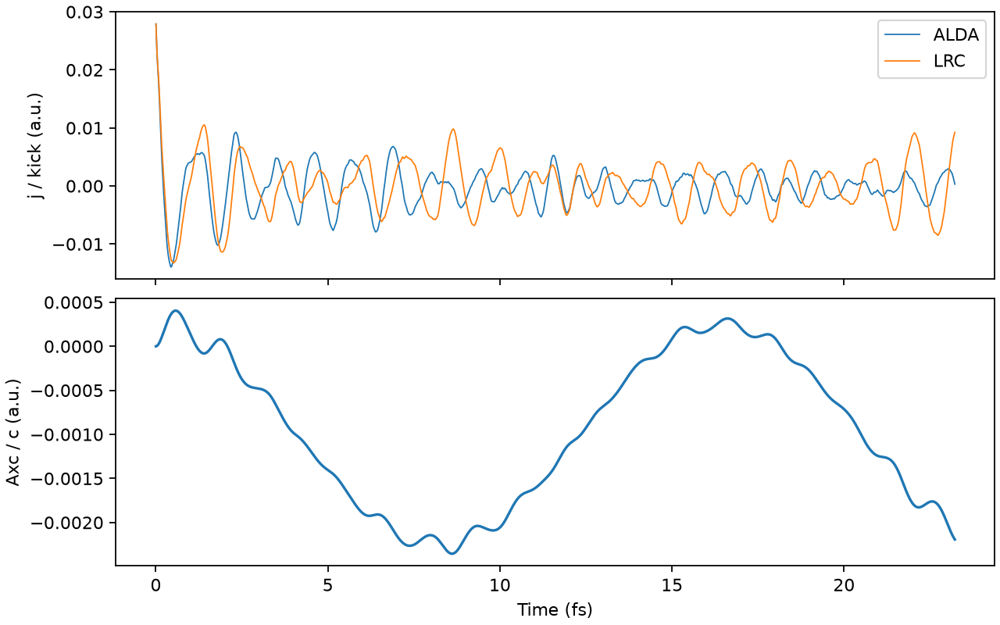

# Si：4³ k点での最初のALDA–LRC比較

ユーザー指定に従い、k点は **4×4×4に固定**。k点収束走査は実施していない。
同じPZ基底状態から、ALDAと巨視的LRC（alpha=0.2、beta=gamma=0）のimpulse応答を計算した。

## 条件

- 通常胞Si 8原子、32電子、32軌道、格子定数10.26 bohr。
- 実空間12³（間隔0.855 bohr）、4³ k点。各軸の縮約k座標は±0.125、±0.375。
- GS密度収束判定1e-9：34反復で8.52e-10に到達。
- z偏光、横応答、A/cのキック0.001 a.u.。
- dt=0.08 a.u.（約1.935 as）、12000ステップ、全時間23.2213 fs。
- 三次窓1−3(t/T)²+2(t/T)³。追加の寿命幅・エネルギーシフト・scissor補正なし。
- 同じ窓で両者を解析。下記の最大値探索は0.01 eV刻み。
  この刻みは物理的な分解能ではなく、h/Tの目安は約0.178 eV。
- ソース84c18671のMPI実行ファイル、各4プロセス。双方が12000ステップ完了し、出力は有限。

## 結果



| 観測量 | ALDA | ALDA+LRC | 変化 |
|---|---:|---:|---:|
| 2–4 eV内の最大ピーク位置 | 3.54 eV | 3.36 eV | −0.18 eV |
| 同ピークのIm epsilon | 110.57 | 126.78 | +14.7% |
| 低エネルギー側の局所ピーク位置 | 2.98 eV | 2.87 eV | −0.11 eV |
| 同局所ピークのIm epsilon | 33.97 | 105.74 | 約3.11倍 |
| 2–4 eVのIm epsilon積分 | 47.289 eV | 62.611 eV | +32.4% |
| 4–6 eVのIm epsilon積分 | 21.197 eV | 17.231 eV | −18.7% |
| 2–6 eVのIm epsilon積分 | 68.486 eV | 79.842 eV | +16.6% |

この条件ではLRCにより低エネルギー側へのシフトと光学強度の再分配が明瞭に現れた。
特に2.9 eV近傍の構造の増強が大きい。表は指定した周波数区間における数値比較であり、
各ピークを実験のE1/E2に一対一対応づけたものではない。ピークのシフトを励起子束縛エネルギーとは解釈しない。
積分はIm epsilonの単純積分であり、振動子強度総和則の積分ではない。

## 時間窓の影響

追加の伝播計算をせず、同じ電流履歴の前半を切り出して、それぞれの終端をTとする窓で再解析した。

| 観測時間 | ALDA最大位置 / 高さ | LRC最大位置 / 高さ | ALDA / LRCの2–4 eV積分 |
|---|---|---|---|
| 11.61 fs | 3.57 eV / 81.18 | 3.34 eV / 80.02 | 47.093 / 62.632 eV |
| 17.42 fs | 3.56 eV / 99.06 | 3.35 eV / 104.42 | 47.287 / 62.617 eV |
| 23.22 fs | 3.54 eV / 110.57 | 3.36 eV / 126.78 | 47.289 / 62.611 eV |

ピーク高さは時間窓に依存する。一方、2–4 eVの積分は17.42→23.22 fsで各0.01%未満の変化であり、
今回の最小限の解析では高さより積分強度の増加を比較しやすい。
これはk点収束や実験との一致を確認したという意味ではない。

## 時間波形と低周波域



この時間範囲でXC場は有限で、max|Axc/c|=0.002355 a.u.。
ゆっくりした振動成分があるが、今回の有限時間内で発散は観測されなかった。
この確認だけで長時間安定性を保証するものではない。

有限時間の電流積分と1/omegaの因子により、低周波域には大きな非物理的成分が残る。
例えば0.01 eVでIm epsilonはALDA −5630、LRC −19.6である。
図は比較対象の1.5–6 eVを表示し、数値を補正・クリップしていない。
表示範囲にも小さい負値があるため、この結果から静的誘電率・吸収端・光学ギャップを抽出しない。
全0.01–8 eVの未補正値はCSVに保存している。

## ファイルと再現

- `alda.csv`, `lrc.csv`：energy_eV, Re_epsilon, Im_epsilon。
- `metrics.json`：条件、局所最大値、積分強度。
- `window_sensitivity.json`：同一履歴からの観測窓比較。
- `absorption.png` / `absorption.pdf`：比較図。
- `time_trace.png`：電流とXC場。
- `analyze_run.py`：解析と図の生成。SALMON2リポジトリ直下から実行する。

入力・生の電流・GS restartはローカルの `calculations/si_tdcdft_k4/{gs,alda,lrc}/` に保存。
大きな生成ファイルはgit管理外、上記解析結果はブランチに保存した。
必要なPython依存はNumPyとMatplotlib。

```sh
python3 docs/results/si-k4/analyze_run.py
```
