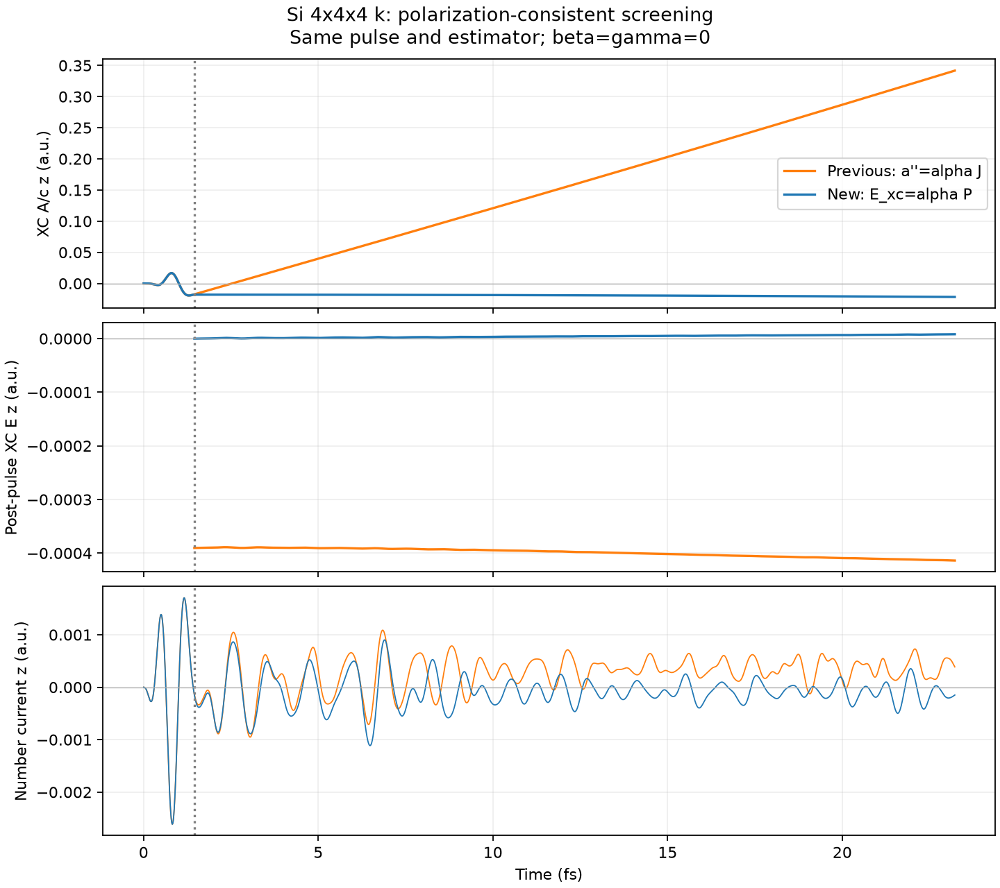

# Si：E_xc=alpha(t)P に整合した瞬時遮蔽

β=γ=0のまま、XC場の定義を `a_xc''=alpha(t)*J` から
`a_xc'=-alpha(t)*P`（P'=-J）へ変更した比較。瞬時K推定とalpha補正式は同じ。
新モードは `tdcdft_screening='polarization'`、従来方式は `instant` として保持した。

## 結果

同じ強レーザー条件で23.2213 fsまで完走。前方式のα変更時に発生していた
一定電場 E_xc-alpha*P は丸め誤差の範囲まで消えた。βやγは追加していない。
外場終了時にA、J、Pをゼロへリセットする処理もない。



| 指標 | 旧方式：加速度にalpha J | 新方式：E_xc=alpha P |
|---|---:|---:|
| パルス後のmax abs(E_xc-alpha P) | 3.9014e-4 a.u. | 3.99e-17 a.u. |
| 最後の3 fsの平均XC電場 | -4.1159e-4 a.u. | +7.4024e-6 a.u. |
| 23.22 fsでのA_xc/c | +0.34165 a.u. | -0.021656 a.u. |
| 最後の3 fsの平均電子数電流 | +3.6638e-4 a.u. | -1.2021e-4 a.u. |
| 印字された電子数の最大誤差 | 3.5e-7電子 | 2.5e-7電子 |
| パルス終了後の電子系エネルギー変化 | +0.10221 a.u. | +0.00079587 a.u. |

残留電場と大きなドリフトは大幅に小さくなった。ただし電流の振動、平均電流、小さな
XC電場・ドリフトは残っている。完全な緩和や無条件の長時間安定性を確認したものではない。
電子系エネルギー出力にはモデルXC場の保存エネルギーを追加していないため、上表は
系全体のエネルギー保存の検証ではない。

## 条件

- Si 8原子、PZ、32電子・32軌道、12³実空間格子、4³ k点。k点収束走査なし。
- 元のGSと強レーザー入力を使用し、長時間比較ではscreeningモードだけ変更。
- alpha0=0.2、β=γ=0、K0=0.19591042214256474、s=1、field floor=2e-5 a.u.。
- z偏光Acos2、omega=0.2 a.u.（約5.44 eV）、全包絡60 a.u.（約1.45 fs）、1e13 W/cm²。
- dt=0.08 a.u.、12000ステップ（約23.22 fs）。4 MPIプロセス、各2スレッド。
- K0は以前の弱レーザー出力の上限から決めた比較用の値。普遍的なSi定数ではない。

## 時間刻み確認

同じ入力でdt=0.04 a.u.、6000ステップ（5.8053 fs）を追加。比較は共通の時間格子で行った。

- 0–5.8053 fsの電流波形の相対L2差：0.0005473（約0.055%）。
- A_xc/cの最大差：0.00010065 a.u.。
- XC電場の最大差：0.00011420 a.u.（α変更中の中心差分電場も含む）。
- 半刻みでもパルス後のmax abs(E_xc-alpha P)は7.70e-17 a.u.。
- 保持されるαは粗い刻みの0.00010098に対し、半刻みでは0.00004730。

電流波形と余分な電場の除去はこの比較で整合する。一方、終端αの約2倍の違いは、
外場が小さくなる時刻でKを推定・保持する方式の刻み依存性が残ることを示す。
これは係数推定の収束を主張できる結果ではない。半刻みの確認は5.8053 fsまでであり、
23.22 fs全体の時間刻み収束を確認したものではない。

## 実装と検証

二次精度の明示的な時間積分：

```
a_next = a_now - dt*alpha_now*P
         + 0.5*dt**2*alpha_now*J
         - 0.5*dt*(alpha_now-alpha_previous)*P
```

滑らかなαについて二次精度。α一定ならPの台形積分と整合し、従来の無減衰LRC更新と一致。
α変更中のE出力はAの中心差分であり、alpha*Pとの離散化誤差を隠していない。
係数変更後にαが一定になれば、E-alpha*Pの定数ずれは残らない。

解析テストは既知の積分解による二次収束、固定α極限、急なα変更後のずれ除去を確認。
シリアルCTest 10件通過、拡張Si回帰テストはシリアル・2プロセスMPI双方で通過。
固定α極限、活性化した補正、再開一致、方式変更・復元項の拒否を検証した。
独立コードレビューでは符号・精度・初期化・再開に阻害事項なし。

この修正はEとPの関係を整合させるモデル変更であり、遮蔽推定そのものの正しさを
保証しない。強励起スペクトルの精度改善や、励起子消失の定量評価は未検証。

## 再現

`run.py long` は元の長時間入力を新モードで実行、`run.py fine` は半刻み計算。
`analyze.py` は以前のinstant長時間結果と合わせて解析する。
SALMON_EXEで実行ファイルを指定可能。NumPy・Matplotlibと既存の4³ GSデータが必要。
生データは `calculations/si_tdcdft_k4/polarization/{long,fine}/` に保存（git管理外）。
